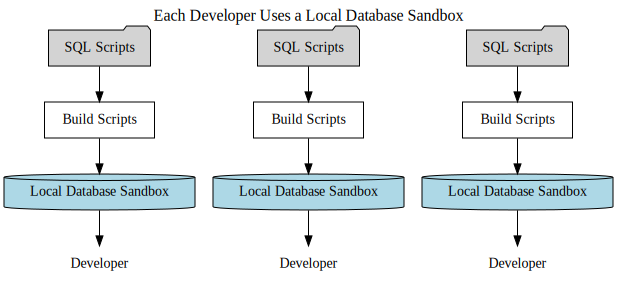
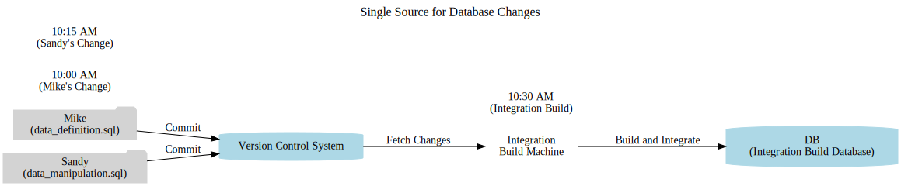

# **Ongoing Database Integration**  
   
"Things do not change; we change."  
—Henry David Thoreau  

**Continuous  Database Integration (CDBI)** refers to the process of consistently rebuilding your database and test data whenever changes are made to a project’s version control repository.  

Do you often find that your source code and database seem to operate in entirely separate “worlds” during the development lifecycle? Developers frequently face delays in applying database updates, or they may be hesitant to make even small test data adjustments for fear of disrupting a shared database environment. These issues are common, but adopting CDBI can help address them effectively.  

Reflecting on the core principles of this approach, database integration should align with the rest of your codebase management processes. This integration is guided by the philosophy that database code (e.g., DDL, DML, configuration files) should be treated as an integral part of the source code ecosystem. Key principles of CDBI include:  

- Storing database artifacts in a version control system.  
- Testing database changes for reliability and compliance.  
- Automating database builds and configurations using build scripts.  

**Database Integration in Continuous Processes**  
When incorporated into a Continuous Integration (CI) system, database integration can achieve the same level of automation and quality control as the rest of the project’s codebase. Changes to database source code can trigger integration builds just like changes to application code, ensuring synchronization between the two.  

**Diverse Data Sources, Common Principles**  
Although not all projects rely on traditional relational databases, most involve some form of persistent data storage, such as flat files, XML, or binary formats. Regardless of the storage mechanism, the principles of CDBI remain applicable.  

To implement CDBI effectively, the database integration process must be included in the build workflow. Scripts to build, configure, and populate the database should be shared within the team through version control. Beyond automation, rebuilding the database and data with every change ensures a continuous verification process. Teams adopting CDBI may need to adjust their development practices, but the benefits—such as improved collaboration, faster updates, and reduced errors—are worth the effort.  

**Treating Databases as Code**  
The ideas in this chapter could easily form the basis for a dedicated discussion on database refactoring. Managing your database as part of your version control process ensures it evolves alongside your application code. This chapter provides the foundational steps to automate and continuously run database integration processes, empowering your team to streamline development workflows and improve project outcomes.

## **Automating Database Integration Across Languages and Build Tools**  

In many projects, database administrators (DBAs) often find themselves bogged down by repetitive tasks like managing database setup, refreshing test data, and applying small changes to database schemas. These tasks not only underutilize their analytical expertise but also slow down development processes. Automating these database integration tasks eliminates bottlenecks, enhances efficiency, and frees DBAs to focus on performance optimization, data normalization, and enforcing standards.  

Here, we explore how database integration tasks can be automated using **TypeScript with Webpack**, **Java with Maven**, and **C/C++ with CMake**, leveraging **AWS Relational Database Services (RDS)** and **NoSQL databases like Amazon DynamoDB** as examples for different use cases.  

### **Key Automation Activities in Database Integration**
Automating database integration involves handling tasks such as:  

## Core Database Integration Activities

The following activities are common to all examples and should be automated to reduce manual overhead:

- **Create/Drop Database or Tables**: Provisioning a clean slate for each environment.  
- **Apply Schemas and Constraints**: Ensuring database integrity and enforcing business rules through DDL statements.  
- **Insert Seed and Test Data**: Populating tables for development, testing, and QA environments.  
- **Migrate Schemas and Data**: Evolving existing databases over time.  
- **Manage Environments**: Supporting multiple stages (development, QA, production) with consistent workflows.  
- **Modify Stored Procedures, Functions, and Triggers**: Updating logic housed in the database.  
- **Backup/Restore**: Handling large data sets and ensuring recoverability.

Once automated, these tasks can be triggered with a single command, improving consistency and speed.

## TypeScript with Webpack and AWS DynamoDB/RDS

### Using AWS DynamoDB

While DynamoDB is schema-less, you can automate table creation and test data insertion using TypeScript scripts and Webpack for bundling. DynamoDB tasks would differ slightly since there are no “SQL scripts,” but you can still achieve “integration” by ensuring tables are created and test items are inserted automatically.

**Directory Structure:**
```
project/
  src/
    dynamodb-setup.ts
    dynamodb-seed.ts
  webpack.config.js
  package.json
```

#### dynamodb-setup.ts: Defining DynamoDB "Database"

```typescript
import AWS from 'aws-sdk';

AWS.config.update({ region: 'us-east-1' });
const dynamodb = new AWS.DynamoDB();

async function createTable() {
  const params = {
    TableName: "Users",
    KeySchema: [{ AttributeName: "userId", KeyType: "HASH" }],
    AttributeDefinitions: [{ AttributeName: "userId", AttributeType: "S" }],
    ProvisionedThroughput: { ReadCapacityUnits: 5, WriteCapacityUnits: 5 }
  };

  try {
    await dynamodb.createTable(params).promise();
    console.log("Users table created or already exists.");
  } catch (err) {
    console.error("Error creating table:", err);
  }
}

createTable();
```

#### dynamodb-seed.ts: Inserting Data into DynamoDB

```typescript
import AWS from 'aws-sdk';

AWS.config.update({ region: 'us-east-1' });
const docClient = new AWS.DynamoDB.DocumentClient();

async function seedData() {
  const items = [
    { userId: "user1", username: "alice", email: "alice@example.com" },
    { userId: "user2", username: "bob", email: "bob@example.com" }
  ];

  for (const item of items) {
    await docClient.put({ TableName: "Users", Item: item }).promise();
  }
  console.log("Seeded DynamoDB with test data.");
}

seedData();
```

#### webpack.config.js

```javascript
const path = require('path');

module.exports = {
  entry: {
    setup: "./src/dynamodb-setup.ts",
    seed: "./src/dynamodb-seed.ts"
  },
  output: {
    filename: "[name].js",
    path: path.resolve(__dirname, "dist")
  },
  resolve: {
    extensions: [".ts", ".js"]
  },
  module: {
    rules: [{ test: /\.ts$/, use: "ts-loader" }]
  }
};
```

**Run:**
```bash
# Install dependencies
npm install aws-sdk typescript ts-loader webpack webpack-cli

# Build scripts
npx webpack

# Create table
node dist/setup.js

# Insert test data
node dist/seed.js
```

### Using AWS RDS with TypeScript

For RDS (e.g., MySQL or PostgreSQL), you can integrate a similar approach by running SQL scripts using a Node.js MySQL/PostgreSQL client within TypeScript:

```typescript
// rds-setup.ts
import { createConnection } from 'mysql2/promise';

async function setup() {
  const connection = await createConnection({
    host: 'aws-rds-endpoint',
    user: 'myuser',
    password: 'mypassword'
  });

  await connection.query("DROP DATABASE IF EXISTS myapp");
  await connection.query("CREATE DATABASE myapp");
  await connection.end();

  console.log("RDS database created.");
}

setup();
```

For data insertion, similarly:

```typescript
// rds-seed.ts
import { createConnection } from 'mysql2/promise';

async function seed() {
  const connection = await createConnection({
    host: 'aws-rds-endpoint',
    user: 'myuser',
    password: 'mypassword',
    database: 'myapp'
  });

  await connection.query("INSERT INTO users(name, email) VALUES('alice','alice@example.com')");
  await connection.query("INSERT INTO users(name, email) VALUES('bob','bob@example.com')");

  await connection.end();

  console.log("RDS test data inserted.");
}

seed();
```

These can be bundled and run via Webpack similarly to the DynamoDB example.

## Java with Maven and AWS RDS/DynamoDB

### Maven + RDS

Use a migration tool like Flyway or Liquibase through Maven to apply SQL changes to RDS.

**pom.xml Snippet:**
```xml
<plugin>
  <groupId>org.flywaydb</groupId>
  <artifactId>flyway-maven-plugin</artifactId>
  <version>9.0.0</version>
  <configuration>
    <url>jdbc:mysql://aws-rds-endpoint:3306/myapp</url>
    <user>myuser</user>
    <password>mypassword</password>
  </configuration>
</plugin>
```

**SQL Files (src/main/resources/db/migration):**
```
V1__Create_tables.sql
V2__Insert_test_data.sql
```

Run:
```bash
mvn flyway:migrate
```

This automatically applies database definition and manipulation scripts. For DynamoDB, you can use the AWS SDK for Java and run a `mvn exec:java` goal tied to a main class that creates tables and inserts items.

### Maven + DynamoDB

**Example Java Class for DynamoDB Setup:**
```java
// DynamoDBSetup.java
import com.amazonaws.services.dynamodbv2.AmazonDynamoDB;
import com.amazonaws.services.dynamodbv2.AmazonDynamoDBClientBuilder;
import com.amazonaws.services.dynamodbv2.model.*;

public class DynamoDBSetup {
    public static void main(String[] args) {
        AmazonDynamoDB dynamoDB = AmazonDynamoDBClientBuilder.standard()
            .withRegion("us-east-1")
            .build();

        CreateTableRequest request = new CreateTableRequest()
            .withTableName("Users")
            .withKeySchema(new KeySchemaElement("userId", KeyType.HASH))
            .withAttributeDefinitions(new AttributeDefinition("userId", ScalarAttributeType.S))
            .withProvisionedThroughput(new ProvisionedThroughput(5L, 5L));

        dynamoDB.createTable(request);
        System.out.println("DynamoDB table created.");
    }
}
```

Run via Maven:
```bash
mvn compile exec:java -Dexec.mainClass="DynamoDBSetup"
```

Similarly, a `DynamoDBSeed` class can insert items after table creation.

## C/C++ with CMake and AWS RDS/DynamoDB

### CMake + RDS (MySQL Example)

**CMakeLists.txt:**
```cmake
cmake_minimum_required(VERSION 3.10)
project(DatabaseIntegration)

find_package(MySQL REQUIRED)
include_directories(${MYSQL_INCLUDE_DIR})

add_executable(db_setup setup.cpp)
target_link_libraries(db_setup ${MYSQL_LIBRARIES})

add_executable(db_seed seed.cpp)
target_link_libraries(db_seed ${MYSQL_LIBRARIES})
```

**setup.cpp:**
```cpp
#include <mysql_driver.h>
#include <mysql_connection.h>
#include <cppconn/statement.h>
#include <iostream>

int main() {
    sql::mysql::MySQL_Driver *driver;
    sql::Connection *conn;
    sql::Statement *stmt;

    driver = sql::mysql::get_mysql_driver_instance();
    conn = driver->connect("tcp://aws-rds-endpoint:3306", "myuser", "mypassword");
    stmt = conn->createStatement();

    stmt->execute("DROP DATABASE IF EXISTS myapp");
    stmt->execute("CREATE DATABASE myapp");
    stmt->execute("USE myapp");
    stmt->execute("CREATE TABLE users (id INT AUTO_INCREMENT PRIMARY KEY, name VARCHAR(50), email VARCHAR(100))");

    std::cout << "RDS database and users table created." << std::endl;

    delete stmt;
    delete conn;
    return 0;
}
```

**seed.cpp:**
```cpp
#include <mysql_driver.h>
#include <mysql_connection.h>
#include <cppconn/statement.h>
#include <iostream>

int main() {
    sql::mysql::MySQL_Driver *driver;
    sql::Connection *conn;
    sql::Statement *stmt;

    driver = sql::mysql::get_mysql_driver_instance();
    conn = driver->connect("tcp://aws-rds-endpoint:3306/myapp", "myuser", "mypassword");
    stmt = conn->createStatement();

    stmt->execute("INSERT INTO users(name, email) VALUES('alice','alice@example.com')");
    stmt->execute("INSERT INTO users(name, email) VALUES('bob','bob@example.com')");

    std::cout << "Test data inserted into RDS." << std::endl;

    delete stmt;
    delete conn;
    return 0;
}
```

**Build and Run:**
```bash
mkdir build && cd build
cmake ..
make
./db_setup
./db_seed
```

### CMake + DynamoDB

For DynamoDB, you would use AWS SDK for C++. Here, you’d write C++ code that uses the AWS SDK to create tables and insert items. The concept remains the same, just the APIs differ.


## Summary

- **TypeScript with Webpack + DynamoDB/RDS**: Use Node.js scripts, AWS SDK, and bundle them for easy execution.  
- **Java with Maven + DynamoDB/RDS**: Use Maven plugins like Flyway for relational migrations and the AWS SDK for DynamoDB setup.  
- **C/C++ with CMake + DynamoDB/RDS**: Leverage native connectors (MySQL Connector/C++) or AWS SDK for C++ to manage databases.

In all cases, the core idea is to automate database setup, schema application, and data insertion so that a single command (or a single CI job) can create a consistent and ready-to-use database environment. By treating database code as first-class citizens under version control, developers ensure reproducibility, reduce downtime, and streamline the continuous integration/continuous delivery pipeline.

## **Utilizing a Local Database Sandbox**

One common obstacle in software development is managing database structure changes without disrupting the team. Many projects rely on a single shared database for development, which means any modifications made by one developer can unintentionally impact others. These changes can break private builds if the tests rely on the database. While developers often use local code “sandboxes” to isolate their work, having a dedicated "database sandbox" would provide a similar advantage, enabling isolated testing of database changes.

### **Multiple Database Instances**

For teams with limited resources, assigning a separate database instance to every developer might not be feasible. In such cases, alternatives like using individual schemas on a central database server or lightweight, open-source databases can serve as practical solutions. Additionally, many popular relational database management systems (RDBMS) offer free versions tailored for development purposes.

By automating database integration, each developer can create a local database instance on their workstation. This local database sandbox allows team members to test and refine their database changes independently without impacting the work of others. Automated scripts make creating and managing these database instances a straightforward, push-button task. Without automation, recreating databases and running local tests becomes far more time-consuming and error-prone.



### **Benefits of a Local Database Sandbox**

With a local sandbox in place and automated database integration, developers can:

1. **Synchronize with the Latest Changes**: Fetch the most recent database scripts from the version control repository alongside application code.  
2. **Create and Test Locally**: Build and test database changes on their workstations without affecting others.  
3. **Commit and Share Updates**: Safely commit modifications back to the repository, where they can be integrated into the Continuous Integration (CI) pipeline.  
4. **Incorporate Changes Seamlessly**: Other developers can then pull these updates into their own local sandboxes, ensuring private builds reflect the latest changes.


### **Supporting Multiple Database Environments**

After implementing local sandboxes, the next step is to enable support for multiple database environments. This can include:

- **Production-Like Databases**: Setting up databases with migrated production data for testing large datasets. This is typically limited to data manipulation (DML) rather than schema definitions (DDL) to reduce complexity.  
- **Version Testing**: Testing new application code against earlier database versions to ensure backward compatibility.

Automated database integration simplifies these tasks. By tweaking build script parameters, you can tailor the database contents for specific environments or versions with a single command. This flexibility ensures developers can efficiently test various scenarios without additional overhead.


### **Integration with Version Control**

Automating database integration alongside version control ensures every database change is tracked, tested, and consistently deployed. When paired with CI practices, this approach minimizes disruptions, enhances collaboration, and streamlines the development lifecycle.

## **Utilize Version Control to Manage and Share Database Assets**  

Storing database integration assets in a version control system (VCS) is an essential best practice. Just as application source code is versioned, database artifacts should be treated as first-class assets and maintained alongside other project files. These assets include:  

- **DDL scripts**: Scripts to create, modify, and drop tables, views, constraints, and triggers.  
- **Stored procedures and functions**: Logic housed within the database.  
- **Entity relationship diagrams (ERDs)**: Visual representations of the database schema.  
- **Test data**: Predefined data sets for different environments like development, testing, or QA.  
- **Configuration files**: Settings or database-specific configurations for various environments.  


### **Recreating Databases From Version Control**  

A VCS allows you to recreate the entire database from scratch using versioned scripts. For smaller projects, you can store **row-by-row DML scripts**, while for larger datasets, exporting and storing bulk data scripts is more efficient. Once the database assets are committed, the version control system preserves a complete history of changes. This enables teams to:  

1. **Run Prior Database Versions**: Test the current application code against previous database versions.  
2. **Enable Team Collaboration**: Allow developers to apply database changes without bottlenecks, reducing reliance on a database administrator (DBA).  
3. **Facilitate Code Integration**: Developers can update database schemas or columns locally, perform a private build, and commit changes to VCS. These changes are validated during the integration build process.  


### **Task Branches for Large-Scale Changes**  

Sometimes, extensive database modifications require input from multiple team members and span a longer timeframe. In such cases, creating a **task branch** in the VCS is the best approach. This isolates the changes, preventing disruption to the main branch and enabling team members to collaborate without slowing overall development.  

Without automated database integration, large-scale schema changes are often left solely to the DBA, who may not have the full context of dependent source code, tests, and scripts. By leveraging a task branch, both database and application code can evolve together while maintaining stability.  


### **Organizing Database Assets in a Structured Directory**  

As with source code, maintaining a clear and consistent directory structure for database assets is crucial. This improves clarity, makes versioning simpler, and ensures adaptability as the project evolves.  

**Example Directory Structure** (for a MySQL database):  

```
implementation/  
    bin/  
    build/  
        filtered-sql/  
    config/  
        properties/  
        xml/  
    database/  
        ddl/          # Table, view, and schema definitions  
        dml/          # Data insertion and migration scripts  
        procedures/   # Stored procedures, triggers, and functions  
        migration/    # Versioned migration scripts  
    lib/  
        mysql/  
    src/  
    tests/  
tools/  
    mysql/           # Tools for database setup, testing, or backups  
```  


### **Maintaining Consistency and Scalability**  

- **Consistency**: Ensure all team members follow the same directory structure and commit changes regularly.  
- **Adaptability**: Choose a flexible directory design that can evolve with the project while minimizing the need for structural changes. Frequent reorganizations can lead to script breakages and increased maintenance overhead.  


### **From VCS to Continuous Integration**  

Once database integration assets are automated and committed to version control, they become part of the **Continuous Integration (CI)** pipeline. Any database change triggers the creation or update of a local database instance, validation of the changes, and integration testing. This ensures database modifications are tested early and frequently, reducing deployment risks.  

By managing database assets in version control and aligning them with the project’s CI process, teams achieve greater collaboration, consistency, and agility in their development workflows.

## **Ongoing Database Integration**  

Ongoing Database Integration (ODBI) ensures that your database structure and application source code remain consistently aligned throughout the development lifecycle. The primary objective of automating, sharing, and building database integration processes is to make them **continuous**. By adopting ODBI, changes to your database are synchronized with your source code multiple times daily, ensuring early defect detection and seamless integration.  


### **How It Works**  
Once a developer commits database changes—such as schema updates, stored procedures, or test data scripts—to the version control repository, the Continuous Integration (CI) system takes over:  

1. **Fetch the Latest Codebase**: The CI system retrieves the entire project source code, including database scripts for schema creation (DDL) and data manipulation (DML).  
2. **Rebuild the Database**: The database is dropped and recreated from the versioned scripts, ensuring a clean and consistent starting state.  
3. **Integrate Source Code**: The application source code is compiled and integrated alongside the database setup.  
4. **Execute Automated Tests**: Both application logic and database changes are tested using automated unit tests, integration tests, and code inspections to identify any defects.  

This streamlined process ensures that all changes—no matter how minor—are tested in isolation and validated against the broader system.  


### **Example Workflow**  

Imagine two developers, **Mike** and **Sandy**, commit changes to the database and source code throughout the day:  

- At **10:00 AM**, Mike updates a table schema.  
- At **10:15 AM**, Sandy inserts new test data.  
- At **10:30 AM**, the CI system triggers an integration build.  

The CI server pulls the updated changes from version control, rebuilds the database with Mike's schema and Sandy's test data, integrates the application code, and runs tests to confirm that everything works together. This guarantees a **single source of truth** for all database changes and synchronizes them with the mainline code.  




### **Simplifying the Process**  

Once database integration tasks are automated and included in your build scripts, enabling continuous execution is straightforward. By adding these database integration tasks as part of the automated build pipeline—using tools like **Ant**, **NAnt**, **Maven**, or **CMake**—the database processes are seamlessly triggered with every build.  

For example, a single command like `ant build` or `mvn clean install` can:  
- Recreate the database.  
- Apply changes (schemas, stored procedures, and test data).  
- Run automated tests.  

This approach ensures that database changes are validated continuously, preventing integration issues and enabling faster feedback for developers.  


### **Benefits of Ongoing Database Integration**  
1. **Synchronization**: Aligns database changes with source code updates.  
2. **Automation**: Reduces manual errors by automating rebuilds and tests.  
3. **Early Defect Detection**: Identifies integration issues as soon as changes are committed.  
4. **Improved Collaboration**: Developers work on a shared, consistent version of the database and code.  
5. **Reliable Builds**: Every integration build includes up-to-date database and source code changes.  

By treating database assets as an integral part of your CI pipeline, Ongoing Database Integration creates a seamless, repeatable process that keeps your system stable and your team productive.

## **Enable Developers to Modify Database Scripts**  

Developers should have the ability to update and refine database scripts as needed. While not every developer may have deep database expertise, providing this capability ensures that teams can work efficiently without being dependent on a database administrator (DBA) for every minor adjustment. With each developer operating within their own local database sandbox, they can safely experiment, test changes, and commit updates to the version control repository. This approach minimizes bottlenecks caused by relying solely on the DBA for database modifications.  


### **Balancing Authority with Responsibility**  

Granting developers the authority to modify database scripts comes with the expectation of added responsibility. Changes to database structures—such as table schemas, constraints, or stored procedures—can have significant ripple effects throughout the system. Therefore, developers must:  
1. **Thoroughly Test Changes**: Validate database modifications within their local environment before committing.  
2. **Ensure Compatibility**: Verify that the changes do not break existing code, tests, or integrations.  

The DBA still plays a crucial role as a reviewer and gatekeeper. By monitoring integration builds and collaborating with developers when issues arise, the DBA ensures that only well-tested, production-ready changes are integrated into the main system.  


### **Why Empower Developers?**  

1. **Reduced Bottlenecks**: Developers can address small, necessary changes without waiting on the DBA.  
2. **Improved Collaboration**: Developers and DBAs work together, with developers taking on more ownership of database-related changes.  
3. **Faster Iterations**: Local sandboxes allow developers to test changes quickly, encouraging an iterative, fail-fast approach.  
4. **Modern Skill Sets**: Today’s developers often have a solid understanding of database scripting, making this approach both practical and efficient.  

By enabling developers to modify database scripts and holding them accountable for testing and quality, teams foster a culture of shared ownership and faster delivery, while maintaining the oversight necessary for stability and performance.

## **The Team Collaborates to Resolve Broken Builds**  

When treating the database as an integral part of the source code, broken builds may occasionally arise due to database-related issues. However, errors can stem from any stage of the build process—whether it's the application code, deployments, automated tests, inspections, or the database itself. With continuous database integration (CDBI), database errors are no different from other build failures, ensuring a consistent approach to issue resolution.  

The team collectively prioritizes fixing whatever caused the build to fail, regardless of its origin. This unified focus ensures that problems are addressed promptly and collaboratively. Once the issue is resolved, the fix is integrated into the system, reducing the risk of the same problem occurring again. This approach promotes stability, maintains momentum, and reinforces a culture of shared responsibility for the system's overall health.

## **Integrate the DBA into the Development Team**  

Eliminate silos by incorporating database administrators (DBAs) as active members of the development team. While some teams may already collaborate closely, it’s still common to see a separation between DBAs and developers, creating a figurative "wall" that hinders efficiency. To foster better teamwork, database code should be treated as equal to application source code, and the same principle applies to team dynamics.  

This approach—though sometimes considered unconventional—has proven far more effective when the DBA works directly alongside developers. While continuous database integration (CDBI) can function with a traditional separation, the process is significantly smoother and more productive when the DBA is embedded within the development team.  

### **The Evolving Role of the DBA**  

Some may wonder, “If the DBA isn’t solely focused on creating tables, managing test environments, or granting access, what value do they bring to the team?” The answer is straightforward: DBAs can now focus on their core responsibilities—tasks that deliver greater value to the project, such as:  
1. **Optimizing Database Performance**: Fine-tuning queries, indexes, and resource utilization.  
2. **Improving SQL Efficiency**: Enhancing query execution to reduce latency and overhead.  
3. **Ensuring Data Integrity**: Normalizing data and enforcing consistency across the system.  
4. **Architecting Scalability**: Planning database structures that scale as the application grows.  

By integrating DBAs into the development team, they can collaborate directly with developers, provide insights during database design, and address issues early in the process. This alignment improves communication, reduces friction, and ensures the database evolves in sync with the rest of the application. Ultimately, DBAs can focus on strategic, high-value tasks instead of being bogged down by routine administrative work.

## **Database Integration and the Integrate Workflow**  

In this section, we explore how database integration fits into the broader context of the **Integrate workflow**, alongside continuous testing, inspection, deployment, and feedback. While the book dives deeper into these concepts in later chapters, here we address key considerations when applying these practices to database integration.  


### **1. Testing the Database**  
Similar to your application source code, database components need thorough testing. Tools like **PL/Unit**, **OUnit** for Oracle, and **SQLUnit** help automate database-specific tests. Stored procedures, functions, triggers, and constraints often contain essential behavior that must be validated as part of the build process. Testing can include:  

- Verifying the behavior of stored procedures and functions.  
- Ensuring data constraints and triggers perform as expected.  
- Testing transactional boundaries for consistency and security.  
- Performing application-level security and data integrity tests.  

Chapter 6 provides an in-depth look at testing methodologies and tools that ensure your database behaves reliably and integrates seamlessly with the rest of your system.  


### **2. Database Code Inspection**  
Database scripts and data should undergo automated inspections similar to application source code. These inspections help maintain performance, consistency, and adherence to standards. Key areas to focus on include:  

- **SQL Query Optimization**: Use tools to analyze queries, such as `EXPLAIN`, to identify inefficiencies and suggest optimizations.  
- **Data Integrity Checks**: Ensure constraints and relationships maintain consistent data integrity.  
- **Query Analysis**: Use SQL profiling tools to detect frequently executed queries that may benefit from optimization or conversion into stored procedures.  
- **Naming Conventions**: Validate adherence to database naming standards to keep schemas maintainable.  

Incorporating inspections into your automated build process ensures that these checks happen consistently, reducing the need for manual reviews and catching issues early.  


### **3. Automated Deployment of the Database**  
Continuous Database Integration (CDBI) treats database assets—such as schemas, scripts, and migrations—the same way as application code. Continuous Deployment automates the deployment of database changes across different environments (e.g., development, testing, production) in sync with application updates.  

Benefits include:  
- **Consistent Environments**: Automate schema creation, updates, and migrations for development and test instances.  
- **Migration Testing**: If migrating to a new database, automation allows you to validate the migration process continuously or on a set schedule.  
- **Rollback Capabilities**: Integration scripts can include rollback functionality to recover quickly from issues.  

By automating database deployment, you ensure consistent environments, minimize errors, and streamline delivery pipelines.  


### **4. Continuous Feedback and Documentation**  
Integrating feedback into the Continuous Integration (CI) system ensures rapid identification and resolution of database-related issues. When a build fails due to recent database changes, the CI system sends immediate notifications to the developers who committed those changes. This enables fast fixes and maintains system stability.  

**Documentation** also plays a key role in database integration by communicating essential details to developers, stakeholders, and customers. Automating the generation of critical database documentation ensures it is always up-to-date. Examples include:  

- **Entity Relationship Diagrams (ERDs)**: Visualize table relationships and database structures.  
- **Data Dictionaries**: Provide definitions for tables, columns, and relationships.  

These artifacts can be generated as part of the continuous build process, possibly as a secondary build, and shared with the team or external stakeholders.  


### **Summary**  
By incorporating testing, inspection, deployment, and feedback into your database integration workflow, you treat the database as a first-class citizen in the development process. This approach ensures consistency, automation, and continuous validation, aligning database integration with modern software development practices. The result is improved collaboration, reliability, and faster delivery of database changes alongside application code.
