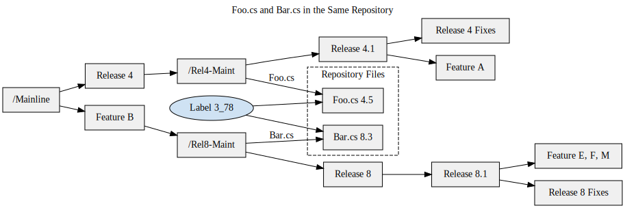

# Seamless Software Delivery

Effortless software delivery is a cornerstone of modern software development. The organizations employing software professionals typically expect them to produce functional, user-ready software within a defined and reasonable timeframe. Yet, the industry still faces tales of "disastrous releases," where unplanned complications lead to panic, sleep deprivation, and stress, often culminating in incomplete or delayed software delivery to users.

For a professional developer, crafting functional software is only part of the equation—the true test lies in its deployment. Without effective delivery, software remains merely a concept. In today’s fast-paced development cycles, where releases occur frequently, mastering the deployment process is as critical as excelling in software creation. Continuous Deployment builds upon Continuous Integration, combining methods and processes to ensure software can be released at any moment, with minimal manual intervention and maximum reliability.

However, achieving this is no small feat. While some organizations excel in this arena, many are still striving to get it right. Companies like Amazon, Google, and eBay stand as industry benchmarks, delivering functional software rapidly and efficiently. Tim O’Reilly noted that Flickr's lead developer claimed their team could deploy updates every 30 minutes on a productive day.

Deployment often culminates in the press of a single "Integrate" button, marking the final step in an efficient, automated pipeline. This represents the pinnacle of a well-optimized development and deployment system.

## Deliver Functional Software Anytime, Anywhere

Automated and repeatable builds. Rigorous and automated testing processes. Categorized test suites with varying frequencies. Continuous code inspections. Seamless database integrations. Together, these components of an optimized Continuous Integration (CI) pipeline enable a single, transformative advantage: the ability to deploy functional, reliable software at any moment, in any environment. Simply put, software that cannot be released is akin to software that doesn’t exist.

What does a standard deployment process involve? Despite variations in platforms, technologies, or domains, deploying functional software generally follows six key steps:

1. Assign labels to repository assets.
2. Establish a pristine environment devoid of prior assumptions.
3. Build and label artifacts directly from the repository, deploying them to the designated system.
4. Execute comprehensive tests in a replica of the production environment.
5. Generate detailed feedback reports on the build.
6. Roll back releases if needed, using version control labels.

When a robust CI environment is in place, these tasks, once tedious and error-prone, can be reduced to the simplicity of pressing a button. While tracking delivered features against customer requirements remains essential, you can be confident that what’s delivered is functional and deployable software.

At its best, deployment becomes as effortless as running a single command, like `ant deploy`.

## Tagging Repository Versions for Organized Tracking

Tagging versions in a repository is a critical practice for efficiently organizing and managing assets. A tag serves as a snapshot in time, grouping related files and their respective versions into a cohesive whole. This allows for easy identification, historical tracking, and streamlined transitions between versions.

For instance, consider two files in a repository, `Foo.cs` (version 4.5) and `Bar.cs` (version 8.3). While each file has its independent version, assigning a shared tag, such as `3_78`, connects them as part of the same release package. This tagging system, provides clarity and consistency for managing grouped assets.



Tagging repository versions is fundamental to maintaining control over software processes. It allows for reliable version snapshots that can be referenced for reporting, future builds, or, when necessary, rollbacks to a stable state. Tags also enable the creation of parallel development branches, allowing teams to isolate bug fixes or enhancements without risking instability from ongoing development in the main branch.

For example, if customers are using a version tagged as `3_78` and new features are being developed in the trunk (the main repository branch), developers can safely apply fixes to the `3_78` tag and produce a stable point release without introducing unintended changes from newer code.

Once tagged, generating the same release becomes straightforward. For instance, tools like Ant can retrieve tagged versions from a repository by referencing the specific tag identifier, as shown in the following code snippet:

```xml
<cvs
  cvsRoot=":pserver:${cvs.user}:${cvs.pass}@${cvs.server.hostname}:${cvs.server.path}" 
  package="${cvs.module}" 
  tag="${cvs.tag.id}" 
  dest="${cvs.module.dest}" 
  command="checkout" />
```

Tagging conventions often follow simple naming patterns for clarity, such as combining major and minor release numbers (e.g., `2_89`). This approach ensures consistency and facilitates efficient management of repository assets across different stages of development.

### Establish a Pristine Environment  

Have you ever tried deploying software only to find inconsistencies caused by mismatched operating system versions, databases, or application servers? Establishing a pristine environment involves systematically clearing and reinstalling all necessary software, scripts, and configuration settings to ensure the system behaves predictably.

When building or testing software, it’s vital to eliminate any lingering files or configurations that might cause failures or misleading success indicators. A common approach involves starting with a blank system and applying software layers incrementally until the environment is fully prepared. This is often done on dedicated testing, staging, or virtual machines, and ideally, the process is automated for consistency and efficiency.  

For instance, a clean environment can be created by removing and applying the following layers in sequence:  

1. **Base Operating System**  
2. **Operating System Configurations** (e.g., network settings, user accounts, firewalls)  
3. **Core Server Components** (e.g., application servers, database servers, messaging systems)  
4. **Server Configuration Settings**  
5. **Third-Party Tools** (e.g., frameworks, libraries, ORM tools)  
6. **Custom Software** (user-specific applications and components)  

In some cases, it might be sufficient to reset only specific layers, such as the custom application components. However, the depth of cleaning depends on the level of risk tolerance and the software’s reliance on system-level dependencies. For applications interacting heavily with the operating system, more frequent full-system resets are recommended.  

At a minimum, all layers should be cleared and reapplied periodically throughout the development process, ensuring a reliable and repeatable environment before releasing the software to end users.

## Assign a Unique Identifier to Each Build  

Assigning a unique identifier, or build label, ensures clarity and traceability for every version of the code that is built. This process involves two key steps: first, tagging the codebase in the repository, and second, applying a unique label to the output generated during the build process. Build labels provide a clear reference for what version of the code is running in a particular environment, making it easier to link defects, new features, or requirements to specific builds.

It’s important to distinguish between repository labels and build labels. **Repository labels** group related source files, usually in their uncompiled state, while **build labels** uniquely identify the compiled binary artifacts, such as executable files, `.jar` archives, `.NET assemblies`, or packaged `.zip` files. The naming schemes for repository and build labels are typically similar, but build labels include additional specificity, such as build numbers or platform details. For example, a repository label `2_89` might correspond to a build labeled `2_89.01` or `2_89.hp-01` for a specific target platform.

Neglecting to label builds can create confusion when identifying or resolving issues. For instance, deploying an unlabeled build to a testing environment introduces ambiguity, as QA teams cannot definitively trace bugs to a specific code snapshot. In contrast, labeled builds simplify issue tracking, as defects can be directly tied to the build’s unique identifier.

The process of labeling a build can be automated. For example, performing a complete build and deploying it to a QA environment could involve a command like:

```bash
ant -Dbuild.id=2_89.01 -Denvironment=qa deploy
```

Automating build labeling ensures that all essential steps—such as compilation, database integration, testing, and inspections—are completed before deployment. Additional checks, like post-deployment tests, can also be incorporated to validate the build. With a clear labeling strategy, teams can improve coordination, streamline defect resolution, and maintain a consistent development process.

## **Execute All Tests**  

While certain phases of development may involve running only specific groups of tests, it is essential to execute the full suite of tests before finalizing a deployment build. This includes everything from unit tests to functional tests. Running all tests ensures the software meets quality standards and minimizes the risk of issues in production.  

Before promoting a build to the next stage, it’s critical to perform this comprehensive testing on a clean, freshly configured environment that replicates the production setup. This step verifies that no environment-specific issues—such as misconfigurations or performance bottlenecks—will cause failures.  

Executing all tests at this stage provides greater confidence in the software's reliability. While automation plays a vital role in ensuring efficiency and consistency, it’s important to remember that software ultimately serves human users. Therefore, incorporating manual testing alongside automated checks remains a necessary part of the quality assurance process.

## Generate Build Feedback Reports  

Automating the creation of build feedback reports ensures transparency about what a specific build contains, such as the changes made to files, defects addressed, and features delivered. These reports allow stakeholders—developers, testers, and project managers—to quickly verify if the build meets the expected requirements and changes.

### Balancing Automation with Manual Review  
While automated testing and reporting provide significant value, they do not always replicate the end-user experience. It’s crucial to complement automated processes with manual reviews to uncover issues that automation might miss—especially user interface glitches, usability problems, or aesthetic inconsistencies.  

For example, a financial organization once implemented rigorous automated tests and auto-deployment processes. Despite this, user-facing issues like broken tables and missing images still appeared in production. These defects only became evident through manual checks that emulated user behavior. By incorporating manual validation into their process, the team significantly reduced these types of errors.

### Ensuring Consistent Test Results  
To maintain confidence in each build, a **100% test success threshold** should be the standard. Allowing even a small percentage of test failures creates uncertainty, as it becomes unclear whether defects are recurring or new. Requiring full test success ensures that every issue is identified, documented, and addressed.  

### Types of Build Feedback Reports  

1. **Defect Resolution Report**  
   A defect resolution report highlights which bugs or issues have been addressed in the current build. This helps QA teams prioritize verification of fixes and ensures that resolved defects are not reintroduced.

2. **File Difference Report**  
   A file difference report outlines all changes made in the codebase for the build. By comparing versions (e.g., between repository tags or specific dates), teams can validate whether the expected fixes or features are included. Tools like Ant can automate this report generation, as shown in the following example:

   ```xml
   <target name="diff-tag-to-tag">
     <delete dir="${cvs.reports.dir}" />
     <mkdir dir="${cvs.reports.dir}" />
     <cvstagdiff package="${cvstagdiff.package}"
         destfile="${cvstagdiff.destfile}"
         starttag="${cvstagdiff.starttag}"
         endtag="${cvstagdiff.endtag}" compression="true"/>
     <style in="${cvstagdiff.destfile}"
         out="${cvs.reports.dir}/tagdiff.html"
         style="${ant.home}/etc/tagdiff.xsl">
       <param name="title" expression="Build Differences" />
       <param name="module" expression="ant" />
     </style>
   </target>
   ```

This task generates an HTML report of all file changes between two labels or timestamps, providing a traceable view of modifications.  

### Why Build Feedback Reports Matter  
These reports serve as a single source of truth during the release process. For example, if QA reports a recurring defect that was previously marked “fixed,” the build difference report can confirm whether the relevant changes were included in the latest release. This enhances collaboration between QA and development teams, ensuring efficient troubleshooting and verification.

By automating build feedback reports and combining them with thorough manual testing, teams can maintain high-quality releases and ensure that each build meets user expectations and technical requirements.

## Enable the Ability to Roll Back Releases  

The ability to swiftly revert to a previous deployment is a critical component of any robust software development and release process. There are instances when newly deployed code introduces defects that disrupt operations, requiring teams to replace it quickly with a previously stable version. By leveraging build and repository labels, teams can efficiently identify and redeploy the desired version.

For instance, imagine the QA team receives build `89_3.04`, which was expected to resolve several high-priority issues. However, upon deployment, a significant yet subtle defect is discovered that halts further testing. In this case, rolling back to the prior stable build (`89_3.03`) ensures minimal disruption. The QA team can resume testing on the earlier version without losing valuable time and can continue logging defects against it.

Having a rollback mechanism in place prevents prolonged downtime and reduces the risk associated with failed deployments. This capability not only supports faster recovery but also provides confidence that the system can quickly return to a known working state when issues arise.
