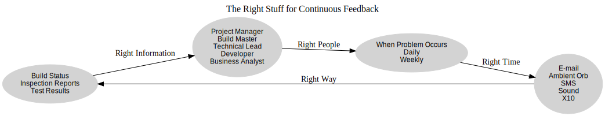
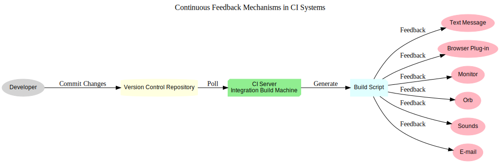

# **Ongoing Feedback**

As a guiding principle, those who achieve the greatest success are often those who possess the most accurate and timely information.

— BENJAMIN DISRAELI (1804–1881)

One day, I was chatting with my coworker, Chuck, when a build failed on one of our projects. I immediately knew about it because multiple notification mechanisms kicked in: an SMS alert appeared on my phone, a custom sound clip played on my computer, an email arrived in my inbox, and the color-changing Orb on my desk shifted to red. I briefly paused my conversation with Chuck to call the project’s technical lead. Without hesitation, they responded, “I just got the alert and am handling it now.” I ended the call and resumed my discussion with Chuck, barely breaking stride. This is an example of ongoing feedback in action—quick, non-intrusive mechanisms that keep everyone informed without unnecessary disruption. 

Feedback is a fundamental outcome of any CI system’s “Integrate” function. Without it, the other components of CI lose their effectiveness. The rationale behind fast builds and quick failures is to ensure rapid feedback. Timely updates are central to CI. Delayed feedback—whether from a failed test, an inspection, a database issue, or a deployment error—means delayed resolution, leading to a greater chance of cascading failures. Feedback is essential for immediate action, providing an accurate and up-to-date picture of your integration build status.

Information on a software project is inherently dynamic. As Heraclitus, the Greek philosopher, famously stated, “The only constant is change.” It’s essential to relay pertinent, concise, and current information to all project stakeholders—be it customers, developers, or management. While direct, face-to-face communication remains highly effective, it lacks scalability. Continuous feedback bridges this gap, enabling teams to disseminate real-time updates across multiple projects seamlessly. Moreover, such feedback mechanisms can aggregate data, identifying trends and providing valuable insights for the broader project landscape.

This chapter explores the importance of delivering the right information to the right people at the right time, and how to accomplish this effectively.

## **Ensuring Effective Communication**

Distributing information indiscriminately—without thought for relevance or timing—rarely yields meaningful results. The purpose of feedback is to craft notifications that prompt precise and timely actions. Achieving this requires delivering the correct information to the appropriate individuals, at the most opportune moment, and through the best possible channel. To achieve this, we must first ensure the information is accurate, then determine who needs it, why it is relevant to them, and when and how it should be delivered.

### Continuous Feedback and CI
The cornerstone of effective feedback in Continuous Integration (CI) systems is delivering tailored, automated, and real-time updates to the right stakeholders. By leveraging CI, teams can streamline the feedback process, ensuring that critical insights reach the right people without delay or unnecessary noise.

Additionally, the mode of communication plays a pivotal role. Continuous feedback mechanisms (CFMs) integrated with CI systems can notify stakeholders about a variety of events—ranging from build success or failure to exceeding predefined thresholds, such as code duplication limits. Figure 9-2 illustrates this process.

### The Right Information
While feedback systems deliver the data, it’s the team members—primarily developers—who act to improve the software. Analysts, testers, and managers also benefit from these updates. Continuous feedback ensures the information is structured, accurate, and relevant, empowering teams to take swift and effective action. Rather than waiting for stakeholders to identify concerns, automated notifications can highlight issues as they arise, ensuring prompt attention.

For instance, a CI system can automate tasks that might otherwise require manual oversight. Notifications about build status—encompassing regression test results, code analysis outcomes, and deployment statuses—are examples of feedback that can be tailored to specific roles and delivered on a consistent schedule.

### The Right People
Not every piece of information needs to reach every team member. Overloading stakeholders with irrelevant updates risks diminishing the value of critical messages. Strategic planning is necessary to ensure that only relevant information is distributed to the appropriate individuals. For example, sending build error notifications to all developers—when only one team member’s code caused the issue—can create unnecessary clutter and lead to ignored alerts.

**Avoiding Information Overload**  
Bombarding the team with excessive updates often results in messages being ignored entirely.

To address this, CI systems can tailor feedback to specific roles:

- **Project Managers (PMs):** Require high-level insights on timelines, costs, quality, and scope to inform resource allocation and strategic decisions.  
- **Architects/Technical Leads:** Need comprehensive visibility into build statuses and system-wide quality metrics, such as adherence to coding standards.  
- **Developers:** Should receive targeted updates related to their recent commits, including test results and build statuses.  
- **Testers:** Benefit from system-wide test results and insights into new features awaiting testing.

By mapping feedback to specific roles, CI systems ensure relevance and clarity, reducing unnecessary interruptions.

### The Right Time
Timeliness is critical. Receiving updates about a failed build days after the fact is far less valuable than real-time notifications. Continuous feedback minimizes the time between defect introduction, detection, and resolution, helping teams address issues before they escalate. Delayed feedback risks compounding errors, increasing costs, and creating additional frustration for developers as they attempt to recall the context of the original issue.

**The Core Principle**  
The essence of continuous feedback lies in minimizing the delay between identifying and resolving defects.

CI systems, such as CruiseControl, excel at delivering real-time updates, ensuring that actionable information reaches the right individuals without delay.

### The Right Way
Delivering information effectively involves selecting the most suitable communication channel, tailoring the presentation, and adapting to stakeholder preferences. Continuous feedback mechanisms can employ various tools, including email, SMS, sound alerts, and visual indicators. Automation ensures that updates are timely and relevant, while also accommodating diverse preferences across team roles.

Real-time communication—such as automated dashboards or dynamic displays—avoids the pitfalls of static, quickly outdated information, like printed posters. By leveraging CI systems, teams can ensure feedback is delivered in the most effective and actionable format.

In summary, ensuring "all the right stuff" for continuous feedback involves a thoughtful approach to delivering the right information to the right people, at the right time, and through the right channels. This strategic alignment transforms feedback into a powerful tool for improving software quality and project outcomes.

## Leveraging Continuous Feedback Tools  

Just as you wouldn't use a single tool for every home repair, no single continuous feedback mechanism is suitable for every communication need. To ensure timely and effective responses, you can leverage a range of feedback mechanisms tailored to your project requirements. These tools include **email alerts, text messages (SMS), visual devices like Ambient Orbs and X10 units, taskbar notifications, sounds, wide-screen monitors, and more**. Each method has unique strengths, challenges, and considerations depending on the use case and team preferences.  

### Types of Continuous Feedback Mechanisms  
The diversity of feedback tools available for a CI (Continuous Integration) system, enabling tailored, real-time communication for project members.

#### **1. Email Notifications**  
**Requirements**: CI servers (e.g., CruiseControl), an email client (e.g., Outlook), and an SMTP-enabled email server.  
**Advantages**: Asynchronous communication that pushes updates to recipients.  
**Disadvantages**: Risk of message overload (“spamming”), leading to ignored alerts.  

Emails are the most widely adopted mechanism for CI notifications. They deliver build statuses, test results, and deployment insights directly to team members. To minimize information fatigue, configure email notifications to prioritize critical events—such as build failures or key changes—rather than routine successes.  

#### **2. SMS (Text Messages)**  
**Requirements**: SMS-capable mobile phones and a CI server that can send emails.  
**Advantages**: Provides critical updates when email access is unavailable.  
**Disadvantages**: Limited message length; potential for excessive alerts.  

SMS is ideal for urgent alerts, such as build failures. For efficiency, configure text notifications to trigger only on failures or when builds recover, reducing unnecessary interruptions.  

#### **3. Ambient Orbs**  
**Requirements**: Ambient Orb device, a network connection, and a script for HTTP integration.  
**Advantages**: Visual, non-intrusive updates that display color-coded statuses.  
**Disadvantages**: Higher cost; limited detail; requires visual proximity.  

Ambient Orbs are “glanceable” devices that change color to reflect build or project status. For instance, green may indicate success, while deeper red signals a prolonged failure. They provide at-a-glance awareness without interrupting workflows.  

#### **4. X10 Devices**  
**Requirements**: X10-compatible devices and home automation interfaces.  
**Advantages**: Cost-effective visual notifications; “cool factor.”  
**Disadvantages**: Limited to binary states (on/off); visual range required.  

X10 devices serve as affordable alternatives to Ambient Orbs. For example, a green lamp could turn on for successful builds, while a red lamp indicates a failure. Though less flexible, X10 devices are simple and effective for centralized notifications.  

#### **5. Windows Taskbar Notifications**  
**Requirements**: Windows operating system and tools like CCTray (CruiseControl.NET).  
**Advantages**: Non-intrusive, real-time feedback displayed in the taskbar.  
**Disadvantages**: Limited to Windows environments.  

Taskbar icons provide instant visibility of build statuses through color-coded indicators. Hover text offers additional details, ensuring quick and unobtrusive access to updates.  

#### **6. Sound Alerts**  
**Requirements**: Sound card and speakers.  
**Advantages**: Immediate auditory feedback for nearby team members.  
**Disadvantages**: Ineffective for remote workers or individuals wearing headphones.  

Sounds add a fun, dynamic layer to feedback mechanisms. For instance, specific sound bites can signal build success or failure, creating a collaborative and engaging work environment.  

#### **7. Wide-Screen Monitors**  
**Requirements**: Network connection and large monitors or projectors.  
**Advantages**: Automated, real-time dashboards with high visibility.  
**Disadvantages**: Upfront costs; potential for information clutter.  

Wide-screen monitors act as **information radiators**, broadcasting build statuses, key metrics, and other actionable insights to the entire team. Automated updates ensure the displayed information remains current and relevant.  

### Expanding Continuous Feedback Options  
Beyond traditional mechanisms, additional tools can further enhance continuous feedback:  

- **Browser Plug-ins**: Display build statuses through color-coded browser indicators (e.g., Firefox plug-ins).  
- **Instant Messaging**: Real-time notifications via chat tools like Slack, AIM, or Yahoo.  
- **RSS Feeds**: Publish CI results in RSS format for team members using feed readers.  
- **Widgets**: Customizable desktop widgets for build monitoring on Windows and Mac platforms.  

### Final Thoughts: Flexible and Actionable Feedback  
The goal of continuous feedback mechanisms is to deliver **relevant, actionable information to the right people at the right time**—all while keeping the process engaging and efficient. By selecting the most appropriate tool for each scenario and avoiding notification fatigue, teams can achieve a balance between awareness and productivity. Flexibility in feedback methods ensures that critical updates are delivered effectively, whether team members are at their desks, on the go, or collaborating remotely.
