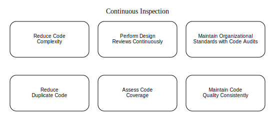

# **Sustained Code Quality Checks**  



Sustained Code Quality Checks rely on leveraging the collective expertise of a team and advanced tools to maintain high standards in software development.  

Peer-based code reviews are widely regarded as essential to improving the quality of codebases, offering opportunities for objective assessments by an additional set of eyes. Similarly, pair programming, a core practice in Extreme Programming (XP), provides continuous, real-time scrutiny. Static code analysis tools, such as Java's PMD and .NET's FxCop, also contribute by systematically scanning source files for predefined rule violations.  

However, the benefits of these practices diminish without consistent application. Human-driven methods like code reviews and pair programming, while effective, are prone to emotional bias, subjective evaluation, and fatigue. Even structured techniques like the Fagan inspection process can be hindered by interpersonal dynamics and time constraints.  

Static analysis tools, on the other hand, address these limitations. Once configured, these tools can run independently and repeatedly at minimal cost, offering unmatched consistency and objectivity. Computers avoid human pitfalls such as bias, negotiation, or distractions and can execute thorough inspections every time code changes are committed to a version control system. Moreover, these tools allow teams to customize rules based on project needs, ensuring they function as relentless code guardians—something human efforts cannot match.  

Automated inspections are particularly effective for distributed teams, ensuring consistent standards regardless of location or time zone. They scale seamlessly with larger codebases, efficiently applying hundreds of rules across files—a task that would overwhelm human reviewers.  

By automating up to 80% of the routine inspection workload, these tools allow developers to focus on the remaining 20% that truly requires human insight, such as assessing compliance with requirements or evaluating long-term maintainability. For instance, tools like Java's PMD can instantly flag critical violations such as excessive cyclomatic complexity, enabling targeted human intervention.  

Automation doesn't replace human reviews but complements them, ensuring manual efforts are focused on high-level, value-added aspects of the code. As software grows increasingly complex, these tools make inspections integral to continuous integration (CI) pipelines, enhancing both speed and accuracy.  

The seamless combination of automated and manual reviews creates a balanced and efficient approach to code quality, enabling teams to deliver robust and maintainable software at scale.  

## **How Do Inspection and Testing Differ?**  

Inspection and testing are two complementary approaches to evaluating software quality, but they differ in their methods and focus areas.  

**Testing** involves executing the software dynamically to validate its functionality and behavior. It operates on a running system, verifying outputs, identifying defects, and ensuring the software meets specified requirements. Examples include unit tests, component tests, and system tests, all of which actively interact with the code in operation.  

**Inspection**, on the other hand, is a static process that examines code without executing it. It relies on predefined rules, coding standards, or design guidelines to identify issues such as code duplication, architectural violations, or syntax inconsistencies. This evaluation can be carried out manually through code reviews or automated using static analysis tools.  

While both processes aim to uncover potential flaws, they do not modify the software directly. Instead, they highlight areas requiring attention, enabling developers to act on the findings and improve overall quality. Testing and inspection alone do not enhance software—they provide insights that, when addressed, drive improvement and reliability.

## **How Frequently Should Inspectors Be Run?**  

Running inspectors frequently minimizes the gap between detecting a defect and applying a fix, ultimately improving both efficiency and code quality. By automating the inspection process, teams can dedicate more time to solving problems rather than identifying them.  

Manual reviews are often limited to small, focused sections of code due to time constraints. This approach poses challenges: determining which areas to inspect, finding the time for reviews, and revisiting assumptions made during initial development. When defects are discovered weeks or months later, developers may struggle to recall the original logic or context, leading to delays in resolution.  

In contrast, running automated inspectors immediately after writing code ensures defects are caught early—often within minutes. This near-instant feedback loop allows for quick fixes, reduces the risk of introducing further issues, and prevents context from being lost. Automating inspections as part of the development workflow, alongside testing, builds a robust process that prioritizes early defect detection and correction.  

Modern Integrated Development Environments (IDEs) simplify this practice by offering built-in tools to identify issues like improper formatting, unused variables, or poor coding practices. While running these inspections locally is valuable, integrating them into automated builds and continuous integration (CI) pipelines ensures consistent, repeatable results and minimizes false positives.  

Incorporating frequent, automated inspections into your workflow creates a proactive development environment, reducing the likelihood of defects being introduced and significantly shortening the time to resolution.

## **The Evolution of Code Metrics**  

Several decades ago, researchers began analyzing code to identify measurable attributes that could predict software defects. The idea was simple yet promising: by recognizing patterns in problematic code, teams could establish models to catch potential issues early, long before they turned into critical defects. When applied effectively, this research yielded actionable insights for improving code quality.  

As this approach gained traction, others attempted to apply metrics to assess developer productivity. The logic seemed straightforward: “If Developer A produces more lines of code than Developer B, then Developer A must be more efficient and valuable.” However, this metric quickly proved problematic. For instance, lines of code (LOC) included non-functional content like comments, and it unintentionally encouraged inefficient, copy-paste coding practices.  

The flaws in this approach became evident when productivity metrics revealed a hidden reality: developers churning out large volumes of code were also introducing more defects. “Developer A’s contributions include a high defect rate, while Developer B, whose code volume was smaller, produced nearly error-free work.” Unfortunately, such oversights led to decisions like penalizing or dismissing developers who wrote higher-quality code simply because they produced fewer lines.  

The reliance on lines of code as a productivity indicator turned out to be an unmitigated failure—something that surprised managers but not developers. This period of misuse eventually gave way to a more refined understanding: code complexity, rather than sheer volume, was often the real obstacle to value. Acknowledging this shift paved the way for modern approaches that prioritize simplicity, maintainability, and defect reduction over raw output.

## **Minimize Code Complexity**  

Have you ever struggled to follow the logic in a lengthy method or a deeply nested conditional statement? If so, your intuition is correct—methods that are overly long or have excessive logical paths are not only difficult to understand but are also more prone to defects.  

Research has consistently shown a strong relationship between code complexity and defect rates. One widely recognized measurement of this complexity is the **Cyclomatic Complexity Number (CCN)**, which calculates the number of independent paths through a piece of code. Studies indicate that when a method’s CCN exceeds 10, the likelihood of defects increases significantly.  

Tools like **JavaNCSS** help quantify complexity by analyzing source code for metrics such as method length, class size, and cyclomatic complexity. For example, JavaNCSS can generate XML or HTML reports that highlight methods with high complexity values, enabling teams to identify problematic areas. A typical output might list large methods, such as a function with hundreds of lines of code and a CCN far exceeding recommended thresholds.  

### Addressing High Complexity  
When high cyclomatic complexity is detected, the first step is to check for corresponding **test cases**. Ideally, the number of test cases should match the CCN value to ensure comprehensive coverage. For instance, if a method has a CCN of 50, it should have roughly 50 test cases. While achieving exact parity may not always be realistic, even partial test coverage can significantly reduce risk.  

If no tests exist, creating them should be the immediate priority. Refactoring comes next, but only after tests are in place—adhering to the fundamental principle: **never refactor without tests**. Techniques like **method extraction** can break complex methods into smaller, more manageable, and testable units, effectively reducing overall complexity. These smaller methods should then be individually inspected and tested.  

### Monitoring Complexity Over Time  
In a continuous integration (CI) environment, complexity trends can be tracked and managed proactively. Tools like JavaNCSS, PMD, and Checkstyle allow teams to:  
- Monitor increases in cyclomatic complexity across methods.  
- Take preventive action if complexity grows, such as adding tests or refactoring.  
- Enforce organizational standards, such as acceptable method length and documentation practices.  

Additionally, a high number of inline code comments can signal complexity, as developers often feel compelled to explain convoluted logic.  

### Tools to Manage Complexity  
Beyond JavaNCSS, tools like **PMD** and **Checkstyle** provide robust rule sets to flag high complexity, long methods, and other code smells. Both tools integrate seamlessly with build systems like Maven and Ant, enabling automated reporting as part of the development workflow.  

### Key Takeaways  
Reducing code complexity is crucial to minimizing defects and ensuring maintainable software. By monitoring cyclomatic complexity, adding sufficient test coverage, and leveraging tools for regular inspections, teams can address complexity proactively. Refactoring methods into smaller, cleaner units improves testability, reduces long-term maintenance challenges, and leads to higher-quality code overall.

## Perform Design Reviews Continuously

**Conduct Continuous Design Reviews**  

One of the key challenges in software development is managing dependencies between components. When an object has numerous dependencies, it becomes fragile—any changes to its dependencies can cause unexpected failures. Similarly, modifying an object that other components rely on heavily can lead to widespread disruptions, often referred to as the **“collateral damage” effect**. Since change is inevitable, systems must be designed to adapt without being hindered by excessive coupling.  

To measure the degree of dependency, two important metrics are used:  
1. **Afferent Coupling (Fan-In)**: The number of objects or components that depend on a given object.  
2. **Efferent Coupling (Fan-Out)**: The number of dependencies an object has on other objects.  

Both metrics provide insights into the maintainability of a codebase. High **Afferent Coupling** indicates that an object carries significant responsibility—any modifications to it may affect many other parts of the system. Conversely, high **Efferent Coupling** reveals that an object relies too heavily on external components, making it susceptible to breakage when those components change.  

These two metrics can also be combined into a single measure known as **Instability**, calculated as:  

<div align="center">
    <math xmlns="http://www.w3.org/1998/Math/MathML">
        <mrow>
            <mi>Instability</mi>
            <mo>=</mo>
            <mfrac>
                <mrow>
                    <mi>Efferent Coupling</mi>
                </mrow>
                <mrow>
                    <mi>Efferent Coupling</mi>
                    <mo>+</mo>
                    <mi>Afferent Coupling</mi>
                </mrow>
            </mfrac>
        </mrow>
    </math>
</div>

An **Instability score** close to 1 signifies high fragility, while a score near 0 indicates stability.  

### Tools for Measuring Coupling  
- For the **.NET** ecosystem, tools like **NDepend** provide comprehensive reports on Afferent Coupling, Efferent Coupling, and Instability. These tools analyze assemblies and classes, highlighting areas that are brittle or overly coupled.  
- In the **Java** ecosystem, **JDepend** is a popular open-source tool that measures coupling at the package level. It integrates easily with build tools like Ant and Maven to generate reports in XML or HTML formats.  

### Practical Use of Coupling Metrics  
Understanding coupling metrics helps teams identify potential risks and prioritize maintenance efforts:  
1. Assemblies or components with **high Afferent Coupling** should have thorough test coverage to ensure reliability, given their broad impact on the system.  
2. Components with **high Efferent Coupling** require careful monitoring since they are more vulnerable to breaking when external dependencies change.  

By monitoring these metrics continuously in a **Continuous Integration (CI)** environment, teams can detect trends early and take action before problems escalate. For example:  
- **Add tests** to mitigate risks in components with high coupling values.  
- **Refactor** brittle or overburdened components to reduce their dependencies and improve flexibility.  
- Evaluate the long-term implications of coupling trends to inform architectural decisions.  

### Monitoring for the Long Run  
Regularly tracking coupling metrics enables teams to make proactive adjustments, ensuring the system remains maintainable and resilient to change. By integrating tools like NDepend or JDepend into your build pipelines, you can surface dependency risks early and address them systematically through testing and refactoring.  

Ultimately, continuous design reviews provide critical visibility into architectural health, enabling teams to balance flexibility, maintainability, and reliability in their codebase.

## **Enforce Organizational Standards with Code Audits**  

Coding standards are essential for maintaining consistency across a codebase, enabling teams to collaborate effectively and respond quickly to changes. Much like standardized car parts simplify repairs regardless of the vendor, a standardized code structure allows developers to easily understand and modify the system without relying on specific individuals or teams.  

While human-driven processes like code reviews and pair programming can help enforce coding standards, they do not scale efficiently for large teams or projects. Automated tools, on the other hand, can analyze code rapidly and thoroughly, applying hundreds of customizable rules with minimal intervention.  

In a **Continuous Integration (CI)** environment, automated code audits can be triggered whenever changes are pushed to a project’s repository. These tools can analyze individual files or the entire codebase, identifying deviations from predefined architectural and coding guidelines. Teams are notified immediately of any violations, allowing them to address issues before they escalate.  

For example, tools like **PMD** for Java include rules that catch a variety of common issues:  
- **Braces Usage**: Even though braces are optional in simple conditionals with one statement, omitting them can lead to logical errors when additional statements are added.  
- **Naming Conventions**: Nondescriptive method or variable names like `s` and `t` make code harder to read and maintain, especially if the original author is no longer available.  
- **Simplification**: Verbose code, though syntactically correct, can be flagged for refactoring to improve clarity and reduce complexity.  

### Example of Simplification:  
**Verbose Method:**  
```java  
public boolean validateAddress() {  
   if (this.getToAddress() != null) {  
         return true;  
   } else {  
         return false;  
   }  
}  
```  

**Refactored Method:**  
```java  
public boolean validateAddress() {  
   return (this.getToAddress() != null);  
}  
```  

Tools like **PMD**, **Checkstyle** (for Java), **FxCop** (for .NET), and **PyLint** (for Python) can produce detailed reports in formats like XML or HTML. These reports highlight rule violations, code complexity, and other metrics that are critical for identifying maintainability risks.  

### Benefits of Automated Code Audits:  
1. **Consistency**: Automated tools enforce coding standards uniformly across the entire codebase.  
2. **Early Detection**: Issues are flagged early, reducing the likelihood of long-term maintenance challenges.  
3. **Improved Readability**: By enforcing naming conventions and simplification rules, the code remains clean and understandable.  
4. **Efficiency**: Automated tools scale effortlessly, catching violations faster and more accurately than manual reviews.  

### Integration with CI Pipelines  
Incorporating automated code audits into CI workflows ensures ongoing compliance with organizational standards. Teams can monitor trends over time, such as complexity growth, and take corrective actions proactively.  

By continuously auditing code, teams foster a culture of quality and maintainability. Issues are identified early, technical debt is minimized, and development remains aligned with architectural and coding guidelines. This approach not only enhances productivity but also ensures the longevity and health of the codebase.


## **Eliminate Code Duplication**  

One of the most common shortcuts in software development is copying and pasting code instead of designing reusable and generalized solutions. Code duplication has been an issue since the early days of programming, and while advancements in programming paradigms—such as procedural, object-oriented, and aspect-oriented programming—have significantly reduced the need for duplication, the temptation to copy code persists. Often, developers are unaware of the duplication they introduce.  

Duplicated code can appear in various forms across a system, including:  
- **Database logic**: SQL queries, stored procedures, and views.  
- **Compiled languages**: Java, C, C++, and C#.  
- **Interpreted code**: JavaScript, Ruby, ASP, and JSP.  
- **Build scripts**: Makefiles and Ant build configurations.  
- **Configuration and data files**: XML, XSD, and other textual formats.  

Studies have shown that even large, widely used systems are not immune. For example, estimates indicated that early versions of the Linux kernel contained 15%–25% duplicated code, while the Sun Java JDK had duplication levels as high as 21%–29%.  

### Why Is Code Duplication a Problem?  
Duplicated code introduces several challenges:  
1. **Increased Maintenance Costs**: Bugs in duplicated code need to be identified, analyzed, and fixed multiple times across various instances.  
2. **Hidden Defects**: Duplicate code increases the risk of missed errors, as not all instances may be detected.  
3. **Testing Overhead**: The additional code requires more testing, increasing time and cost.  

### Tools to Detect Duplicate Code  
Several tools can help identify and eliminate code duplication by analyzing the codebase and generating detailed reports.  

#### **PMD Copy/Paste Detector (CPD)**  
PMD offers a built-in Copy/Paste Detector (CPD) that works with languages like Java, C/C++, PHP, and Ruby. It scans code for duplicated blocks based on configurable parameters like token counts, and it can ignore string literals and variable names to focus solely on structural duplication. PMD integrates seamlessly with build tools like Ant and Maven and can produce reports in text, XML, or CSV formats.  

**Sample Ant Task for CPD**:  
```xml  
<taskdef name="cpd" classname="net.sourceforge.pmd.cpd.CPDTask" classpathref="pmd.classpath" />  
<cpd minimumTokenCount="20" outputFile="cpd-results.xml" format="xml" ignoreLiterals="true">  
    <fileset dir="src">  
        <patternset refid="non.test.sources.pattern" />  
    </fileset>  
</cpd>  
```  
Here, `minimumTokenCount` specifies the threshold for identifying duplication, and options like `ignoreLiterals` and `ignoreIdentifiers` reduce false positives.  

#### **Simian**  
Simian is another powerful tool for detecting duplicate code. It supports languages like Java and C# and integrates easily into build pipelines. Simian allows developers to define thresholds (e.g., the minimum number of matching lines) to identify code blocks that warrant refactoring.  

**Sample Ant Task for Simian**:  
```xml  
<taskdef resource="simiantask.properties" classpathref="simian.classpath" />  
<simian threshold="4" language="java">  
    <fileset dir="src">  
        <include name="**/*.java" />  
        <exclude name="**/*Test*" />  
    </fileset>  
    <formatter type="xml" toFile="simian-results.xml" />  
</simian>  
```  
Simian can also transform its XML reports into HTML for easier review using XSLT stylesheets.  

### Addressing Code Duplication  
1. **Detect Early**: Use tools like PMD-CPD or Simian as part of the **Continuous Integration (CI)** pipeline to flag duplicate code as soon as it is introduced.  
2. **Refactor Duplicates**: Once duplication is identified, apply strategies like method extraction or creating shared utility classes to consolidate similar logic.  
3. **Monitor Trends**: Regularly review duplication reports to ensure duplication does not grow over time.  

### Benefits of Reducing Duplicate Code  
- **Easier Maintenance**: Updates and bug fixes need to be made only once.  
- **Improved Quality**: Reducing redundancy lowers the likelihood of inconsistencies and defects.  
- **Better Code Readability**: Consolidating similar logic makes the codebase cleaner and easier to understand.  

By leveraging automated tools and integrating them into the development workflow, teams can identify duplication early and refactor proactively. This approach reduces technical debt, improves code maintainability, and ensures a more efficient development process.


## Assess Code Coverage


**Evaluate Code Coverage**  

Code coverage is a critical metric for assessing the effectiveness of a test suite. It measures the extent to which code is exercised during testing, helping developers identify untested areas and improve overall reliability.  

The most common type of coverage measurement is **line coverage** (or statement coverage), which determines whether specific lines of code have been executed. By running a test suite, data is captured to indicate which parts of the codebase were "touched" during the test process. This data is then compiled into a coverage report, providing a clear picture of test completeness.  

For example, if a method contains 10 lines of code and 7 lines are executed during testing, the method achieves **70% line coverage**. The same principle applies to larger scopes:  
- If a class has 100 lines and 65 are exercised, line coverage is 65%.  
- If a codebase has 10,000 non-comment lines of code and tests cover 3,000 lines, overall coverage is 30%.  

In addition to line coverage, some tools measure **branch coverage** (also called path coverage). This metric focuses on decision points in the code, such as `if` and `else` statements. For instance, if a conditional block has two branches and tests execute both, the method achieves **100% branch coverage**.  

### Tools for Code Coverage  
Various tools are available to measure and report on code coverage:  
- **Java**: Common test harnesses like JUnit pair well with tools such as **Cobertura**, **EMMA**, and **Clover**.  
- **.NET**: NUnit serves as the testing framework, while tools like **NCover** and **Clover.NET** provide coverage analysis.  

For example, in a Maven-based Java project, tools like EMMA simplify code coverage assessment:  
1. The EMMA plugin is installed in the Maven plugin directory.  
2. The `emma` goal is executed, which compiles, instruments the source code, and runs the test suite.  
3. EMMA generates an **HTML report** that visually highlights coverage percentages, enabling teams to identify gaps quickly.  

### Why Code Coverage Matters  
1. **Identifies Untested Code**: Areas of the codebase that are not exercised by tests are more prone to defects.  
2. **Improves Confidence**: High coverage ensures critical logic and decision paths are validated.  
3. **Supports Refactoring**: With sufficient test coverage, teams can refactor code safely, knowing tests will catch regressions.  

### Interpreting Results  
While **100% coverage** is an ideal goal, achieving it is often impractical. Instead, teams should prioritize covering critical paths, decision points, and edge cases to maximize test effectiveness. Combining line coverage with branch coverage provides a more comprehensive view of test quality.  

By incorporating coverage tools into the **Continuous Integration (CI)** process, teams can automatically generate reports for every test run, ensuring coverage metrics are tracked over time. This proactive approach helps maintain test effectiveness as the codebase evolves, enabling teams to deliver more reliable and maintainable software.

## **Continuously Evaluate Code Quality**  

To maintain software quality, it’s essential to evaluate code continuously using tools like test coverage analysis. These tools help identify parts of the codebase that have not been adequately tested, ensuring that gaps are addressed proactively. However, it’s important not to overinterpret coverage metrics; they highlight untested areas but do not guarantee defect-free software.  

### Using Coverage Reports Effectively  
When reviewing a coverage report, focus on sections with low coverage. Ask why specific code hasn’t been exercised by tests and determine whether additional test cases are needed. This insight can help development and QA teams prioritize areas for manual testing and ensure the most critical parts of the system are thoroughly validated.  

In a **Continuous Integration (CI)** environment, coverage tools run alongside automated test suites. This process ensures newly added or modified code is consistently tested. For instance, if a package starts the week with 70% coverage but drops to 60%, it typically means:  
1. New code has been added without corresponding tests.  
2. Existing tests have been removed or no longer effectively cover the code.  

Regularly monitoring these reports allows teams to set realistic quality goals, such as maintaining a specific coverage percentage or balancing test-to-code ratios. If developers frequently omit tests, corrective actions—such as additional training, mentoring, or pair programming—can be implemented to reinforce best practices.  

### Managing Coverage Frequency  
Most code coverage tools instrument the codebase, adding overhead that can slow down test execution. This can impact CI pipelines, so it’s often better to integrate code coverage checks into a secondary or nightly build process.  

A tiered testing strategy can help balance performance and thoroughness:  
- **Unit Tests**: Run with every code commit.  
- **Component Tests**: Execute periodically throughout the day.  
- **System Tests with Coverage Enabled**: Run nightly to generate comprehensive reports.  

By running coverage tools during off-peak hours, such as overnight, teams can collect detailed insights without slowing development workflows. Tools like **Cobertura** for Java even support merging multiple coverage reports (unit, component, and system) into a single master report for clarity.  

**Example of Merging Coverage Reports**:  
```xml  
<target name="merge-coverage" depends="all-coverage-run">  
    <cobertura-merge datafile="${cobertura.all.ser}">  
        <fileset dir="${base.dir}">  
            <include name="${cobertura.unit.ser}" />  
            <include name="${cobertura.comp.ser}" />  
            <include name="${cobertura.sys.ser}" />  
        </fileset>  
    </cobertura-merge>  
    <mkdir dir="${cov.report.dir}" />  
    <cobertura-report format="html" datafile="${cobertura.all.ser}" destdir="${cov.report.dir}" srcdir="${src.dir}" />  
</target>  
```  

### Avoiding Performance Conflicts  
Running coverage-enabled tests alongside performance, stress, or load testing is counterproductive because coverage instrumentation affects execution speed. To avoid resource conflicts:  
- Exclude performance tests when generating coverage reports.  
- Schedule stress or load tests separately from coverage analysis.  

**Example of Excluding Tests in Coverage Runs**:  
```xml  
<batchtest todir="${testreportdir}">  
    <fileset dir="test/component">  
        <include name="**/*Test.*" />  
        <exclude name="**/*StressTest.java" />  
        <exclude name="**/BatchDepXMLReportPerfTest.java" />  
        <exclude name="**/BatchDepXMLReportLoadTest.java" />  
    </fileset>  
</batchtest>  
```  

### Key Benefits  
1. **Early Detection**: Identifying low coverage areas allows teams to target their testing efforts.  
2. **Improved Visibility**: Trends in test coverage over time help teams monitor progress and address gaps.  
3. **Informed Decisions**: Actionable insights guide improvements, ensuring coverage goals are met.  

By evaluating code quality continuously and refining the coverage process, teams can balance efficiency with thoroughness, ensuring reliable, well-tested software without disrupting performance or delivery timelines.
