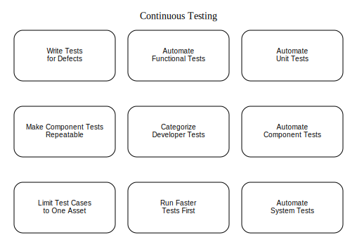

# **Ongoing Software Validation**



**Continuous Validation**  
"Practice makes perfect."  
—**English Proverb**

**Reliable**  
*adjective* — Producing consistent outcomes in repeated trials.

In systems engineering, the reliability of a linear system is calculated as the product of the reliability of each of its individual components. For instance, consider a simple system made up of three components, each with a reliability of 90%. While it might seem intuitive to assume the overall system reliability would also be 90%, this isn’t the case. The actual reliability is the product of all three components: 0.9 × 0.9 × 0.9 = 0.73, meaning the system is only 73% reliable.

Would you trust a bridge that's only 73% reliable? Or use a pen that works just 73% of the time? Such situations highlight the importance of ensuring reliability at the most basic level to achieve dependable systems. This principle was a cornerstone of the Japanese automotive industry’s success in the 1970s, as their manufacturers focused on achieving reliability at the component level. This attention to detail enabled them to outperform U.S. carmakers in terms of reliability.

Software systems introduce even more complexity. Unlike the linear systems described earlier, software systems are nonlinear, meaning reliability must also account for the connections between components. With most software systems having hundreds or thousands of components, achieving high reliability becomes exponentially more challenging. For instance, in a system with 100 components, each with 99% reliability, the overall reliability drops to just 37%.

To meet high reliability expectations, such as a near-perfect Service Level Agreement (SLA), software must ensure quality at the most granular level: individual components. This can only be accomplished through robust unit testing. However, simply writing unit tests is not enough; they must effectively evaluate the intended behavior of each component and be executed frequently.

Given the interconnected nature of software, even minor changes can impact other components. To mitigate this risk, tests should run automatically whenever modifications are introduced. Integrating continuous testing into a Continuous Integration (CI) pipeline ensures this process is seamless and efficient. Figure 6-2 illustrates how automated developer tests, triggered by an “Integrate” button, play a crucial role in establishing a fully automated build and CI environment.

## **Automated Validation of Individual Code Units**  

The term *“unit test”* is frequently misused, leading to misconceptions—particularly when developers claim their "unit tests take too long to execute." Establishing a precise definition of unit tests and categorizing them effectively can significantly enhance the efficiency of Continuous Integration (CI) systems, enabling faster and more reliable builds.  

**Unit tests** focus on verifying the behavior of the smallest functional pieces of a software system—typically individual functions, methods, or classes. While most unit tests are tightly scoped to a single class or function, occasional overlap occurs when additional classes are tightly coupled with the unit under test.

For different programming environments, frameworks like **JUnit** (Java), **Jest** (TypeScript), and **CUnit** (C/C++) serve as practical tools for writing and automating unit tests:  


### Example: Unit Testing with JUnit (Java)  
JUnit simplifies testing individual methods. The following verifies that a filter behaves correctly based on input strings:  

```java
import static org.junit.Assert.*;
import org.junit.Test;

public class RegexFilterTest {
    @Test
    public void testStarPattern() {
        RegexFilter filter = new RegexFilter("java.lang.*");

        assertTrue("Expected 'java.lang.String' to pass the filter", 
            filter.applyFilter("java.lang.String"));
        assertFalse("Expected 'org.junit.TestCase' to fail the filter", 
            filter.applyFilter("org.junit.TestCase"));
    }
}
```


### Example: Unit Testing with Jest (TypeScript)  
Jest, a widely used framework for JavaScript and TypeScript, enables rapid testing of isolated units.  

```typescript
describe('RegexFilter', () => {
  test('should correctly apply regex pattern', () => {
    const filter = new RegexFilter(/Google|Amazon/);

    expect(filter.applyFilter("Google")).toBe(true);
    expect(filter.applyFilter("Microsoft")).toBe(false);
  });
});
```


### Example: Unit Testing with CUnit (C/C++)  
CUnit is a lightweight tool for testing C and C++ functions in isolation:  

```c
#include <CUnit/CUnit.h>
#include <CUnit/Basic.h>

bool apply_filter(const char* input);

void test_apply_filter() {
    CU_ASSERT_TRUE(apply_filter("Google"));
    CU_ASSERT_FALSE(apply_filter("Microsoft"));
}

int main() {
    CU_initialize_registry();
    CU_pSuite suite = CU_add_suite("RegexFilterTest", NULL, NULL);
    CU_add_test(suite, "test_apply_filter", test_apply_filter);

    CU_basic_run_tests();
    CU_cleanup_registry();
    return 0;
}
```


### Key Attributes of Effective Unit Tests  
1. **Isolated Execution**: Unit tests should not depend on external systems like databases, APIs, or file systems, which often slow execution.  
2. **Fast and Lightweight**: They should run quickly to enable frequent testing during development.  
3. **Early Debugging**: Unit tests can be written and executed from the first day of development, ensuring rapid feedback and identifying bugs early.  
4. **Mocking Dependencies**: Mock objects replace complex external dependencies to keep tests focused and efficient.  

Automating unit tests ensures that individual components behave as expected and remain reliable as the system evolves. Frameworks like JUnit, Jest, and CUnit provide the tools necessary to validate code units effectively, forming the foundation of a robust CI pipeline. By focusing on small, isolated tests, developers can debug efficiently, reduce regression risks, and build highly reliable software systems.

## **Automating Component-Level Tests**  

**Component tests** (sometimes referred to as integration tests) validate interactions between larger sections of a software system, such as multiple classes, modules, or subsystems. Unlike unit tests, component tests often require external dependencies such as databases, file systems, or network endpoints to verify that components work together as expected. By exercising broader portions of code, these tests provide increased code coverage but typically run longer than unit tests.  

In component testing, frameworks such as **JUnit** (Java), **Jest** (TypeScript), and **CUnit** (C/C++) enable developers to validate interactions while connecting to databases like **AWS RDS** (Relational Database Service) and **Amazon DynamoDB** for persistence testing.


### Example: Component Test with JUnit and AWS RDS (Java)  
The following example uses JUnit to test a data access object (DAO) interacting with an **RDS MySQL** database:  

```java
import org.junit.BeforeClass;
import org.junit.Test;
import static org.junit.Assert.*;

import java.sql.Connection;
import java.sql.DriverManager;
import java.sql.PreparedStatement;
import java.sql.ResultSet;

public class WordDAOComponentTest {
    private static Connection connection;

    @BeforeClass
    public static void setup() throws Exception {
        connection = DriverManager.getConnection(
            "jdbc:mysql://aws-rds-instance-endpoint/words_db", 
            "username", "password");
        PreparedStatement stmt = connection.prepareStatement(
            "INSERT INTO words (word, definition) VALUES ('pugnacious', 'Combative in nature; belligerent.')");
        stmt.executeUpdate();
    }

    @Test
    public void testFindWord() throws Exception {
        WordDAO dao = new WordDAO(connection);
        String definition = dao.findDefinition("pugnacious");
        assertEquals("Combative in nature; belligerent.", definition);
    }
}
```

Here, the test interacts with a live AWS RDS instance to confirm that the DAO retrieves the correct word definition.


### Example: Component Test with Jest and DynamoDB (TypeScript)  
The following example demonstrates a Jest test that validates a service interacting with **DynamoDB**:  

```typescript
import { DynamoDB } from 'aws-sdk';
import WordService from './WordService';

const dynamoDB = new DynamoDB.DocumentClient();
const tableName = "WordsTable";

beforeAll(async () => {
  await dynamoDB.put({
    TableName: tableName,
    Item: { word: "pugnacious", definition: "Combative in nature; belligerent." },
  }).promise();
});

describe('WordService Component Test', () => {
  it('should retrieve the correct word definition', async () => {
    const service = new WordService(dynamoDB, tableName);
    const result = await service.getDefinition("pugnacious");
    expect(result).toBe("Combative in nature; belligerent.");
  });
});
```

This test inserts sample data into a **DynamoDB** table and verifies that the service correctly retrieves it.


### Example: Component Test with CUnit and AWS RDS (C)  
The following example uses CUnit to test a function that queries an **RDS MySQL** database:  

```c
#include <mysql/mysql.h>
#include <CUnit/CUnit.h>
#include <CUnit/Basic.h>

MYSQL *conn;

int init_suite(void) {
    conn = mysql_init(NULL);
    return (mysql_real_connect(conn, "aws-rds-endpoint", "user", "password", "words_db", 0, NULL, 0) == NULL);
}

int clean_suite(void) {
    mysql_close(conn);
    return 0;
}

void test_find_word() {
    MYSQL_RES *res;
    MYSQL_ROW row;

    mysql_query(conn, "SELECT definition FROM words WHERE word = 'pugnacious'");
    res = mysql_store_result(conn);
    row = mysql_fetch_row(res);

    CU_ASSERT_STRING_EQUAL(row[0], "Combative in nature; belligerent.");
    mysql_free_result(res);
}

int main() {
    CU_initialize_registry();
    CU_pSuite suite = CU_add_suite("WordDAOComponentTest", init_suite, clean_suite);
    CU_add_test(suite, "test_find_word", test_find_word);

    CU_basic_run_tests();
    CU_cleanup_registry();
    return 0;
}
```

This test connects to an AWS RDS database, queries it, and validates the response.


### Key Characteristics of Component Tests  
1. **External Dependencies**: Component tests may rely on live systems like databases (AWS RDS, DynamoDB), file systems, or APIs.  
2. **API Interaction**: Tests typically validate the behavior of components via exposed interfaces.  
3. **Broader Scope**: Unlike unit tests, component tests verify the interactions of multiple units working together.  
4. **Integration**: While they validate subsystems, they don’t necessarily test the entire application stack like system tests.  


By automating component tests, developers can ensure that systems behave correctly when integrated with critical dependencies. Tools like **JUnit**, **Jest**, and **CUnit** combined with cloud services such as **AWS RDS** and **DynamoDB** provide the ideal environment for building robust, scalable software.

Here's an extended version where **DynamoDB** replaces or complements the earlier database examples across **JUnit**, **Jest**, and **CUnit** for component testing.


## **Automating Component Tests with DynamoDB**

**Component tests** validate interactions between various units or modules in a software system, often requiring external dependencies like databases. DynamoDB, AWS's managed NoSQL database, is particularly useful for these tests because it is lightweight, scalable, and integrates well with testing tools.  

Below are examples for **Java (JUnit)**, **TypeScript (Jest)**, and **C/C++ (CUnit)** showcasing component tests that interact with **DynamoDB**.


### **Example: Component Test with JUnit and DynamoDB (Java)**  

This example uses the **AWS SDK for Java** to perform a component test of a `WordService` that interacts with DynamoDB.

```java
import com.amazonaws.services.dynamodbv2.AmazonDynamoDB;
import com.amazonaws.services.dynamodbv2.AmazonDynamoDBClientBuilder;
import com.amazonaws.services.dynamodbv2.document.DynamoDB;
import com.amazonaws.services.dynamodbv2.document.Table;
import com.amazonaws.services.dynamodbv2.model.*;
import org.junit.BeforeClass;
import org.junit.Test;
import static org.junit.Assert.*;

public class WordServiceDynamoDBTest {

    private static Table table;

    @BeforeClass
    public static void setup() throws Exception {
        AmazonDynamoDB client = AmazonDynamoDBClientBuilder.standard().withRegion("us-east-1").build();
        DynamoDB dynamoDB = new DynamoDB(client);

        String tableName = "WordsTable";

        // Create table
        CreateTableRequest request = new CreateTableRequest()
            .withTableName(tableName)
            .withKeySchema(new KeySchemaElement("word", KeyType.HASH))
            .withAttributeDefinitions(new AttributeDefinition("word", ScalarAttributeType.S))
            .withProvisionedThroughput(new ProvisionedThroughput(1L, 1L));
        client.createTable(request);

        table = dynamoDB.getTable(tableName);

        // Insert test data
        table.putItem(new com.amazonaws.services.dynamodbv2.document.Item()
            .withPrimaryKey("word", "pugnacious")
            .withString("definition", "Combative in nature; belligerent."));
    }

    @Test
    public void testFindDefinition() {
        WordService service = new WordService(table);
        String definition = service.findDefinition("pugnacious");
        assertEquals("Combative in nature; belligerent.", definition);
    }
}
```


### **Example: Component Test with Jest and DynamoDB (TypeScript)**  

This example uses **Jest** and the **AWS SDK v3 for JavaScript** to interact with DynamoDB.

```typescript
import { DynamoDBClient, PutItemCommand, GetItemCommand } from "@aws-sdk/client-dynamodb";
import WordService from "./WordService";

const client = new DynamoDBClient({ region: "us-east-1" });
const tableName = "WordsTable";

beforeAll(async () => {
  // Create table setup would typically be done here in actual automation
  await client.send(new PutItemCommand({
    TableName: tableName,
    Item: {
      word: { S: "pugnacious" },
      definition: { S: "Combative in nature; belligerent." }
    }
  }));
});

describe("WordService DynamoDB Component Test", () => {
  it("should fetch the correct definition from DynamoDB", async () => {
    const service = new WordService(client, tableName);
    const result = await service.getDefinition("pugnacious");
    expect(result).toBe("Combative in nature; belligerent.");
  });
});
```


### **Example: Component Test with CUnit and DynamoDB (C/C++)**  

This example uses the **AWS SDK for C++** to interact with DynamoDB.  

**Prerequisite:** Install and configure the AWS SDK for C++.

```c
#include <aws/core/Aws.h>
#include <aws/dynamodb/DynamoDBClient.h>
#include <aws/dynamodb/model/PutItemRequest.h>
#include <aws/dynamodb/model/GetItemRequest.h>
#include <CUnit/CUnit.h>
#include <CUnit/Basic.h>

Aws::SDKOptions options;
Aws::DynamoDB::DynamoDBClient* client;

int init_suite(void) {
    Aws::InitAPI(options);
    client = new Aws::DynamoDB::DynamoDBClient();
    Aws::DynamoDB::Model::PutItemRequest request;
    request.SetTableName("WordsTable");
    request.AddItem("word", Aws::DynamoDB::Model::AttributeValue("pugnacious"));
    request.AddItem("definition", Aws::DynamoDB::Model::AttributeValue("Combative in nature; belligerent."));
    client->PutItem(request);
    return 0;
}

int clean_suite(void) {
    delete client;
    Aws::ShutdownAPI(options);
    return 0;
}

void test_get_word_definition() {
    Aws::DynamoDB::Model::GetItemRequest request;
    request.SetTableName("WordsTable");
    request.AddKey("word", Aws::DynamoDB::Model::AttributeValue("pugnacious"));

    auto outcome = client->GetItem(request);
    CU_ASSERT(outcome.IsSuccess());
    CU_ASSERT_STRING_EQUAL(outcome.GetResult().GetItem().at("definition").GetS().c_str(), 
                           "Combative in nature; belligerent.");
}

int main() {
    CU_initialize_registry();
    CU_pSuite suite = CU_add_suite("WordServiceDynamoDBTest", init_suite, clean_suite);
    CU_add_test(suite, "test_get_word_definition", test_get_word_definition);
    CU_basic_run_tests();
    CU_cleanup_registry();
    return 0;
}
```


## **Key Insights for DynamoDB Component Tests**  
1. **Isolation**: Use separate test tables or prefixes to isolate test data.  
2. **Data Seeding**: Seed the database with controlled inputs to ensure predictable results.  
3. **AWS SDKs**: Utilize the AWS SDKs for your respective language to interact with DynamoDB.  
4. **Cleanup**: Ensure cleanup after test execution to avoid resource leaks.  

By automating component tests with DynamoDB, developers can validate the behavior of integrated components with a lightweight, cloud-native persistence layer. Frameworks like **JUnit**, **Jest**, and **CUnit** provide robust tools to streamline this process across Java, TypeScript, and C/C++.

**Automating End-to-End System Tests**

**System tests** validate the behavior of an entire software system by exercising all its components as a cohesive unit. These tests require a fully deployed system environment, including essential infrastructure like web servers, databases, and application containers. System tests typically focus on ensuring that external interfaces—such as web pages, APIs, and graphical user interfaces (GUIs)—function as expected from start to finish.

Compared to unit and component tests, system tests are more resource-intensive, often requiring longer runtimes and more complex setup. However, by automating lower-level tests (unit and component), most smaller issues are identified early in the development lifecycle. This allows system tests to focus on higher-level integration issues and can be scheduled to run at longer intervals, such as during nightly builds or secondary integration phases.


### **Key Characteristics of System Tests**  
1. **End-to-End Validation**: Verifies the entire application workflow, including interactions between subsystems.  
2. **External Interfaces**: Tests interfaces like HTTP endpoints, RESTful APIs, and user-facing components.  
3. **Prolonged Execution**: Longer execution times necessitate careful scheduling, such as overnight or during non-peak hours.  
4. **Mimics Production Usage**: Ensures the software behaves as intended in a near-production environment.


### **Example: System Test with Selenium (Java)**  
Selenium drives a browser to simulate real user interactions with a web application.

```java
import org.openqa.selenium.By;
import org.openqa.selenium.WebDriver;
import org.openqa.selenium.WebElement;
import org.openqa.selenium.chrome.ChromeDriver;
import org.junit.AfterClass;
import org.junit.BeforeClass;
import org.junit.Test;

import static org.junit.Assert.assertTrue;

public class LoginSystemTest {
    private static WebDriver driver;

    @BeforeClass
    public static void setUp() {
        System.setProperty("webdriver.chrome.driver", "/path/to/chromedriver");
        driver = new ChromeDriver();
        driver.get("http://example.com/login");
    }

    @Test
    public void testLoginSuccess() {
        WebElement username = driver.findElement(By.id("username"));
        WebElement password = driver.findElement(By.id("password"));
        WebElement loginButton = driver.findElement(By.id("login"));

        username.sendKeys("testuser");
        password.sendKeys("testpassword");
        loginButton.click();

        assertTrue(driver.getPageSource().contains("Welcome, testuser"));
    }

    @AfterClass
    public static void tearDown() {
        driver.quit();
    }
}
```


### **Example: System Test with Playwright (TypeScript)**  
Playwright enables automated browser testing for end-to-end workflows.

```typescript
import { test, expect } from '@playwright/test';

test('successful login test', async ({ page }) => {
  await page.goto('http://example.com/login');

  // Fill in login form
  await page.fill('#username', 'testuser');
  await page.fill('#password', 'testpassword');
  await page.click('#login');

  // Verify successful login
  const welcomeMessage = await page.textContent('h1');
  expect(welcomeMessage).toContain('Welcome, testuser');
});
```


### **Example: System Test with CUnit and REST API (C/C++)**  
This example tests the end-to-end behavior of a backend API.

```c
#include <curl/curl.h>
#include <CUnit/CUnit.h>
#include <CUnit/Basic.h>

void test_api_login() {
    CURL *curl = curl_easy_init();
    CURLcode res;

    if (curl) {
        curl_easy_setopt(curl, CURLOPT_URL, "http://example.com/api/login");
        curl_easy_setopt(curl, CURLOPT_POSTFIELDS, "username=testuser&password=testpassword");

        res = curl_easy_perform(curl);

        CU_ASSERT_EQUAL(res, CURLE_OK);
        curl_easy_cleanup(curl);
    } else {
        CU_FAIL("Failed to initialize CURL");
    }
}

int main() {
    CU_initialize_registry();
    CU_pSuite suite = CU_add_suite("SystemTests", NULL, NULL);

    CU_add_test(suite, "test_api_login", test_api_login);

    CU_basic_run_tests();
    CU_cleanup_registry();
    return 0;
}
```


### **Benefits of Automating System Tests**  
1. **End-to-End Confidence**: Ensures that the application behaves correctly under real-world scenarios.  
2. **Improved Reliability**: Detects integration or deployment issues that unit and component tests may miss.  
3. **Automation Efficiency**: Tools like Selenium, Playwright, and CURL provide a framework to automate end-to-end workflows.  
4. **Reduced Manual Testing**: Streamlines repetitive validation tasks for interfaces and user flows.


By automating system tests, teams can validate complete workflows across all system components, ensuring the application delivers the desired behavior under realistic conditions. Frameworks like **Selenium**, **Playwright**, and tools such as **CURL** enable the creation of robust end-to-end tests that enhance software quality and reliability.

## **Automating Functional Testing**

**Functional tests** validate the behavior of an application as experienced by an end user or client. These tests simulate real-world usage by replicating workflows and interactions, ensuring the system meets business and user requirements. Functional tests are often referred to as **acceptance tests** because they confirm that the system operates as expected from the client's perspective.  

Unlike unit or component tests, functional tests verify the system's high-level features and workflows, typically interacting with user interfaces (UIs), APIs, or other client-facing components.


### Key Characteristics of Functional Tests  
1. **End-User Simulation**: Functional tests mimic user actions and verify that workflows behave as expected.  
2. **Workflow-Based Testing**: Functional tests follow real-world scenarios, such as logging in, submitting forms, or completing transactions.  
3. **Tool Support**: Tools like **Selenium**, **Cypress**, and **Playwright** are widely used to automate browser-based functional tests.  
4. **Non-Technical Authoring**: Many functional testing tools use table-based or script-free test models, allowing non-developers to contribute to testing.  


### Example: Functional Test Using Selenium (Java)  

This Selenium example automates a login workflow and validates expected outcomes:  

```java
import org.junit.AfterClass;
import org.junit.BeforeClass;
import org.junit.Test;
import org.openqa.selenium.By;
import org.openqa.selenium.WebDriver;
import org.openqa.selenium.WebElement;
import org.openqa.selenium.chrome.ChromeDriver;

import static org.junit.Assert.assertTrue;

public class FunctionalLoginTest {
    private static WebDriver driver;

    @BeforeClass
    public static void setUp() {
        System.setProperty("webdriver.chrome.driver", "/path/to/chromedriver");
        driver = new ChromeDriver();
        driver.get("http://example.com/");
    }

    @Test
    public void testSuccessfulLogin() {
        // Navigate to login page
        driver.findElement(By.linkText("Log In")).click();

        // Perform login
        driver.findElement(By.id("inputUserId")).sendKeys("admin");
        driver.findElement(By.id("inputPassword")).sendKeys("admin");
        driver.findElement(By.id("loginSubmit")).click();

        // Verify success
        assertTrue(driver.getPageSource().contains("Logout"));

        // Logout and confirm
        driver.findElement(By.linkText("Logout")).click();
        assertTrue(driver.getPageSource().contains("Log In"));
    }

    @AfterClass
    public static void tearDown() {
        driver.quit();
    }
}
```


### Example: Functional Test Using Cypress (TypeScript)  

This Cypress example validates the same login workflow using modern functional testing tools:  

```typescript
describe('Functional Login Test', () => {
  it('should log in and log out successfully', () => {
    // Open application
    cy.visit('http://example.com/');

    // Navigate to login page
    cy.contains('Log In').click();

    // Fill out login form
    cy.get('#inputUserId').type('admin');
    cy.get('#inputPassword').type('admin');
    cy.get('#loginSubmit').click();

    // Verify successful login
    cy.contains('Logout').should('be.visible');

    // Perform logout
    cy.contains('Logout').click();
    cy.contains('Log In').should('be.visible');
  });
});
```


### Example: Functional Test Using CURL (C/C++)  

For functional tests interacting with APIs, CURL automates HTTP interactions:  

```c
#include <CUnit/CUnit.h>
#include <CUnit/Basic.h>
#include <curl/curl.h>

void test_api_login_functional() {
    CURL *curl = curl_easy_init();
    CURLcode res;

    if (curl) {
        curl_easy_setopt(curl, CURLOPT_URL, "http://example.com/api/login");
        curl_easy_setopt(curl, CURLOPT_POSTFIELDS, "username=admin&password=admin");

        res = curl_easy_perform(curl);
        CU_ASSERT_EQUAL(res, CURLE_OK);

        // Perform assertion based on API response
        curl_easy_cleanup(curl);
    } else {
        CU_FAIL("Failed to initialize CURL");
    }
}

int main() {
    CU_initialize_registry();
    CU_pSuite suite = CU_add_suite("FunctionalTests", NULL, NULL);
    CU_add_test(suite, "test_api_login_functional", test_api_login_functional);

    CU_basic_run_tests();
    CU_cleanup_registry();
    return 0;
}
```


### Benefits of Automating Functional Tests  
1. **End-to-End Validation**: Ensures critical workflows meet business goals.  
2. **Improved Accuracy**: Automation eliminates human error in repetitive manual testing.  
3. **Cross-Browser Testing**: Tools like Selenium and Cypress allow testing across multiple browsers.  
4. **Non-Developer Friendly**: Table-based or low-code functional testing frameworks allow QA teams to write tests without coding expertise.  


By automating functional tests, teams validate the application's overall functionality from the user's perspective. Tools such as **Selenium**, **Cypress**, and **CURL** enable robust testing of user-facing interfaces and workflows, ensuring the system meets functional requirements and delivers a seamless experience to clients.

## **Organize and Categorize Developer Tests**

While writing and executing tests is critical for ensuring software quality, it’s equally important to **structure and categorize** them effectively. Without clear organization, tests can quickly become overwhelming and counterproductive as projects grow. Treating tests as an integral part of the system architecture—rather than as an afterthought—allows developers to maximize their value while keeping build times manageable.

As the codebase expands, running all tests continuously can become time-intensive and resource-draining. Categorizing tests into distinct groups—such as **unit tests**, **component tests**, **system tests**, and **functional tests**—allows teams to prioritize execution based on speed and scope.  


### **Benefits of Categorizing Tests**  
1. **Faster Feedback**: Unit tests, which execute quickly, can run whenever code is committed, providing immediate feedback.  
2. **Optimized Build Pipelines**: Slower-running tests like system or functional tests can be scheduled at periodic intervals, such as during nightly builds or after integration builds.  
3. **Resource Efficiency**: Avoid unnecessary delays in notifying developers of build issues, particularly in Continuous Integration (CI) pipelines.  
4. **Improved Maintainability**: A well-structured directory and naming convention makes locating, organizing, and managing tests far simpler.  


### **Categorizing Tests: Practical Approach**  

Modern testing frameworks like **JUnit** (Java), **TestNG**, **NUnit** (.NET), or Jest (JavaScript/TypeScript) simplify test categorization using annotations, tags, or configurations. When such tools are unavailable, developers can use **naming conventions** or **directory structures** to logically group tests.  


### **Example: Organizing Tests with JUnit (Java)**  

JUnit 5 provides tags that make it easy to group tests and run specific categories:  

```java
import org.junit.jupiter.api.Tag;
import org.junit.jupiter.api.Test;

import static org.junit.jupiter.api.Assertions.assertTrue;

public class CategorizedTests {

    @Test
    @Tag("unit")
    public void testUnitLevel() {
        assertTrue(true); // Fast, isolated test
    }

    @Test
    @Tag("component")
    public void testComponentLevel() {
        // Simulates component behavior with dependencies
        assertTrue(true);
    }

    @Test
    @Tag("system")
    public void testSystemLevel() {
        // Tests end-to-end system behavior
        assertTrue(true);
    }
}
```

To run specific categories:  
```bash
mvn test -Dgroups="unit"  # Runs only unit tests
mvn test -Dgroups="system"  # Runs only system tests
```


### **Example: Directory Structure for Categorized Tests**  

A project directory can be organized as follows:  

```
project-root/
    src/              # Application source code
    test/             # Root test directory
        unit/         # Unit tests
        component/    # Component-level tests
        system/       # System tests
        functional/   # Functional tests (e.g., Selenium)
    build.xml         # Build file for Ant or other CI tool
```

For example:  
```
test/
    unit/
        WordServiceTest.java
    component/
        WordComponentTest.java
    system/
        system/
            com/
                example/
                    AccountSystemTest.java
    functional/
        LoginFunctionalTest.java
```


### **Example: Categorizing Tests with Jest (TypeScript)**  

Jest provides tagging through file naming conventions and test descriptions:  

```typescript
describe('Unit Tests', () => {
  test('should run a quick test', () => {
    expect(true).toBe(true);
  });
});

describe('Component Tests', () => {
  test('should test component behavior', () => {
    expect(2 + 2).toBe(4);
  });
});

describe('System Tests', () => {
  test('should validate end-to-end behavior', async () => {
    const result = await fetch('http://example.com/api/test');
    expect(result.status).toBe(200);
  });
});
```

**Directory Example**:  
```
tests/
    unit/          # Unit tests
    component/     # Component tests
    system/        # System tests
```


### **Automating Categorization in CI Pipelines**  

Once tests are categorized, CI tools like Jenkins, GitHub Actions, or Azure Pipelines can execute tests in stages:  

1. **Fast Feedback**: Run unit tests on every commit.  
2. **Intermediate Validation**: Execute component tests during commit builds.  
3. **Comprehensive Verification**: Run system and functional tests during nightly or scheduled builds.  

**Example CI Pipeline Configuration (Jenkinsfile):**  
```groovy
pipeline {
    stages {
        stage('Unit Tests') {
            steps {
                sh 'mvn test -Dgroups=unit'
            }
        }
        stage('Component Tests') {
            steps {
                sh 'mvn test -Dgroups=component'
            }
        }
        stage('System Tests') {
            steps {
                sh 'mvn test -Dgroups=system'
            }
        }
    }
}
```


### **Conclusion**  

By categorizing developer tests into logical groups, teams can optimize their CI pipelines, reduce build times, and provide faster feedback. Whether achieved through annotations, tags, or directory structures, a well-organized testing strategy ensures tests are executed efficiently and at appropriate intervals. This systematic approach allows developers to maintain high-quality code without compromising productivity or delaying releases.

## **Prioritize Fast-Running Tests**  

In most software builds, the majority of runtime is consumed by tests, with **slower tests**—such as those that rely on databases, file systems, or fully deployed systems—contributing the most overhead. By classifying tests into categories like **unit tests**, **component tests**, and **system tests**, teams can design a build pipeline that runs tests incrementally rather than executing every test simultaneously. This approach significantly improves feedback speed and resource efficiency.  


### **Test Execution Order**  

1. **Unit Tests**  
   - **Scope**: Validate individual methods or classes in complete isolation.  
   - **Execution Speed**: Lightning-fast; each test completes in milliseconds.  
   - **Priority**: Unit tests should run immediately after every commit (as part of the CI pipeline's commit build).  
   - **Rationale**: Rapid feedback allows developers to catch small errors early before they cascade into larger issues. A unit test taking more than a fraction of a second likely involves external dependencies and should be re-evaluated.  

   **Example (JUnit, Java):**  
   ```java
   @Test
   public void testAddition() {
       Calculator calc = new Calculator();
       assertEquals(4, calc.add(2, 2));
   }
   ```
   **Key Point**: Unit tests require no external setup, enabling immediate execution and quick results.  


2. **Component Tests**  
   - **Scope**: Verify interactions between multiple units, often involving lightweight dependencies like mock databases or external services.  
   - **Execution Speed**: Slower than unit tests due to setup and teardown of dependencies.  
   - **Priority**: Run component tests as part of a **secondary build** or after the commit build. For smaller projects, lightweight component tests can be included with the commit build.  
   - **Rationale**: While slower than unit tests, component tests provide broader coverage and validate functionality beyond individual units.  

   **Example (Jest, TypeScript):**  
   ```typescript
   test('Component interacts with DB mock', async () => {
       const dbMock = jest.fn().mockResolvedValue([{ word: 'pugnacious', partOfSpeech: 'adj' }]);
       const result = await WordService.getWord('pugnacious', dbMock);
       expect(result.partOfSpeech).toBe('adj');
   });
   ```
   **Key Point**: Component tests should run at a frequency that balances speed with thoroughness, ensuring reliable integrations without excessive overhead.


3. **System Tests**  
   - **Scope**: Validate end-to-end workflows across the entire software system, including fully deployed environments, databases, and APIs.  
   - **Execution Speed**: Slowest due to system complexity and environment setup.  
   - **Priority**: Schedule system tests during periodic builds, such as nightly runs or secondary integration builds.  
   - **Rationale**: Running system tests after unit and component tests ensures that lower-level issues are identified first, minimizing redundant failures and delays.

   **Example (Selenium, Java):**  
   ```java
   @Test
   public void testSuccessfulLogin() {
       driver.get("http://example.com");
       driver.findElement(By.id("username")).sendKeys("admin");
       driver.findElement(By.id("password")).sendKeys("admin");
       driver.findElement(By.id("loginSubmit")).click();
       assertTrue(driver.getPageSource().contains("Welcome, admin"));
   }
   ```

   **Key Point**: System tests offer comprehensive validation but should be reserved for longer-running build cycles or off-hours.


### **Why Run Faster Tests First?**  
- **Quick Feedback Loop**: Faster unit tests immediately identify small, isolated issues, allowing developers to address them quickly.  
- **Resource Optimization**: Slower tests, such as system tests, can be deferred to later stages, ensuring that resources are allocated efficiently.  
- **Improved CI Pipelines**: Categorizing tests and staging their execution keeps CI builds fast and responsive, preventing delays that impact developer productivity.  


### **Best Practices for Optimizing Test Execution**  
1. **Categorize Tests**: Organize unit, component, and system tests into separate directories or use tags/annotations to group them logically.  
   ```
   project-root/
       tests/
           unit/          # Unit tests
           component/     # Component tests
           system/        # System tests
   ```  

2. **Run Tests in Stages**:  
   - Unit tests: Run **on every commit**.  
   - Component tests: Run **periodically** or as part of secondary builds.  
   - System tests: Run during **nightly builds** or when the system reaches a stable checkpoint.  

3. **Leverage CI Tools**: Tools like **Jenkins**, **GitHub Actions**, and **Azure Pipelines** allow teams to define separate stages for each test category, ensuring faster builds.  

   **Example Jenkins Pipeline:**  
   ```groovy
   pipeline {
       stages {
           stage('Unit Tests') {
               steps { sh 'mvn test -Dgroups=unit' }
           }
           stage('Component Tests') {
               steps { sh 'mvn test -Dgroups=component' }
           }
           stage('System Tests') {
               steps { sh 'mvn test -Dgroups=system' }
           }
       }
   }
   ```


### **Conclusion**  
By running **faster tests first**—starting with unit tests, followed by component and system tests—teams can optimize build times, accelerate feedback, and ensure a smooth Continuous Integration process. This incremental approach enables developers to detect and resolve issues at the most efficient stage, improving software quality while keeping builds manageable and responsive.

## **Write Tests to Prevent Recurring Defects**

While thorough developer testing and Continuous Integration (CI) practices help reduce the likelihood of defects, errors are inevitable in any software development process. The key to long-term success is not just fixing defects when they occur but also ensuring they never reappear. When a defect is identified, the process of addressing it should include writing a test that exposes the issue—this guarantees that the same bug cannot resurface undetected.  


### **Why Write Tests for Defects?**  
1. **Expose the Issue**: Writing a test that reproduces the defect verifies the problem and confirms the exact conditions under which it occurs.  
2. **Prevent Regression**: Once the defect is fixed, the test serves as a regression safeguard, ensuring the fix is not inadvertently broken in the future.  
3. **Improve Test Coverage**: Defects often appear in overlooked or untested parts of the codebase, so addressing them increases overall coverage.  
4. **Drive Code Quality**: Treating defect fixes as opportunities for learning and improvement strengthens code resilience.


### **Step-by-Step Approach to Handling Defects**  

1. **Isolate the Issue**: Identify and isolate the faulty code that caused the defect.  
2. **Write a Test That Reproduces the Defect**: Create a failing test case that replicates the behavior described in the bug report.  
3. **Fix the Defect**: Update the code to correct the issue.  
4. **Update the Test**: Modify the test to assert the expected behavior after the fix is applied.  
5. **Ensure the Test Passes**: Verify that the test now succeeds and serves as a permanent guardrail against regression.


### **Example Process: Java Test Case with JUnit**  

**Original Defect**: A `findWord` method throws an `IndexOutOfBoundsException` when no results are returned from the database.  

**Step 1: Write a Failing Test That Reproduces the Issue**  
```java
@Test
public void testFindNonExistentWord() throws Exception {
    WordDAOImpl dao = new WordDAOImpl();
    try {
        dao.findWord("nonexistent"); // Input that triggers the defect
        fail("Expected an exception for non-existent word");
    } catch (FindException ex) {
        assertTrue("Exception should wrap IndexOutOfBoundsException",
            ex.getCause() instanceof IndexOutOfBoundsException);
    }
}
```
This test exposes the defect by triggering the exact conditions that cause the unexpected behavior.


**Step 2: Fix the Code**  
Modify the `findWord` method to check for an empty list before accessing its elements:  

```java
public IWord findWord(String word) throws FindException {
    Session sess = null;
    try {
        sess = WordDAOImpl.sessFactory.getHibernateSession();
        Query qry = sess.getNamedQuery("word.finder.bySpelling");
        qry.setString("spelling", word);

        List<IWord> result = qry.list();
        IWord wordResult = result.isEmpty() ? null : result.get(0);

        sess.close();
        return wordResult;
    } catch (Throwable thr) {
        try { sess.close(); } catch (Exception e) {}
        throw new FindException("Error finding word: " + word, thr);
    }
}
```


**Step 3: Update the Test to Verify the Fix**  
Update the test case to confirm that the method now handles the edge case gracefully by returning `null` instead of throwing an exception:  

```java
@Test
public void testFindNonExistentWord() throws Exception {
    WordDAOImpl dao = new WordDAOImpl();
    IWord word = dao.findWord("nonexistent");
    assertNull("Should return null for non-existent word", word);
}
```


### **The Value of Tests for Defects**  

By writing tests that reproduce and verify defects, you achieve two important goals:  
1. **Defect Resolution**: You ensure the issue is fixed.  
2. **Defect Prevention**: The test becomes part of the automated test suite, preventing the bug from reoccurring in future code changes.  


### **Best Practices for Writing Tests for Defects**  
1. **Reproduce the Problem First**: Always write a test that fails due to the defect before fixing the code.  
2. **Document Edge Cases**: Use the test to assert behavior under edge cases that might have been overlooked previously.  
3. **Avoid Assumptions**: Test the actual reported defect behavior instead of guessing the outcome.  
4. **Update Tests After Fixing**: Ensure the test asserts the corrected behavior explicitly.  
5. **Integrate into CI**: Add the new test to your Continuous Integration pipeline to catch regressions immediately.  


### **Conclusion**  

Writing tests for defects ensures that bugs, once fixed, remain fixed. This process turns each discovered defect into an opportunity for improvement, increasing confidence in the software's stability. By combining defect resolution with rigorous testing practices, teams can avoid repeated issues and maintain a more reliable, defect-free system.

## **Ensuring Component Tests are Repeatable**

Component tests often require **external dependencies** such as databases, file systems, or network services. While these dependencies enable component tests to validate real interactions between units, they also introduce challenges like ensuring tests are repeatable across different environments. A repeatable test must produce consistent results regardless of where or when it runs, making it crucial for reliable automation and CI pipelines.  


### **Why Repeatability Matters**  
1. **Consistency**: A repeatable test eliminates flakiness, ensuring the same input consistently yields the same output.  
2. **CI Integration**: Repeatable tests are essential for Continuous Integration (CI) systems to maintain reliable build processes.  
3. **Environment Independence**: Repeatability ensures tests can run across diverse environments—developer workstations, test servers, or CI pipelines—without modification.  
4. **Debugging Efficiency**: A predictable and reproducible test simplifies defect identification and resolution.  


### **Techniques for Repeatable Component Tests**

1. **Seed Databases with Controlled Data**  
   To make database-dependent tests repeatable, frameworks like **DbUnit** (Java), **NDbUnit** (.NET), and **PDbSeed** (Python) can seed databases with controlled datasets. These tools allow test data to be loaded, cleaned, or reset automatically, ensuring a predictable environment.

   **Example: DbUnit Configuration for Java**  

   ```java
   public class WordDAOImplTest extends DatabaseTestCase {
       @Override
       protected IDataSet getDataSet() throws Exception {
           return new FlatXmlDataSetBuilder().build(
               new File("test/conf/words-seed.xml"));
       }

       @Override
       protected IDatabaseConnection getConnection() throws Exception {
           return new DatabaseConnection(
               DriverManager.getConnection("jdbc:mysql://localhost/words", "user", "password"));
       }

       @Test
       public void testFindWord() throws Exception {
           WordDAOImpl dao = new WordDAOImpl();
           IWord word = dao.findWord("pugnacious");
           assertNotNull("Word should not be null", word);
           assertEquals("Combative in nature; belligerent.", word.getDefinition());
       }
   }
   ```

   **Key Points**:
   - Use XML (or similar formats) to seed the database before running tests.
   - Reset the database state after tests to ensure isolation.


2. **Avoid Hard-Coded Configurations**  
   Hard-coded connection strings and environment-specific configurations can break tests in CI pipelines or on other machines. Instead:
   - **Centralize Configurations**: Store database credentials and URLs in external configuration files or environment variables.
   - **Reuse Application Settings**: Read the same configuration files used by the production application to eliminate duplication.

   **Example: Reusing Hibernate Configuration**  

   ```java
   public static IDatabaseConnection getDBConnection() throws Exception {
       Configuration config = new Configuration().configure();
       String url = config.getProperty("hibernate.connection.url");
       String user = config.getProperty("hibernate.connection.username");
       String pass = config.getProperty("hibernate.connection.password");

       return new DatabaseConnection(
           DriverManager.getConnection(url, user, pass));
   }
   ```


3. **Reset Test State Before and After Execution**  
   - **Clean Inserts**: Use database seeding tools to reset tables to a known state before tests.  
   - **Tear Down**: Clear or rollback any changes after tests are completed to maintain repeatability.

   **Example: Clean Database Before Tests (DbUnit)**  

   ```java
   @Override
   protected DatabaseOperation getSetUpOperation() {
       return DatabaseOperation.CLEAN_INSERT;
   }

   @Override
   protected DatabaseOperation getTearDownOperation() {
       return DatabaseOperation.DELETE_ALL;
   }
   ```


4. **Leverage Mocks or In-Memory Databases for Simplicity**  
   When full database integration isn’t required, replace dependencies with **mocks** or **in-memory databases**. For example:
   - Use **H2** or **SQLite** for lightweight in-memory testing.  
   - Mock external dependencies with tools like **Mockito** (Java) or **NSubstitute** (.NET).

   **Example: Replace MySQL with H2 for Testing**  

   ```xml
   <property name="hibernate.connection.url">jdbc:h2:mem:testdb</property>
   <property name="hibernate.connection.driver_class">org.h2.Driver</property>
   <property name="hibernate.connection.username">sa</property>
   <property name="hibernate.connection.password"></property>
   ```


5. **Abstract Common Test Utilities**  
   Use base classes or utility classes to centralize the setup and teardown logic for repeated tasks like database initialization.  

   **Example: Abstract Base Test Class**  

   ```java
   public abstract class BaseDbUnitTest extends DatabaseTestCase {
       @Override
       protected IDatabaseConnection getConnection() throws Exception {
           return DbUnitConfigurator.getDBConnection();
       }

       @Override
       protected abstract IDataSet getDataSet();
   }
   ```

   Derived test cases can simply provide the dataset:

   ```java
   public class WordDAOImplTest extends BaseDbUnitTest {
       @Override
       protected IDataSet getDataSet() throws Exception {
           return new FlatXmlDataSetBuilder().build(new File("test/seed/words.xml"));
       }
   }
   ```


### **Best Practices for Repeatable Component Tests**  
1. **Isolate Tests**: Ensure each test runs independently and does not rely on data left behind by other tests.  
2. **Automate Database State Management**: Use tools like **DbUnit** to seed and clean up data automatically.  
3. **Avoid Environmental Dependencies**: Remove hard-coded configurations and use environment-agnostic solutions.  
4. **Use Mocked or In-Memory Solutions When Possible**: For lightweight testing, use mocks or in-memory databases.  
5. **Reset Resources**: Clean up all connections, sessions, and states after tests to avoid resource leaks.


### **Conclusion**  

Creating repeatable component tests requires careful management of external dependencies like databases and configurations. By seeding controlled datasets, reusing application settings, and isolating test states, teams can ensure consistent, reliable tests across any environment. This repeatability strengthens CI pipelines, reduces test flakiness, and simplifies debugging—ultimately leading to higher confidence in the system’s stability.

## **Focus on One Assertion Per Test Case**  

When writing test cases under tight deadlines or complex scenarios, it can be tempting to group multiple assertions into a single test. While this approach may seem efficient, it introduces inefficiencies and makes debugging more challenging. Each additional assertion increases the likelihood of incomplete test results if the first assertion fails, halting execution and skipping subsequent checks.


### **The Problem with Multiple Assertions**  

JUnit and similar testing frameworks are designed to fail fast—when one assertion fails, the rest of the test case does not execute. This behavior leads to the following issues:  

1. **Incomplete Feedback**: Only the first failure is reported, leaving potential subsequent issues undiscovered until later runs.  
2. **Inefficient Debugging**: Developers are forced into a repetitive cycle of fixing one issue, rerunning the test, and encountering the next failure.  
3. **Hard-to-Trace Errors**: With multiple assertions, it becomes harder to pinpoint which specific behavior caused the failure.  

**Example of a Test with Multiple Assertions:**  

```java
@Test
public void testBuildHierarchy() throws Exception {
    Hierarchy hier = HierarchyBuilder.buildHierarchy(
        "test.com.example.hierarchy.HierarchyBuilderTest");
    
    assertEquals("should be 2", 2, hier.getHierarchyClassNames().length);
    assertEquals("should be junit.framework.TestCase", 
                 "junit.framework.TestCase", 
                 hier.getHierarchyClassNames()[0]);
    assertEquals("should be junit.framework.Assert", 
                 "junit.framework.Assert", 
                 hier.getHierarchyClassNames()[1]);
}
```

In this example, a single failure halts execution, potentially hiding issues with the subsequent assertions.


### **Best Practice: One Assertion Per Test Case**  

By isolating each assertion into its own test case, developers gain several advantages:  

1. **Complete Test Results**: All failures are reported in a single test run, providing a comprehensive view of issues.  
2. **Faster Debugging**: Developers can address multiple issues at once rather than iteratively.  
3. **Clearer Test Design**: Single-assertion tests are easier to understand, maintain, and trace back to specific requirements.  

**Refactored Example with One Assertion Per Test Case:**  

```java
@Test
public void testBuildHierarchySize() throws Exception {
    Hierarchy hier = HierarchyBuilder.buildHierarchy(
        "test.com.example.hierarchy.HierarchyBuilderTest");
    assertEquals("should be 2", 2, hier.getHierarchyClassNames().length);
}

@Test
public void testBuildHierarchyFirstClassName() throws Exception {
    Hierarchy hier = HierarchyBuilder.buildHierarchy(
        "test.com.example.hierarchy.HierarchyBuilderTest");
    assertEquals("should be junit.framework.TestCase", 
                 "junit.framework.TestCase", 
                 hier.getHierarchyClassNames()[0]);
}

@Test
public void testBuildHierarchySecondClassName() throws Exception {
    Hierarchy hier = HierarchyBuilder.buildHierarchy(
        "test.com.example.hierarchy.HierarchyBuilderTest");
    assertEquals("should be junit.framework.Assert", 
                 "junit.framework.Assert", 
                 hier.getHierarchyClassNames()[1]);
}
```

With this approach, all three issues can be identified in a single test run, enabling developers to fix them collectively.


### **Balancing Test Granularity and Test Management**  

While single-assertion tests can increase the number of test cases, this trade-off is outweighed by the benefits of improved test feedback and maintainability. A well-organized directory structure and naming conventions help manage a growing test suite. For example:  

**Example Directory Structure for Organized Tests:**  

```
test/
    unit/
        HierarchyBuilderTest.java
    component/
        SomeOtherComponentTest.java
```


### **Key Considerations**  

1. **Group Related Assertions if Necessary**: In rare cases where multiple assertions validate closely related behaviors (e.g., verifying an object's state), they can be grouped into a single test with descriptive error messages.  
2. **Avoid Overlapping Test Coverage**: Ensure that each test case focuses on a unique aspect of the functionality to prevent redundancy.  

**Example with Grouped Assertions (When Justified):**  

```java
@Test
public void testBuildHierarchyAttributes() throws Exception {
    Hierarchy hier = HierarchyBuilder.buildHierarchy(
        "test.com.example.hierarchy.HierarchyBuilderTest");

    assertAll("Verify hierarchy attributes",
        () -> assertEquals("should be 2", 2, hier.getHierarchyClassNames().length),
        () -> assertEquals("should be junit.framework.TestCase", 
                           "junit.framework.TestCase", 
                           hier.getHierarchyClassNames()[0]),
        () -> assertEquals("should be junit.framework.Assert", 
                           "junit.framework.Assert", 
                           hier.getHierarchyClassNames()[1])
    );
}
```


### **Conclusion**  

Limiting test cases to one assertion improves the clarity, maintainability, and effectiveness of a test suite. It ensures fast and comprehensive feedback, streamlining debugging and reducing repetitive test cycles. This disciplined approach aligns with best practices for software testing, creating a foundation for robust and reliable code.
