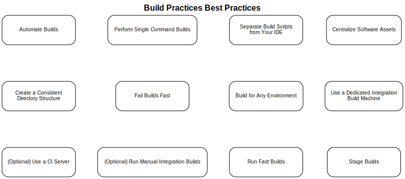
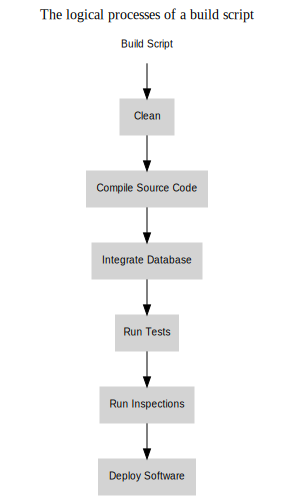
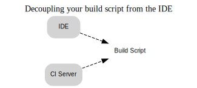
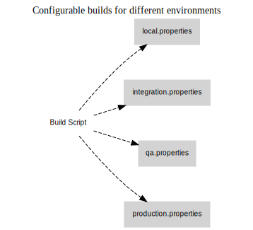
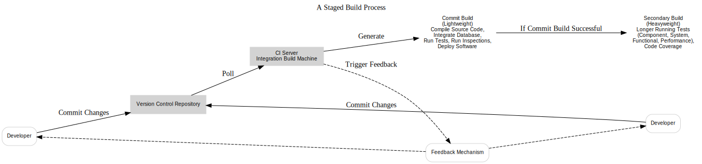
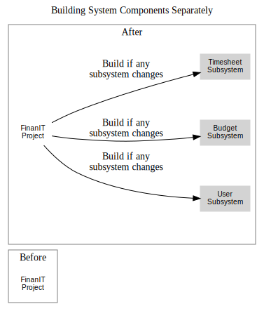

# **Building Software with Every Update**  



The entire fabric of creation must be deconstructed, piece by piece, only to be reassembled anew.  
— Inspired by HENRY MILLER, AMERICAN WRITER AND PAINTER (1891–1980)  

In the early 20th century, cars like the Ford Model T were painstakingly crafted by hand, requiring several days to complete. Fast forward to today, and vehicles—far more advanced than the Model T—are manufactured in mere hours. The secret? Automation. By replacing repetitive manual labor with robots, the automobile industry revolutionized its production process. Similarly, in software development, automating tedious and repetitive tasks can transform workflows and improve efficiency. Just as the automobile industry evolved to meet rising demand, software teams must adopt automation to keep pace with increasing complexity and expectations. Without automation, developers spend countless hours on manual tasks, leaving little room for critical activities like monitoring, refining processes, and strategizing improvements.

Paradoxically, software developers often find themselves like the proverbial shoemaker who neglects to make shoes for their own family. While they craft tools to automate processes for end-users, they frequently overlook automating their own workflows. A 2003 study revealed that only 27% of development teams used daily builds, illustrating that much of the industry still relies on outdated, labor-intensive methods akin to early automobile assembly lines.

Some developers argue that software's inherent complexity makes automation challenging. While it’s true that developing software can be intricate, many of its repetitive and error-prone tasks are prime candidates for automation. While the creation of software might demand ingenuity and precision, the process of delivering it should be seamless—achieved at the push of a button.

Modern software development practices now incorporate an automated assembly line of sorts. Continuous Integration (CI) tools automate the process of building and integrating software, akin to how robots have transformed manufacturing. Automating these builds helps improve software quality while minimizing risk.

This chapter explores how to use CI servers to trigger integration builds with every code change. Since not all builds serve the same purpose, we’ll discuss the types of builds commonly executed and strategies for staging them effectively. Additionally, we’ll examine the benefits of using dedicated integration build machines for CI and touch on manual integration techniques for queued builds. Recognizing the importance of swift feedback in CI, we conclude with strategies for addressing long-running builds, alongside answers to common CI-related questions.

## **Automating Builds**  

Automating build scripts significantly reduces the manual, repetitive, and error-prone tasks involved in software development projects. 

### What is a Build?  
A build can mean different things depending on the processes involved. Is it merely compiling code? Does it include running automated tests? Or does it extend to code inspections and packaging? A build can encompass any combination of these steps. However, adding more processes to a build helps mitigate risks while potentially slowing feedback. Deciding what to include in your automated build is crucial.  

For instance, as discussed in Chapter 2, running a *private build* involves integrating the latest changes from your team, compiling the code, and performing a complete build on your local machine before pushing updates to the Git repository. This approach helps avoid broken builds. Conversely, if you’re testing minor changes with no intention to commit, you might opt for a lightweight build—one that compiles the code and executes a few unit tests for quick validation.

### “Why Build Automation Matters”  
Many examples in this book use tools like Maven for Java or CMake for C/C++ due to their robust dependency management and programming constructs. These tools streamline the build process compared to custom shell or batch scripts, offering consistency and repeatability.  

Modern build systems should be seamless and triggerable with a single button press. When you hit the **Integrate** button, the entire build pipeline should run, resulting in functioning software. Yet some organizations struggle to adopt Continuous Integration (CI) because their builds aren't fully automated. Common roadblocks include tightly coupled dependencies and hard-coded references.  

For example:  
- A project had build scripts dependent on shared drives, with paths hardcoded to a specific `K:\` drive that didn’t exist on some developers’ machines.  
- Another build script referenced tools located on the `C:\` drive, causing errors for developers without the required directory structure.  

These issues not only rendered the scripts non-functional on non-Windows systems but also created frustrations for developers unable to resolve dependencies, leading to failed builds. Avoiding hardcoded paths and ensuring dependencies are portable and declarative can help ensure builds are platform-independent and repeatable.

### The Definition of "Working Software"  
Would you consider untested software to be fully functional? What if it’s tested but hasn’t passed inspection? Or if everything works except for a critical component like the database? Some developers consider their software "working" if it merely compiles—but that’s rarely sufficient.  

Build types range from lightweight builds for rapid feedback to heavyweight builds that ensure software is verified, tested, and deployable. Finding the balance between thorough verification and quick feedback is key to maintaining both quality and efficiency.  

By automating builds with tools like Git, Jenkins, TypeScript, Webpack, Maven, and CMake, developers can eliminate manual errors, reduce bottlenecks, and establish reliable pipelines for delivering high-quality software.

## **Executing Single-Command Builds**

Martin Fowler famously said, *"Get everything you need into source control and configure it so you can build the entire system with a single command."* This ideal of a single-command build is fundamental to automating software development processes. By typing a single command, such as `mvn package` or `cmake --build .`, you can trigger a comprehensive build process, ensuring consistency, repeatability, and efficiency.

### Single-Command Build Example

When using a modern build tool, a single command can handle the entire lifecycle: cleaning, compiling, testing, packaging, and deploying software. Here's an example of running a Maven-based build for a TypeScript and Webpack project:

```bash
$ mvn package
```

The output might look like this:

```text
[INFO] --- maven-clean-plugin:3.1.0:clean (default-clean) ---
[INFO] Cleaning directory /project/target
[INFO] --- maven-compiler-plugin:3.8.1:compile (default-compile) ---
[INFO] Compiling 10 source files to /project/target/classes
[INFO] --- maven-surefire-plugin:2.22.2:test (default-test) ---
[INFO] Running tests
[INFO] Tests run: 20, Failures: 0, Errors: 0, Skipped: 0
[INFO] --- maven-jar-plugin:3.2.0:jar (default-jar) ---
[INFO] Building jar: /project/target/project.jar
[INFO] BUILD SUCCESS
```

### Steps in a Build Script

The steps a build process typically follows: cleaning, compiling, testing, inspecting, packaging, and deploying. Below are reimagined examples using tools like Maven, CMake, Jenkins, Git, and more.



#### **1. Cleaning the Workspace**
Before any build, remove artifacts from previous builds to ensure consistency.

```xml
<plugin>
  <artifactId>maven-clean-plugin</artifactId>
  <version>3.1.0</version>
  <configuration>
    <filesets>
      <fileset>
        <directory>${project.build.directory}</directory>
      </fileset>
    </filesets>
  </configuration>
</plugin>
```

For a CMake project, the equivalent is:

```bash
$ cmake --build . --target clean
```

#### **2. Compiling the Source Code**
Maven example for compiling a TypeScript project bundled with Webpack:

```xml
<plugin>
  <groupId>org.codehaus.mojo</groupId>
  <artifactId>exec-maven-plugin</artifactId>
  <executions>
    <execution>
      <id>typescript-compile</id>
      <phase>compile</phase>
      <goals>
        <goal>exec</goal>
      </goals>
      <configuration>
        <executable>npx</executable>
        <arguments>
          <argument>webpack</argument>
        </arguments>
      </configuration>
    </execution>
  </executions>
</plugin>
```

CMake example for compiling C++ code:

```bash
$ cmake --build .
```

#### **3. Running Automated Tests**
Maven example for testing:

```xml
<plugin>
  <groupId>org.apache.maven.plugins</groupId>
  <artifactId>maven-surefire-plugin</artifactId>
  <version>2.22.2</version>
  <configuration>
    <testFailureIgnore>false</testFailureIgnore>
  </configuration>
</plugin>
```

CMake example for running tests:

```bash
$ ctest --output-on-failure
```

#### **4. Inspecting Code**
Integrate linters or code inspection tools to ensure code quality.

Maven:

```xml
<plugin>
  <groupId>org.apache.maven.plugins</groupId>
  <artifactId>maven-checkstyle-plugin</artifactId>
  <version>3.1.0</version>
</plugin>
```

For C++ projects, tools like `cppcheck` can be used:

```bash
$ cppcheck --enable=all --inconclusive --xml .
```

#### **5. Packaging**
Bundle the application into deployable formats (e.g., JAR, ZIP, or binary).

Maven example:

```xml
<plugin>
  <groupId>org.apache.maven.plugins</groupId>
  <artifactId>maven-jar-plugin</artifactId>
  <version>3.2.0</version>
  <configuration>
    <archive>
      <manifest>
        <addClasspath>true</addClasspath>
        <mainClass>com.example.Main</mainClass>
      </manifest>
    </archive>
  </configuration>
</plugin>
```

CMake example for packaging binaries:

```bash
$ cpack
```

#### **6. Deployment**
Deploy the build artifacts to a server, repository, or FTP location.

Maven:

```xml
<plugin>
  <groupId>org.apache.maven.plugins</groupId>
  <artifactId>maven-deploy-plugin</artifactId>
  <version>3.0.0-M1</version>
</plugin>
```

CMake example with scp for deployment:

```bash
$ scp ./bin/myapp user@server:/deploy/path
```

---

### Feedback and Failures
Feedback from build failures is critical. Whether it's a failed test, an unmet dependency, or a syntax error, build tools like Jenkins can notify developers immediately through logs or email alerts.

With single-command builds, you ensure that every step in the process—from compilation to deployment—can be executed reliably and efficiently with minimal human intervention. This approach eliminates bottlenecks and aligns with Continuous Integration principles.

## **Decouple Build Scripts from Your IDE**  

Build scripts should remain independent of any specific Integrated Development Environment (IDE). While an IDE can rely on a build script, the reverse dependency—where a build script requires the IDE—should be avoided. This concept which shows the proper flow of dependency.  



The relationship can often be subtle. For instance, IDEs frequently provide tools to generate build scripts, but they may embed files and dependencies within the IDE’s directory structure. To ensure your build script is truly portable and reusable, test it on a clean machine that contains only the operating system and the required build tools (like Maven, Webpack, or CMake).  

### Why Should Build Scripts Be Independent?  

1. **IDE Flexibility**: Developers often use different IDEs tailored to their preferences or project needs. Tying your build process to a single IDE can lead to inconsistencies and difficulties managing varied configurations.  

2. **CI Automation**: Continuous Integration (CI) servers need to run builds autonomously, without human intervention. The same build script developers use locally should also work seamlessly on a CI server.  

By keeping build scripts decoupled from your IDE, you ensure that your build process is consistent, repeatable, and portable across development environments and automated systems.

## **Consolidate Software Assets**  

To ensure efficient and reliable software builds, it is essential to consolidate all software assets in a central location. Using a **version control system** (VCS) like Git to manage and centralize these assets enables a smoother implementation of single-command builds, as discussed earlier. Centralization also helps resolve the common “it works on my machine” issue, where developers are unable to reproduce bugs or inconsistencies found in other environments, such as QA or production.

### Why Centralizing Assets Matters  
A centralized repository ensures that all critical components needed to build, test, and deploy software are stored in one place. This approach aligns with the *Repository Pattern* described by Stephen Berczuk and Brad Appleton in *Software Configuration Management Patterns*. According to the pattern, a workspace includes much more than just the source code and should encompass the following:  

- Source files and libraries  
- Third-party dependencies (e.g., JARs, DLLs, or external libraries)  
- Configuration files and environment settings  
- Data files for application initialization  
- Build scripts and related environment configurations  
- Installation and deployment scripts  

### Determining What to Include  
While the repository serves as the single source of truth, it is up to the team to decide what qualifies as “all software assets.” The level of risk often dictates this decision. For long-term projects, older versions of tools, compilers, and dependencies may become incompatible or cause subtle issues when revisiting legacy builds. By centralizing assets, you ensure that:  

1. **Historical Builds are Reproducible**: You can reliably recreate an older build, complete with specific tools and dependencies, to debug or patch earlier versions of the software.  
2. **Consistency Across Environments**: Developers, testers, and CI servers work from the same set of tools and assets, minimizing discrepancies and false positives.  
3. **Tool Compatibility**: Specifying and storing versions of compilers, build tools, and libraries ensures that the team uses compatible software, reducing errors caused by mismatched tools.  

### Future-Proofing Projects  
No part of a project is immune to the benefits of version tracking and centralized storage. From code to configurations and third-party tools, keeping assets in a version control system future-proofs your project by enabling consistent, traceable, and repeatable builds across teams and environments.

## **Establish a Uniform Directory Structure**  

Using a version control system to organize all software assets is a critical first step, but its true potential is unlocked with a well-defined, consistent directory structure. A logical structure ensures that assets can be efficiently retrieved for various tasks, such as Continuous Integration (CI) builds, testing, and deployments.  

### Why Consistency Matters  
A clear and organized directory structure allows teams to:  
1. Streamline automated processes (e.g., CI pipelines).  
2. Retrieve only necessary assets for specific tasks, avoiding unnecessary overhead.  
3. Improve clarity and collaboration across team members.  

### Defining Your Directory Layout  
One effective strategy is to align directories with key phases of the software development lifecycle, such as requirements, design, implementation, testing, and deployment. While the exact names can vary based on project needs, maintaining consistency and clear separation of contents is crucial.  

For example, a typical structure might look like this:  
```
project-root/
|-- requirements/      # Requirements documentation  
|-- design/            # Architecture and design artifacts  
|-- implementation/    # Source code and build scripts  
|-- testing/           # Test cases, automation scripts  
|-- deployment/        # Deployment tools, installation scripts  
|-- management/        # Project plans, schedules  
|-- tools/             # External tools, utilities  
```

### Optimizing for Builds  
To ensure builds are efficient and focused:  
- The **implementation** directory should include only source code and relevant scripts.  
- Build tasks should reference specific directories (e.g., `implementation/`) rather than pulling from the entire project, which may include unnecessary documents or binaries.  
- This reduces build times significantly and avoids clutter that could lead to errors.

### Benefits of a Consistent Structure  
- **Efficiency**: Faster and more targeted builds by avoiding unnecessary file retrieval.  
- **Clarity**: Clear organization simplifies collaboration and onboarding.  
- **Automation-Friendly**: CI tools and build scripts can reliably access the right files without ambiguity.  

By adopting a uniform and logical directory structure, you make your project more maintainable, efficient, and automation-ready, enabling seamless development and build processes.

## **Fail Builds Early**  

An effective build process ensures failures are detected as early as possible. Waiting for the build to complete only to discover an issue wastes valuable time and delays critical feedback. By structuring your build to fail early, you can quickly pinpoint errors and address them without unnecessary waiting.  

### Strategies for Early Build Failures  
To implement fast-failing builds, follow a logical execution order that prioritizes steps most prone to failure:  

1. **Integrate Components**:  
   - Retrieve the latest changes from the version control system (e.g., Git) and compile the source code.  
   - Compilation errors are common and should be caught immediately.  

2. **Run Focused Unit Tests**:  
   - Execute lightweight unit tests that don’t rely on external dependencies, such as databases or APIs.  
   - These tests are fast and help uncover issues in isolated code logic.  

3. **Execute Other Automated Steps**:  
   - After passing unit tests, proceed with tasks like database rebuilds, code inspections, and deployments.  
   - These steps are more time-consuming and should occur only after basic errors are ruled out.  

### Optimize Build Order  
The general principle is simple: **run the steps most likely to fail first**. For example:  
- If code compilation frequently fails, it should be the first step.  
- Unit tests, being quick and independent, should follow immediately.  
- Time-intensive tasks, like rebuilding databases or running inspections, should occur later in the sequence.  

### Benefits of Failing Builds Early  
1. **Faster Feedback**: Developers receive error notifications sooner, minimizing time wasted on long, incomplete builds.  
2. **Efficient Debugging**: Isolating failures early makes it easier to diagnose and resolve issues.  
3. **Resource Optimization**: Reducing unnecessary steps in a failed build conserves time and computing resources.

By prioritizing early failure detection and refining the execution order of build tasks, you create a process that delivers faster, more actionable feedback. This allows developers to address issues promptly, keeping the development workflow efficient and focused.

## **Adapt Builds for Any Environment**  

Software projects often need to run in multiple environments, such as development, testing, QA, and production. To accommodate this variability, it’s essential to make your build process **configurable** without modifying core build scripts. By leveraging environment-specific configuration files and parameterization, you can ensure that the same build process works seamlessly across different environments.

### Environment Configuration with Build Tools  
Instead of hardcoding environment settings into build scripts, use configuration files (e.g., `.json`, `.yaml`, or `.ini`) stored in your version control system, such as **Git**. Tools like **Maven** for TypeScript projects or **CMake** for C/C++ applications support dynamic configuration by reading these files.

---

### Key Configuration Elements  
Here are examples of values that typically vary across environments:  
- **Logging Levels**: Adjust verbosity (e.g., `DEBUG` in development, `ERROR` in production).  
- **Application Settings**: Customize parameters like port numbers or resource limits.  
- **Database Connections**: Specify environment-specific credentials, URLs, or schemas.  
- **External Frameworks/APIs**: Configure endpoints or authentication details.  

---

### Example for TypeScript with Maven and Webpack  

You can pass parameters during a build to configure environments dynamically. For instance, Maven uses profiles and properties to manage configurations.

**1. Create Configuration Files**  

Store environment-specific settings in separate files:  

**`config.dev.json`**  
```json
{
  "dbConnection": "localhost:5432/devdb",
  "loggingLevel": "DEBUG"
}
```

**`config.qa.json`**  
```json
{
  "dbConnection": "qa-db.company.com:5432/qadb",
  "loggingLevel": "INFO"
}
```

---

**2. Parameterize Maven Build**  

Define Maven profiles to load the right file during the build:  

```xml
<profiles>
    <profile>
        <id>dev</id>
        <properties>
            <config.file>config.dev.json</config.file>
        </properties>
    </profile>
    <profile>
        <id>qa</id>
        <properties>
            <config.file>config.qa.json</config.file>
        </properties>
    </profile>
</profiles>
```

Run the build for a specific environment using:

```bash
mvn clean package -P qa
```

---

### Example for CMake with C/C++  

For C/C++ projects, **CMake** allows environment-specific configurations using variables:

**CMakeLists.txt**  
```cmake
if(ENVIRONMENT STREQUAL "dev")
    set(DB_CONNECTION "localhost:5432/devdb")
    set(LOGGING_LEVEL "DEBUG")
elseif(ENVIRONMENT STREQUAL "qa")
    set(DB_CONNECTION "qa-db.company.com:5432/qadb")
    set(LOGGING_LEVEL "INFO")
endif()
```

Run the build with an environment flag:  
```bash
cmake -DENIRONMENT=qa -B build && cmake --build build
```



### Why Use Configurable Builds?  

1. **Single Build Script**: One build script can handle all environments, reducing duplication and complexity.  
2. **Flexibility**: You can quickly switch between environments without modifying code.  
3. **Improved Maintainability**: Decoupling environment settings from the build logic makes updates easier.  

By centralizing configurations into versioned files and parameterizing build tools like **Maven** and **CMake**, you ensure that your builds are portable, efficient, and adaptable to any environment. This approach eliminates manual tweaks, improves reliability, and streamlines the deployment process.

## **Build Types and Triggers**  

Different types of builds serve varying purposes and stakeholders within the development process, from individual developers to teams and end users. Builds can be executed using several trigger mechanisms, such as manual initiation, scheduled intervals, polling for changes, or event-driven triggers.

### **Build Types**  
Builds are typically categorized into three levels: **private builds**, **integration builds**, and **release builds**. Each level addresses the needs of specific stakeholders, ensuring the software progresses reliably through development, testing, and release.

#### **1. Private Build**  
A private build is executed by an individual developer (or pair) before committing code changes to the version control repository. Running a private build ensures the developer’s changes integrate seamlessly with the latest version of the system, preventing broken builds in the shared repository.  

**Steps to Perform a Private Build:**  
1. Pull the relevant code from the repository.  
2. Apply changes to the codebase.  
3. Sync with the latest updates from the repository.  
4. Execute a local build, including unit tests.  
5. If successful, commit the changes back to the repository.  

#### **2. Integration Build**  
Integration builds validate code changes submitted by multiple developers against the mainline (e.g., the trunk or master branch). These builds are typically run on a **dedicated CI server** to ensure the stability of the shared codebase.  

- **Staged Builds**: As described by Martin Fowler, integration builds often occur in stages:  
   - **Commit Build**: A fast build (<10 minutes) that includes compiling the code and running unit tests.  
   - **Secondary Builds**: Slower builds that incorporate component tests, system tests, performance tests, and automated code inspections.  

#### **3. Release Build**  
A release build prepares the software for deployment to end users or for QA validation. It often includes:  
- Extensive tests (e.g., load, performance, and acceptance tests).  
- Creation of installation artifacts or media.  

Release builds typically occur at project milestones, such as the end of an iteration or sprint, and ensure the software is deployable in production environments.  

---

### **Build Trigger Mechanisms**  
The mechanism that triggers a build depends on its purpose and frequency. Choosing the appropriate trigger ensures efficient execution without overloading systems or delaying feedback.

1. **On-Demand**  
   - A build is manually triggered by a user when needed.  
   - Common for private builds or specialized builds requiring significant resources.  

2. **Scheduled**  
   - Builds are triggered at predefined time intervals, such as hourly, nightly, or weekly.  
   - Useful for long-running tasks like exhaustive load tests or security scans that run outside peak hours.  

3. **Polling for Changes**  
   - A process periodically checks the version control repository (e.g., Git) for updates.  
   - If changes are detected, the build process starts automatically.  
   - Most CI servers, such as **Jenkins**, support polling mechanisms.  

4. **Event-Driven**  
   - Builds are triggered in response to specific events, such as code commits or pull request merges.  
   - The version control system notifies the CI server, which immediately executes the build.  

---

### **Build Types and Triggers Summary**  

| **Build Type**    | **Build Trigger Mechanisms**                          |  
|-------------------|------------------------------------------------------|  
| **Private**       | On-demand                                           |  
| **Integration**   | On-demand, Polling for changes, Scheduled, Event-driven |  
| **Release**       | On-demand, Scheduled                                |  

---

By aligning build types with appropriate triggering mechanisms, teams ensure that the software development process is reliable, automated, and efficient. This approach minimizes risks, accelerates feedback, and delivers consistent results across environments.

## **Leverage a Dedicated Integration Build Machine**  

Using a dedicated machine for integration builds helps eliminate environmental inconsistencies and ensures reliable, repeatable build processes. Relying solely on developer workstations often introduces hidden dependencies and configuration discrepancies that can result in the dreaded *“It works on my machine”* scenario. By centralizing integration builds, issues are detected early and resolved before they impact team productivity.


### Why a Dedicated Build Machine is Essential  

1. **Eliminates Configuration Assumptions**:  
   - Developer machines often have unique configurations, tools, or dependencies that differ from deployment environments.  
   - A dedicated build machine ensures every build starts with a **clean and consistent state**, reducing hard-to-debug discrepancies.  

2. **Catches Missing Files or Changes**:  
   - If a developer forgets to commit a file to the version control system (e.g., Git), the build on a dedicated machine will fail and highlight the omission.  

3. **Reproducible Builds**:  
   - By resetting application servers, databases, and configurations to known states for each build, the process becomes fully repeatable.  

4. **Acts as a Safety Net**:  
   - Team members can avoid pulling problematic changes from the repository by checking the latest integration build results.


### Cost and Setup Considerations  

Setting up a dedicated integration build machine doesn’t always require purchasing new hardware. As demonstrated in many projects, an unused server or spare machine can serve as the build environment. Even in cases where a dedicated machine is unavailable, using a separate workspace or directory on a local development machine is preferable to neglecting integration builds altogether.  

**Example Steps to Set Up the Machine**:  
1. **Clean Environment**:  
   - Before each integration build, clear all previous binaries, cached files, and artifacts.  
   - Reset test data and configuration settings to a **baseline state**.  

2. **Centralize Software Assets**:  
   - Store all assets, including source code, build scripts, configuration files, tools, and test data, in the version control repository.  

3. **Optimize System Resources**:  
   - Invest in sufficient CPU, memory, and storage to reduce build times and ensure efficient performance. Faster builds save developer time and increase feedback speed.  


### Avoid “Magic Machines”  

A “magic machine” is a build machine that only works because of untracked dependencies, hardcoded paths, or manual tweaks made over time. While it might seem reliable initially, it becomes a bottleneck when builds fail elsewhere or when the machine is no longer available.  

**Common Causes of Magic Machines**:  
- Hardcoded file paths or environment variables.  
- Unscripted dependencies, such as tools installed manually.  
- Configuration changes that are not versioned or documented.  

**Solutions to Prevent Magic Machines**:  
1. **Automate Dependencies**:  
   - Script all dependencies (e.g., database initialization, environment variables) into the build process.  
2. **Version Everything**:  
   - Include configuration files, tools, and environment settings in the version control system.  
3. **Use Virtualization or Containerization**:  
   - Tools like Docker or VM images ensure that the build environment is reproducible and portable across machines.  


### Benefits of a Dedicated Integration Build Machine  

- **Consistency**: Builds run in an environment identical to production-like systems.  
- **Early Detection**: Integration issues are caught before they cascade into larger problems.  
- **Efficiency**: Teams spend less time debugging environmental differences and more time improving code quality.  
- **Scalability**: Build scripts and environments can be easily replicated if the primary machine fails.


By setting up a dedicated integration build machine and removing hardwired dependencies, teams can establish reliable, repeatable, and maintainable build processes. This approach eliminates environment-related issues, reduces integration risks, and ensures that the entire team can depend on consistent, automated feedback from every build.

## **Leverage a Continuous Integration (CI) Server**  

When implementing Continuous Integration (CI), using a dedicated CI server is the most effective approach. While manual integrations or custom tools are possible, modern CI servers provide robust, out-of-the-box features that save time and effort, making it unnecessary to build a CI system from scratch. These tools not only automate key tasks but also streamline the integration process for teams of all sizes.  

### Key Features of CI Servers  
Most CI servers offer a rich set of features that simplify and enhance the integration process:  

1. **Automated Polling**:  
   - CI servers can regularly check version control systems (e.g., Git) for changes at defined intervals. When changes are detected, the build process triggers automatically.  

2. **Scheduled Tasks**:  
   - Integration builds or other automated tasks can be scheduled to run at specific intervals, such as hourly, nightly, or weekly.  

3. **Quiet Periods**:  
   - CI servers support configurable quiet periods to ensure that builds only trigger after a period of inactivity, preventing unnecessary builds during frequent code commits.  

4. **Tool Support**:  
   - CI servers integrate seamlessly with popular build tools like **Maven**, **CMake**, **Gradle**, and scripting tools (e.g., shell scripts).  

5. **Notifications**:  
   - Automated alerts, such as emails or messaging integrations (e.g., Slack), notify team members of build statuses, failures, or other critical events.  

6. **Build History**:  
   - A detailed history of past builds, including logs, failures, and successes, is maintained for easy reference and debugging.  

7. **Web-Based Dashboards**:  
   - Most CI servers provide a centralized, web-accessible dashboard for teams to monitor build statuses, test results, and other key metrics.  

8. **Version Control Integration**:  
   - Support for multiple version control systems ensures flexibility across projects and environments.  


### Popular CI Servers  
There are numerous CI tools available, each with its own strengths. Examples include:  
- **Jenkins** (highly extensible and widely adopted)  
- **GitLab CI/CD**  
- **CircleCI**  
- **TeamCity**  
- **Travis CI**  

These tools come with prebuilt features and extensive plugin ecosystems to meet the needs of any project.  


### Manual Integration vs. CI Servers  
While it is possible to perform integrations manually, this approach has limitations, such as:  
- Delayed feedback on code changes.  
- Higher likelihood of human error.  
- Difficulty scaling as the project grows.  

Manual integrations may still be useful in specific cases, such as small projects or when advanced CI tools are unavailable. However, the advantages of CI servers—automated processes, consistent monitoring, and immediate notifications—make them the preferred choice for most teams.  


### Why Use a CI Server?  
By automating integration builds and centralizing build monitoring, CI servers:  
- **Reduce Integration Risk**: Frequent and automated builds ensure errors are detected early.  
- **Save Time**: Automating repetitive tasks eliminates manual overhead.  
- **Improve Collaboration**: Teams get rapid feedback, enabling smoother communication and faster issue resolution.  

Ultimately, a CI server ensures reliable, efficient, and scalable CI processes, empowering teams to focus on delivering high-quality software.

## **Perform Manual Integration Builds**  

Manual integration builds offer an alternative or complementary approach to using a CI server. This method ensures that only one developer (or pair) integrates code into the repository at a time. By manually running an integration build on a dedicated integration machine, teams can maintain a clean, successful build and prevent broken code from entering the repository.  


### How Manual Integration Works  
In a manual integration process, developers follow a sequential workflow:  
1. A **queue** is established to allow only one developer (or pair) to integrate at any given time.  
2. The developer runs an integration build on a separate machine before committing changes.  
3. If the build passes, the changes are committed to the repository, ensuring the mainline remains stable.  

To manage the process, some teams use a physical token (e.g., a button or placeholder) or file locking to signal which developer currently owns the integration step.  


### Benefits of Manual Integration  
1. **Prevents Broken Builds**:  
   - By testing the build before committing changes, teams reduce the risk of introducing broken code into the repository.  
2. **Sequential Process**:  
   - Integration occurs one developer at a time, ensuring clear ownership and accountability.  
3. **Build Stability**:  
   - Keeping the build in a constant “green” state fosters confidence among team members.  


### Drawbacks of Manual Integration  
While manual builds offer advantages, there are challenges, particularly for larger teams:  
1. **Poor Scalability**:  
   - As the team size grows, waiting for sequential integration can create bottlenecks and delays.  
2. **Reduced Frequency of Integration**:  
   - Developers may delay integrating changes, opting to batch updates into larger, less frequent commits. This approach increases the risk of integration conflicts.  
3. **Lack of Automation**:  
   - Without automated enforcement, there’s no guarantee every team member will consistently follow the manual process.  


### Combining Manual and Automated Approaches  
Teams can balance the benefits of both manual and automated integrations:  
- **Manual Integration**: Developers perform private builds on their local machines to validate changes before committing code.  
- **Automated Integration**: A CI server (e.g., Jenkins) continuously polls the repository, triggers builds, and provides feedback.  

This hybrid approach combines the stability of manual processes with the efficiency and scalability of automation, ensuring the build remains clean while minimizing delays.  


### Conclusion  
Manual integration builds offer a robust way to ensure code stability and prevent disruptions caused by broken builds. While this approach doesn’t scale well for larger teams, it can be a useful complement to automated CI systems. By adopting a combination of sequential manual builds and automated processes, teams can achieve the best of both worlds: maintaining clean builds while streamlining integration workflows.

## **Optimize Build Speed**  

Long build times disrupt development flow and slow down feedback, creating frustration for developers and reducing productivity. Fast builds are essential for effective Continuous Integration (CI) because they provide rapid feedback on changes, enabling teams to detect and address issues quickly.  


### **Why Fast Builds Matter**  
The faster an integration build runs, the sooner developers receive actionable feedback. Slow builds discourage frequent commits to version control systems like Git and can lead to larger, riskier code changes being integrated less often. By optimizing build performance, teams maintain a smooth development rhythm while increasing confidence in the stability of their codebase.  


### **Key Strategies to Achieve Fast Builds**  

#### 1. **Analyze and Identify Bottlenecks**  
Improving build speed begins with identifying what’s slowing it down. Use build metrics to measure performance across key areas:  
- **Compilation Time**: Measure how long it takes to compile the source code.  
- **Test Execution Time**: Categorize and measure unit, component, and system test durations.  
- **Database Rebuild Time**: Track the time needed to recreate databases or initialize test data.  
- **Deployment Time**: Evaluate how long it takes to package and deploy artifacts to target environments.  
- **Resource Usage**: Analyze CPU, memory, disk I/O, and network performance on the build machine.  

#### 2. **Use Incremental Builds**  
Instead of rebuilding the entire codebase, focus on compiling only the files that have changed. Tools like **Maven** (for TypeScript/Java) and **CMake** (for C/C++) support incremental compilation to save time.  

#### 3. **Optimize Automated Tests**  
Testing is often the largest contributor to slow builds. You can improve test performance by:  
- **Categorizing Tests**: Separate tests into **unit**, **component**, and **system** categories.  
   - Run **unit tests** (fast and isolated) during every commit.  
   - Defer **component/system tests** to secondary builds or scheduled runs.  
- **Parallelizing Tests**: Execute tests in parallel to leverage multiple CPU cores.  
- **Mocking Dependencies**: Use mocks and stubs for complex or external components like databases or APIs.  
- **Refactoring Slow Tests**: Use profiling tools to identify and optimize slow-running tests.  

#### 4. **Leverage Hardware Resources**  
Improving hardware performance on the integration build machine can significantly reduce build duration:  
- Increase **CPU speed** and leverage multi-core processing (e.g., symmetric multiprocessing).  
- Upgrade **RAM** to allow for more efficient execution.  
- Use faster storage, such as **solid-state drives (SSDs)**, to speed up I/O operations.  

#### 5. **Run Builds on Dedicated Machines**  
Dedicated CI servers (e.g., Jenkins) ensure that builds run in isolated, clean environments with known configurations. This prevents false positives caused by local workstation variations and reduces integration risks.  

#### 6. **Run Builds in Stages**  
As Martin Fowler describes, staged builds help distribute the workload across multiple steps:  
- **Commit Builds**: Fast builds (<10 minutes) that include compilation and unit tests.  
- **Secondary Builds**: Run slower tasks such as integration, system, and performance tests.  


### **Practical Workflow to Optimize Build Speed**  
To systematically improve build performance, follow this iterative approach:  

1. **Gather Build Metrics**: Measure key aspects like compile time, test execution, and deployment duration.  
2. **Analyze Metrics**: Identify bottlenecks by pinpointing the slowest steps.  
3. **Apply Improvements**: Target specific optimizations, such as hardware upgrades, incremental builds, or test categorization.  
4. **Measure Again**: Reevaluate build performance to confirm improvements and determine if further changes are necessary.  


### **Ten-Minute Build Rule**  
Kent Beck, in *Extreme Programming Explained*, suggests keeping integration builds under **10 minutes**. Builds exceeding this duration interrupt developer flow and discourage frequent integration. To achieve this:  
- Prioritize **fast feedback** from commit builds.  
- Offload slower processes, like full test suites and inspections, to **secondary builds**.  


### **Summary of Best Practices**  
1. Monitor and analyze build performance using metrics.  
2. Incrementally improve builds by removing bottlenecks.  
3. Run tests in parallel and categorize them for faster execution.  
4. Use dedicated machines with optimized hardware for CI builds.  
5. Split builds into **stages** to balance speed and thoroughness.  

By focusing on these strategies, teams can maintain fast, efficient builds that provide rapid feedback, fostering a smooth development workflow and reinforcing the value of Continuous Integration.

## **Implement Staged Builds**  

A staged build process is an effective strategy for reducing build times while maintaining a robust integration pipeline. By breaking builds into distinct phases—starting with a lightweight build and progressing to a more comprehensive one—teams can balance speed and thorough validation. This method aligns with the principle of “failing fast,” as it prioritizes early detection of critical issues before running more resource-intensive tests.

### **The Staged Build Approach**  
Staged builds involve two primary phases:  

1. **Commit Build (Lightweight Build):**  
   - This initial stage integrates the latest code changes and runs quick unit tests to identify obvious issues.  
   - The commit build typically completes in a few minutes, providing rapid feedback to developers.  

2. **Secondary Build (Heavyweight Build):**  
   - Once the commit build passes, a more exhaustive build runs.  
   - This stage includes slower, comprehensive processes such as:  
     - Component and system-level tests.  
     - Code inspections and static analysis.  
     - Deployment preparation and packaging. 



### **Optimizing the Build Process**  

#### 1. **Analyze Infrastructure Bottlenecks**  
Slow builds can result from infrastructure issues such as poor network performance, overloaded servers, or geographically dispersed resources. Address these bottlenecks by:  
- Upgrading hardware or network resources.  
- Streamlining VPN or network access.  
- Improving the reliability of build environments.  

#### 2. **Implement Incremental Builds**  
For large codebases, rebuilding the entire system for every change can be time-consuming. **Incremental builds** compile or process only the files that have been modified.  
- Example: Rarely changing components, such as shared libraries, can be rebuilt less frequently.  
- **Caution**: Use incremental builds selectively, as they may overlook integration issues that a clean build would catch.  


#### 3. **Break Builds into Smaller Components**  
When a project consists of multiple modules or subsystems, integrating everything at once can lead to long build times. Instead:  
- Separate the codebase into smaller, independent modules.  
- Create **isolated build projects** for each module within the CI system.  
- Designate one project as the “master project” that triggers dependent builds when changes occur.  

This modular approach ensures that only the affected subsystems are rebuilt, reducing overall build duration.  



#### 4. **Improve Inspection Performance**  
Code inspections, while valuable, can slow down builds significantly. To optimize inspection performance:  
- **Analyze Value**: Ensure that each inspection metric adds meaningful value.  
- **Eliminate Redundancy**: Remove duplicate or unnecessary inspections.  
- **Adjust Frequency**: Run intensive inspections as part of secondary or scheduled builds instead of every commit.  
- **Target Specific Subsystems**: Perform inspections on smaller subsets of the codebase when possible.  


#### 5. **Leverage Distributed Builds**  
For extremely large projects, a distributed build system can harness multiple machines to run parts of the build concurrently. Tools like **BuildForge**, **Jenkins with distributed agents**, and others allow teams to:  
- Distribute workloads across multiple servers.  
- Parallelize tasks such as compiling code or running tests.  

**Note**: Distributed builds can introduce challenges, such as copying large files between machines, so this approach should be a last resort after other optimizations have been attempted.  


### **Reevaluate and Iterate**  
After implementing improvements, measure the updated build duration and compare it to previous metrics. Engage the team to assess the changes and identify any remaining pain points. This iterative process—gathering data, making adjustments, and reevaluating—ensures that build performance continues to improve over time.


### **Benefits of Staged Builds**  
- **Rapid Feedback**: Quick commit builds catch critical errors early.  
- **Improved Scalability**: Modular builds handle larger codebases more efficiently.  
- **Resource Optimization**: Secondary builds focus on thorough validation without slowing down the commit process.  

By adopting a staged build approach, teams can optimize build performance, balance speed with thorough testing, and maintain a steady flow of reliable feedback—essential for a successful Continuous Integration workflow.

## **How Can This Work for Your Project?**  

At this point, you may recognize the value of running integration builds on every code change to reduce project risks. However, you might still question whether this approach is practical for your team, especially if you’re dealing with unique challenges like large codebases, legacy applications, or budget constraints. Below are common concerns and practical solutions to address them.

### **1. “Our Project is Massive. How Can CI Work for Us?”**  
If your project has a large codebase, CI is even more critical. Larger projects experience frequent changes, increasing the likelihood of conflicts and errors. Ignoring these problems until later only compounds the difficulty of fixing them.  

**Solution:**  
- Keep the **build fast** by running lightweight commit builds for quick validation and deferring longer processes (e.g., system tests) to staged builds.  
- Break the project into **modular subsystems** that can be built and tested independently.  
- Use incremental builds to avoid recompiling unchanged components unnecessarily.


### **2. “We’re Supporting a Legacy System. Is CI Even Possible?”**  
Legacy applications may lack automated build scripts or tests, making CI adoption seem daunting.  

**Solution:**  
- Start small by writing a basic **build script** to compile the source code.  
- Gradually add **automated tests** for every bug fix or feature change to improve coverage over time.  
- Integrate these tests into your CI pipeline so progress builds incrementally.  


### **3. “We Use Multiple Version Control Repositories.”**  
If your source code is spread across multiple repositories, changes in one system might require rebuilding dependent projects in another.  

**Solution:**  
- Use a CI tool that supports **build dependencies**. For example, if Project A depends on Project B, the CI server can trigger a rebuild of Project A whenever Project B changes.  
- Consolidate version control tools over time if feasible to simplify build automation.  


### **4. “Our Teams Are Distributed Geographically. How Can CI Work?”**  
Remote teams may face network delays, security restrictions, or infrastructure issues that complicate CI practices.  

**Solution:**  
- Leverage **distributed CI servers** to host builds close to each team’s location. Tools like Jenkins, GitLab CI/CD, and others support distributed configurations.  
- Use project dependencies to trigger builds in the correct order across multiple repositories.  
- Optimize network performance to ensure quick synchronization of code and artifacts.  


### **5. “Our Builds Take Too Long!”**  
Slow builds interrupt development flow and reduce CI effectiveness.  

**Solution:**  
- Optimize build performance by running **incremental builds** or splitting builds into **stages** (e.g., commit builds for quick checks and secondary builds for exhaustive tests).  
- Improve **test performance** by categorizing tests (unit, component, system) and running only the most relevant ones for each build phase.  
- Upgrade the CI machine’s **hardware resources** (CPU, RAM, and disk speed) to reduce bottlenecks.  


### **6. “We Keep Getting Build Failures. Are We Doing Something Wrong?”**  
Frequent build failures indicate unverified code changes being committed to the repository.  

**Solution:**  
- Encourage developers to run a **private build** locally before committing changes. This simulates the CI environment and catches issues early.  
- Ensure that every developer has access to a clean “sandbox” environment to test code, run unit tests, and verify database scripts.  


### **7. “We Can’t Afford a Dedicated Build Machine.”**  
Budget constraints often make it challenging to justify purchasing new hardware.  

**Solution:**  
- Start small by repurposing an unused server or workstation for CI. Even basic hardware can run initial builds effectively.  
- Emphasize the cost savings from **reduced downtime** and faster issue resolution to justify future hardware investments. CI systems typically pay for themselves in saved productivity within weeks.  


### **8. “Our Software is Too Complex to Automate.”**  
Complex projects with extensive dependencies or manual processes may seem too challenging to automate.  

**Solution:**  
- Simplify the process by tackling it in **small steps**:  
   1. Organize the version control repository into a clean directory structure.  
   2. Start with a **simple build script** that compiles the code.  
   3. Gradually add tests, inspections, and deployments as the process matures.  
- Over time, automate redundant processes and dependencies to reduce manual effort.  


### **9. “We Use Branching for Multiple Versions. How Does CI Fit?”**  
Branches are common when supporting multiple versions of software, but CI should always focus on the **mainline** (trunk).  

**Solution:**  
- Use CI to ensure the mainline remains stable at all times.  
- Run builds for feature branches as needed, but merge changes back into the mainline frequently to maintain consistency.  
- Configure CI tools to support multiple branches without compromising the integrity of the mainline.  


### **Summary**  
No matter the challenges—large codebases, legacy systems, limited budgets, or distributed teams—Continuous Integration can be adapted to suit your project’s needs. Start small, address the most immediate pain points, and build incrementally. CI isn’t about achieving perfection overnight but about making consistent improvements that drive higher quality, faster feedback, and more reliable software. By adopting CI, you’ll quickly realize the benefits far outweigh the initial effort.
