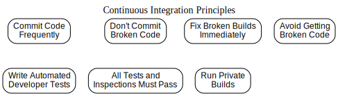
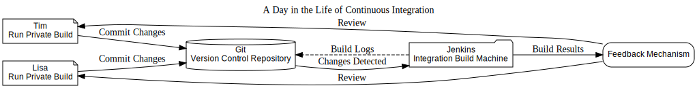
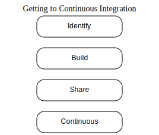

# **Understanding Continuous Integration: A Fresh Perspective**

*"Assumption is the mother of all screw-ups."*  
– *Wethren’s Law of Suspended Judgment*

From early in my software development journey, I realized that building reliable software consistently boils down to adhering to solid foundational practices, regardless of the technology stack. One of the greatest challenges in this field is the tendency to assume. For instance, assuming a method will always receive the correct parameter can lead to failure. Assuming everyone is following coding standards can result in unmaintainable code. Assuming configuration files remain unchanged can waste hours troubleshooting non-existent issues. These assumptions introduce inefficiencies and risks that derail progress.

### Eliminating Assumptions
Continuous Integration (CI) addresses these risks by systematically rebuilding the software whenever changes are committed to a version control system.  

It’s tempting to believe that new technology will single-handedly resolve our challenges, but experience has taught me otherwise. In one role, my responsibility was to lead by example in embedding strong development practices within the organization. Over time, we implemented several industry-standard methodologies. Among these, iterative approaches—such as the Rational Unified Process (RUP) and Extreme Programming (XP)—proved effective because they continuously mitigate risks and adapt to change.

CI embodies a similar mindset: anticipating and managing change. It allows developers to modify code with confidence, knowing that any breakages will trigger immediate feedback. This responsiveness not only reduces errors but also facilitates rapid adjustments, aligning development with evolving requirements.

Although CI might not have the allure of cutting-edge features or sleek interfaces, its importance is undeniable in today’s complex projects. Rarely will a client or stakeholder commend the behind-the-scenes work of integration. However, developers who embrace CI understand the value of a streamlined, repeatable build process that activates with every repository change.

### CI as a Pillar of Software Quality
For some, CI is just about merging components. In reality, it’s the backbone of modern development, safeguarding the software’s integrity by ensuring every change triggers a build. The quality of a project can often be gauged by the status of its latest integration build.

Focusing on foundational activities like CI doesn’t detract from more exciting development tasks. Instead, it frees developers to tackle stimulating challenges by minimizing last-minute firefighting over neglected basics. By maintaining a "green build" status, teams avoid the stress of rushing fixes before a release—precisely when mistakes are most likely.

Like exercise, CI requires discipline. While the effort may seem mundane, it keeps development "fit" and ready for high-stakes challenges. The process ensures smooth production cycles, leaving room for creativity and innovation.

### The Role of CI in Team Practices
This chapter explores the nuances of adopting CI within a project. It highlights the benefits, addresses potential drawbacks, and explains how CI integrates with broader development practices. Importantly, CI is not a task to delegate and forget. It demands active involvement from every team member to succeed.

What does a CI-enabled workflow look like? To illustrate, we’ll dive into a day in the life of Tim, a developer embracing CI.

## A Day in the Life of Continuous Integration  

As Tim steps into his office, his attention is drawn to the large monitor displaying the status of his project in real-time. The monitor shows that the most recent integration build on the Jenkins CI server was successful just a few minutes ago. Alongside, it highlights quality metrics such as adherence to coding standards, duplicate code reports, and other key indicators. Tim is one of 15 developers working on a Java-based management software project for an online brewery.  

#### Starting the Day  

Tim begins his day by refactoring a subsystem flagged for excessive code duplication in the latest Jenkins report. Before committing his changes to Git, he runs a private build on his workstation. This process compiles the code and executes unit tests against the latest codebase to ensure his changes don’t break anything. Once the build passes locally, Tim commits his updates to the Git repository.  

Meanwhile, Jenkins continuously polls the Git repository for changes. Shortly after Tim's commit, Jenkins detects the update and triggers an integration build. This build executes a series of automated tasks, including code compilation, testing, and inspection tools to ensure the codebase adheres to established standards.  

Tim receives an email notification from Jenkins about a minor coding standards violation. He quickly fixes the issue, commits the changes, and waits for Jenkins to rerun the integration build. This time, the build passes, and by reviewing the detailed reports generated by Jenkins, Tim confirms that his refactoring successfully reduced code duplication in the subsystem.  

#### Collaboration in Action  

Later that day, Lisa, another developer on the project, visits Tim with a concern.  

**Lisa:** "I think your changes broke the last build!"  
**Tim:** "Hmm... but I ran all the tests."  
**Lisa:** "I didn’t have time to write tests for my changes yet."  
**Tim:** "Are you following the code coverage metric we agreed upon?"  

After their discussion, the team decides to enforce stricter measures. They configure Jenkins to fail the integration build if code coverage drops below 85%. Lisa then writes a test for the issue she discovered and resolves the defect. With the fix in place and the test added, the integration build remains stable and "in the green."  

#### Key Takeaways  

Tim's day showcases how Continuous Integration, when combined with tools like Git and Jenkins, can transform the development workflow. Automated builds, immediate feedback, and clear metrics allow the team to identify and resolve issues quickly. Moreover, collaboration and continuous improvement in processes ensure the project maintains high-quality standards throughout development.  

By adhering to these practices, the team reduces risks and creates a more efficient and reliable software delivery pipeline. Continuous Integration isn't just about tools—it's about fostering a culture of accountability, collaboration, and consistent quality.  

#### Glossary of Terms  

**Automated**  
A "hands-off" process that requires no user intervention once initiated. System administrators often refer to this as a "headless" process, emphasizing its ability to run independently without manual oversight.

**Build**  
The series of activities involved in generating, testing, inspecting, and deploying software. A build encapsulates the process of assembling code into a working system.

**Continuous**  
In technical terms, "continuous" implies something that, once started, does not stop. However, in the context of Continuous Integration (CI), "continuous" refers to a process that runs continually, polling for changes in the version control repository. When changes are detected, the process triggers a build.

**Continuous Integration**  
A software development practice in which team members frequently integrate their work—ideally at least once daily, often resulting in multiple integrations per day. Each integration is verified by an automated build that includes testing, aiming to detect errors as early as possible. Teams adopting CI often report fewer integration issues and accelerated development of cohesive software.

**Development Environment**  
The set of tools, configurations, and resources used to write software. This environment typically includes an Integrated Development Environment (IDE), build scripts, third-party libraries, servers, configuration files, and other necessary utilities.

**Inspection**  
The analysis of source code or bytecode to assess internal quality attributes. In CI, inspection typically refers to automated processes like static analysis or runtime analysis to ensure the software meets defined quality standards.

**Integration**  
The process of combining distinct source code artifacts into a cohesive whole. Integration ensures that the separate components of a software system work together correctly.

**Integration Build**  
A specific type of build where software components or modules are combined into a unified system. On larger projects, integration builds may encompass multiple subsystems, while smaller projects might only involve compiling source files. Typically, integration builds are performed on a dedicated build machine to validate changes.

**Private (System) Build**  
A local build process run by developers on their own workstations prior to committing changes to the version control repository. Running a private build helps reduce the likelihood of breaking the shared integration build.

**Quality**  
Defined as an "essential and distinguishing attribute of something" or "superior grade," quality in the context of CI refers to measurable attributes such as maintainability, extensibility, security, performance, and readability. These metrics ensure that software meets both functional and non-functional requirements.

**Release Build**  
A build prepared for software deployment to users. Release builds typically occur at the end of development cycles, iterations, or significant milestones. They often include acceptance tests and, in some cases, extensive performance and load tests.

**Risk**  
The potential for a problem to occur. In software development, risks that materialize are known as problems. CI emphasizes addressing high-priority risks—those with the greatest likelihood of occurrence and potential impact.

**Testing**  
The overarching process of verifying that software functions as intended. From a CI perspective, testing often focuses on developer tests such as unit tests, component tests, and system tests. These tests validate the functionality of objects, modules, packages, and the system as a whole. Additionally, CI builds may include staged testing, where fast tests run first, followed by slower, more extensive tests.

## Understanding the Value of Continuous Integration (CI)

The true value of Continuous Integration lies in its ability to:  

- Minimize risks  
- Automate repetitive manual tasks  
- Provide deployable software at any time and from anywhere  
- Improve project visibility  
- Build confidence in the software among the development team  

### **Minimizing Risks**
Frequent integrations significantly reduce project risks by enabling early detection of issues, continuous assessment of software quality, and eliminating reliance on assumptions.

- **Earlier defect detection**: By integrating and running tests multiple times daily, defects are identified soon after they’re introduced. This proactive approach prevents issues from lingering until later stages, such as during final testing.  
- **Measurable software health**: Continuous testing and inspection ensure that key attributes like complexity and code quality are monitored over time, providing actionable insights into the software’s health.  
- **Reduced assumptions**: A clean and consistent build process, performed in a controlled environment, eliminates guesswork related to third-party libraries, environment variables, and other dependencies.  

CI acts as a safety net to mitigate risks such as fragmented codebases, late-stage defect discoveries, low-quality outputs, and lack of visibility into project progress.  

### **Eliminating Repetitive Processes**
Automation within CI reduces the burden of repetitive tasks, saving time and effort while ensuring consistency.  

- **Consistency**: Automated processes ensure tasks like compilation, testing, inspection, and deployment are performed the same way every time. For example, static analysis might always precede testing in a predefined order.  
- **Triggered by every commit**: With CI, repetitive tasks are initiated automatically whenever changes are committed to the version control system.  
- **Focus on higher-value work**: By freeing developers from mundane, repetitive tasks, automation allows them to focus on more strategic, thought-provoking activities.  
- **Streamlined improvements**: Automated mechanisms reduce resistance to process improvements, such as testing or database integration, by embedding them seamlessly into workflows.  

### **Delivering Deployable Software Anytime**
One of the most tangible benefits of CI is its ability to produce deployable software at any moment.  

Regularly integrating small, incremental changes ensures a stable and deployable codebase. If issues arise, they’re quickly addressed, keeping the software in a ready-to-release state.  

- **Client and user benefits**: For external stakeholders, deployable software is the clearest demonstration of progress and value.  
- **Avoiding last-minute rushes**: Teams that delay integration until just before delivery face unnecessary risks—missed deadlines, unresolved defects, and potential project failure. CI eliminates these risks by ensuring the software is continuously in a deployable state.  

### **Enhancing Project Visibility**
CI offers unparalleled visibility into project status, trends, and quality metrics, helping teams make informed decisions and drive innovation.  

- **Data-driven decisions**: A CI system provides up-to-date insights into build statuses, quality metrics, defect rates, and feature completion. This timely information empowers teams to make better decisions.  
- **Trend identification**: Frequent integrations allow teams to spot patterns, such as recurring build failures or improving quality metrics, enabling early intervention or celebration of progress.  

### **Building Confidence in the Product**
CI instills confidence among team members by validating every change and ensuring the integrity of the codebase.  

- **Continuous validation**: With every build, CI verifies the software against tests, coding standards, and design principles, ensuring it remains functional and testable.  
- **Reduced fear of changes**: Teams are empowered to make changes confidently, knowing the CI system will flag issues immediately.  
- **Single source of truth**: CI centralizes all software assets into a single reliable source, further boosting confidence in its accuracy and completeness.  

By adopting Continuous Integration, teams not only streamline their workflows but also foster a culture of quality, accountability, and agility. Whether reducing risks, automating tasks, or ensuring deployable software, CI offers tangible value to developers, stakeholders, and users alike.

## Challenges That Prevent Teams from Adopting Continuous Integration (CI)

Despite its numerous benefits, some development teams hesitate to implement CI in their projects due to a mix of perceived and real concerns. Here are some common reasons for this reluctance:

### **Perceived Overhead of Managing CI Systems**
A common misconception is that maintaining a CI system introduces unnecessary overhead. However, tasks like integration, testing, inspection, and deployment are required regardless of whether CI is in place. The difference lies in automating these tasks versus managing them manually.  
- **Reality check**: Manual processes can be far more cumbersome and error-prone compared to managing a robust CI system. Ironically, the most complex, multiplatform projects—which benefit the most from CI—are often the ones that resist adopting it due to fears of added complexity.

### **Resistance to Change**
For teams working on legacy projects, transitioning to CI may feel overwhelming due to the number of processes that need to be updated.  
- **Incremental adoption**: Rather than implementing CI all at once, a gradual approach works best. Start with low-frequency builds, such as daily builds, and gradually increase their frequency as the team gains familiarity and confidence with the process.

### **Frequent Build Failures**
Failed builds can discourage teams from embracing CI. This usually happens when developers don’t perform private builds before committing their code to the version control repository.  
- **The fix**: Developers need to ensure that their code compiles and passes tests locally before committing. When issues like missing files or failed tests occur, a quick response is critical to prevent disruption in the CI pipeline.

### **Concerns Over Costs**
Adopting CI often requires additional resources, such as a dedicated integration server or machine. While this does incur hardware or software expenses, the cost is minimal compared to the high price of detecting and fixing issues later in the development lifecycle.  
- **Perspective**: Investing ins CI early on helps avoid costly delays, rework, and defects discovered during production or later testing stages.

### **Misunderstanding of Developer Responsibilities**
Management may feel that CI duplicates activities developers should already be performing. While developers are responsible for certain tasks, CI ensures these activities are carried out consistently and efficiently in a controlled environment.  
- **Added value**: Automated CI processes not only increase the reliability and frequency of these tasks but also minimize assumptions by running them in a clean and consistent environment. This results in better decision-making and improved software quality.

### **Conclusion**
Many of the challenges preventing teams from adopting CI stem from misunderstandings or resistance to change. Addressing these concerns through incremental adoption, proper training, and emphasizing the long-term benefits of automation can help teams overcome these hurdles. Ultimately, CI provides a more reliable, efficient, and scalable approach to software development.

## How Do You Achieve "Continuous" Integration?

It’s often surprising how little automation exists in many development organizations. While developers excel at automating tasks for their users, they often overlook opportunities to automate their own workflows. Sometimes, teams believe they’ve automated enough because they’ve created a few scripts to streamline certain processes. However, true automation goes beyond individual scripts—it involves fully integrating them into the development pipeline. Let’s consider this scenario:

**Joan (Developer):** “I already automated that. I wrote some scripts to drop and recreate the database tables.”  
**Sue (Technical Lead):** “That’s great! Did you add them to the Git repository?”  
**Joan:** “No.”  
**Sue:** “Did you include them in the build process?”  
**Joan:** “No.”  
**Sue:** “Then they’re not truly automated yet, are they?”  

In this example, Joan’s scripts are a good start, but they need to be incorporated into the version control system and integrated into the build process to be effective. Figure 2-2 illustrates the steps to make a process continuous.

### **The Path to Continuous Integration**

The journey to achieving CI can be broken down into four key steps:

1. **Identify**  
   Begin by identifying a process that can benefit from automation. This could include tasks such as code compilation, testing, inspection, deployment, or database integration. These are often repetitive activities that, once automated, can save time and reduce errors.

2. **Build**  
   Create a build script to make the process repeatable and consistent.  
   - For **TypeScript and Webpack**, write scripts to compile the code and bundle the assets.  
   - For **C/C++ projects**, use CMake to automate builds.  
   - For **Java projects**, Maven can be used to handle dependencies, compilation, and packaging.  
   Build scripts ensure that tasks are executed reliably across environments.

3. **Share**  
   Store the scripts in a version control system like Git. This allows the entire team to access and use the automated processes, ensuring consistency across the project. Sharing automation not only improves collaboration but also spreads the benefits of CI to the entire team.

4. **Make It Continuous**  
   Use a CI server like Jenkins to run the automated processes whenever changes are pushed to the Git repository. Jenkins can poll the repository for updates, execute build scripts, and provide immediate feedback to the team. If desired, teams can also manually trigger the process, though automation is ideal.

To remember these steps, use the acrostic **“I Build So Consistently”**: Identify, Build, Share, Continuous.

### **Start Small and Scale Incrementally**

Achieving CI doesn’t have to happen overnight. Start with small, manageable tasks and gradually expand the system:  
- Begin with essential processes like automated builds and testing.  
- Once the team becomes comfortable, add other tasks like code inspections, deployment scripts, or database integration.  

Incremental growth ensures that the system evolves alongside the team’s needs. Attempting to implement everything at once can be overwhelming and counterproductive, similar to refactoring an entire codebase in one go. Instead, aim for a working system that developers can adopt and expand over time based on project risks and priorities.

### **Continuous Compilation vs. Continuous Integration**

During CI implementation, many organizations mistakenly think they’ve achieved CI when, in reality, they’re practicing something closer to “continuous compilation.” For example:  

- **What they think:**  
   “We’ve set up Jenkins to poll our Git repository for changes, retrieve the source code, compile it, and send an email if something breaks.”  

- **What’s missing:**  
   While this setup automates compilation, it lacks the full benefits of CI, such as:  
   - Running tests to measure code coverage and catch bugs.  
   - Tracking metrics like build times, code complexity, and duplication.  
   - Labeling builds for version control and storing deployable artifacts in a reliable location.  

Continuous compilation is a good first step, but it’s not the same as full CI. True CI involves integrating testing, inspection, and deployment processes into the pipeline, providing the team with immediate feedback and actionable insights.  

By following these steps, you can move beyond basic automation to create a robust CI system that enhances collaboration, improves software quality, and reduces risks across the development lifecycle.

## When and How Should a Project Implement Continuous Integration (CI)?

The best time to introduce CI is at the beginning of a project. Starting early allows you to build CI practices into the team’s workflow before any habits or processes become entrenched. While implementing CI later in a project is possible, it can be more challenging due to time constraints and resistance to change. In such cases, adopting CI incrementally can help ease the transition.

### **How to Get Started with CI**

Implementing CI requires a thoughtful approach, as it involves both technical and cultural changes. Here’s a step-by-step strategy:

1. **Start Small**  
   Begin by running builds on a daily schedule rather than on every code change. This helps the team get accustomed to the process without overwhelming them. Over time, as confidence grows, you can increase the frequency to trigger builds with every commit to the version control system.

2. **Focus on the Basics First**  
   Initially, the CI system can focus on simpler tasks, such as compiling the source code and packaging the binaries. At this stage, you don’t need to include automated tests or inspections if the team isn’t familiar with those tools. The goal is to establish a basic, consistent build process.

3. **Gradually Expand the Scope**  
   Once the team becomes comfortable with the initial setup, start integrating automated regression tests and inspections. These should eventually run with every change to the codebase, enabling the team to detect defects and maintain code quality in real-time.

### **Cultural Considerations**

Remember, CI is not just a technical shift—it’s an organizational and cultural one. Teams often resist change, especially when new processes feel disruptive or time-consuming. Introducing CI in small, manageable steps can help reduce resistance and demonstrate its benefits incrementally. 

### **Key Takeaways**

- **Start early** to avoid resistance and minimize disruption.  
- If starting late, **adopt CI incrementally**, beginning with simple builds and adding complexity over time.  
- Recognize that CI is not just about tools—it’s about fostering a culture of collaboration, automation, and continuous improvement.  

By taking this approach, you can effectively implement CI in any project and gradually unlock its full potential.

## The Evolution of Software Integration

Is Continuous Integration (CI) a revolutionary new approach to software development? Not exactly. CI represents the next step in the ongoing evolution of software integration practices. In the early days, when programs were composed of just a few small files, integrating them into a complete system was straightforward and required minimal effort. As systems grew in complexity, the need for more structured integration practices became evident.

### **Early Integration Practices**
The concept of nightly builds has long been regarded as a software development best practice. Books and articles over the years have highlighted the importance of regular integration to ensure project progress and stability. For instance:
- In *Microsoft Secrets*, Michael A. Cusumano and Richard W. Selby discuss Microsoft’s use of daily builds as a core development practice.
- Steve McConnell, in *Software Project Survival Guide*, describes the "Daily Build and Smoke Test" as an essential part of project workflows.

Similarly, Grady Booch, in *Object Solutions: Managing the Object-Oriented Project*, emphasizes the importance of integration, stating:  
*"The macro process of object-oriented development is one of ‘continuous integration’... At regular intervals, this process produces executable releases that steadily increase in functionality. These milestones allow management to track progress, evaluate quality, and address risks proactively."*

### **From Daily Builds to Continuous Integration**
The concept of CI gained more prominence with the rise of Agile methodologies like Extreme Programming (XP). While the idea of daily builds had been around for years, Agile frameworks expanded the practice into the realm of “continuous” builds—emphasizing frequent, incremental integration.

Martin Fowler’s influential article, *Continuous Integration*, brought widespread attention to the practice, cementing it as a cornerstone of modern software development. Today, CI is a common feature in almost every book on Agile and XP, highlighting its central role in iterative and incremental development.

### **The Ongoing Evolution of CI**
As hardware capabilities and software tools continue to advance, CI practices are evolving to include more processes. Modern CI systems go beyond just building and testing code; they integrate a wide range of activities, from static code analysis to automated deployments. This expansion reflects the growing complexity of software systems and the increasing demand for streamlined, efficient workflows.

### **Conclusion**
CI is not a new invention but rather a natural progression in the way software is integrated. From the simplicity of nightly builds to the sophistication of continuous integration pipelines, the practice has adapted to meet the needs of increasingly complex software systems. As technology continues to improve, CI will undoubtedly evolve further, incorporating even more processes to enhance the development lifecycle.

## How Does Continuous Integration Enhance Other Development Practices?

Continuous Integration (CI) is a powerful practice that complements and enhances various software development practices, such as developer testing, coding standards adherence, refactoring, small releases, and collective ownership. It integrates seamlessly with a range of methodologies, including RUP, XP, Scrum, Crystal, and others. Here's how CI supports and improves these practices:

### **Developer Testing**
CI strengthens developer testing by automating the execution of tests written with frameworks like JUnit, NUnit, or other xUnit-based tools.  
- **Integration with builds**: CI ensures that tests are automatically executed whenever a change is made to the codebase.  
- **Regression testing**: By including automated regression tests in every build, CI helps verify the stability of the entire codebase, identifying issues as soon as they are introduced.

### **Adherence to Coding Standards**
Coding standards provide a consistent set of guidelines for developers to follow, but manual code reviews to enforce these standards can be time-consuming.  
- **Automation through CI**: CI can integrate static analysis tools to inspect the source code for compliance with coding standards automatically during each build.  
- **Immediate feedback**: Developers receive timely reports on violations, enabling quick corrections and maintaining consistency across the project.

### **Refactoring**
Refactoring involves improving the internal structure of code without altering its external behavior, making it more maintainable and readable.  
- **Continuous inspection**: CI integrates tools that identify code smells and structural issues, offering developers actionable insights during each build.  
- **Confidence in changes**: By running regression tests alongside inspection tools, CI ensures that refactoring does not introduce unintended side effects.

### **Small Releases**
Small, frequent releases allow testers and users to interact with functional software regularly, providing valuable feedback.  
- **Ease of releases**: CI makes releasing software simple and efficient by frequently integrating changes and maintaining a deployable codebase.  
- **On-demand availability**: With CI, a release can be generated at virtually any time, reducing the overhead typically associated with traditional release cycles.

### **Collective Ownership**
Collective ownership ensures that any developer can work on any part of the codebase, preventing the creation of "knowledge silos."  
- **Enhanced collaboration**: CI facilitates collective ownership by enforcing coding standards and running regression tests on a continuous basis.  
- **Consistency**: Automated processes ensure that the codebase remains stable and accessible, encouraging developers to take shared responsibility for its quality.

### **Conclusion**
Continuous Integration is not just a technical process—it’s a practice that strengthens and aligns with other development practices, improving efficiency, consistency, and collaboration. Whether through automated testing, streamlined releases, or fostering collective ownership, CI enhances the overall development workflow and ensures higher-quality software.

## How Long Does It Take to Implement Continuous Integration (CI)?

Setting up a basic CI system for a new project, including simple build scripts, can usually be accomplished within a few hours—assuming you have some foundational knowledge and pre-existing build scripts. If no build scripts are available, the setup process may take longer. As you become more familiar with the CI tools, the system can gradually be expanded to include advanced features such as automated code inspections, complex deployments, more extensive testing, and other processes. These enhancements are typically introduced incrementally over time.

For an ongoing project, however, implementing CI can be a more time-intensive process, potentially requiring several days, weeks, or even months. The time frame largely depends on the complexity of the project and the availability of resources, such as dedicated team members to manage the transition.  

### **Factors That Influence the Setup Time**

1. **Migrating Existing Workflows**  
   - If you're transitioning from batch scripts or shell scripts to a dedicated build automation tool like Maven or CMake, additional time will be needed to rewrite and optimize build scripts.  
   - Projects that previously relied on manual integration or IDE-driven deployment workflows may require significant adjustments to adopt an automated, headless CI system.

2. **Managing Dependencies**  
   - Shifting to a CI system often involves managing all project dependencies, such as third-party libraries or binary packages, which can be a complex process in itself.  

3. **Incremental Adoption**  
   - Full CI implementation is rarely achieved in a single step. Teams typically start with basic builds and gradually introduce additional functionality, such as automated testing, code quality checks, and deployment pipelines. This incremental approach allows for smoother adoption but also extends the timeline.  

### **Conclusion**

For new projects, CI can be set up relatively quickly, especially if build scripts and automation tools are already in place. For existing projects, the timeline is more variable, depending on the starting point and complexity of the transition. By adopting CI incrementally and dedicating resources to its implementation, teams can make steady progress toward a fully automated and efficient development process.

## Continuous Integration and You  

For Continuous Integration (CI) to be effective, developers need to adopt specific habits and adjust their day-to-day workflows. Key changes include committing code frequently, prioritizing the resolution of broken builds, writing automated builds with consistently passing tests, and ensuring that broken code is neither retrieved from nor committed to the version control repository.  

While these practices require discipline, the long-term benefits they offer make the effort worthwhile. Teams that embrace CI typically experience significant improvements in efficiency, quality, and collaboration. The most successful scenarios occur when the majority of team members recognize the exponential value of consistently adhering to CI practices.  

### **Seven Practices for Effective CI**  

To help individuals and teams implement CI effectively, the following seven practices have proven to work well:  

1. **Commit Code Frequently**  
   Commit your changes often to ensure the codebase stays updated and integrated with contributions from others.  

2. **Avoid Committing Broken Code**  
   Always validate your code locally before committing to the repository to prevent introducing errors that could disrupt the team.  

3. **Fix Broken Builds Immediately**  
   Treat build failures as a top priority. Quickly identifying and resolving issues helps maintain the stability of the codebase.  

4. **Write Automated Developer Tests**  
   Develop and maintain automated tests to validate functionality and ensure that code changes do not introduce regressions.  

5. **Ensure All Tests and Inspections Pass**  
   Commit code only when all automated tests and inspections have been successfully executed.  

6. **Run Private Builds**  
   Perform a local build on your machine before committing changes. This reduces the risk of breaking the shared build.  

7. **Avoid Using Broken Code**  
   Never integrate or work with broken code from the repository. Always pull the latest stable version to avoid cascading issues.  

### **Conclusion**  

By following these practices, developers and teams can fully leverage the benefits of CI. Though these changes may initially feel demanding, they lead to smoother workflows, improved collaboration, and a stronger, more reliable codebase in the long run. With commitment and discipline, CI becomes a transformative tool in modern software development.  

## Commit Code Regularly  

A core principle of Continuous Integration (CI) is frequent integration to minimize conflicts and ensure smooth collaboration. Developers must commit their code often to fully benefit from CI. Delaying commits for more than a day can make integration more challenging and time-consuming, while also preventing others from accessing the latest changes. To encourage regular commits, consider adopting the following strategies:

### **Strategies for Committing Code More Often**

1. **Focus on Small Changes**  
   Instead of making sweeping updates across multiple components, work on small, manageable tasks. Write the necessary tests and source code for that task, validate them locally, and then commit your changes to the repository.

2. **Commit After Completing Each Task**  
   Break down your tasks into smaller work items that can be completed within a few hours. Once you finish a task, commit your changes immediately to avoid building up uncommitted work.

### **Avoid Common Pitfalls**
- **Don’t Commit All at Once**: Avoid having everyone commit code at the same time, such as at the end of the workday. This can lead to a flood of build errors and conflicts due to overlapping changes. Instead, spread out commits throughout the day.  
- **The Integration Delay Dilemma**: The longer you wait to integrate your changes with others, the harder the integration process will be. Regular commits reduce the risk of significant conflicts.

### **Overcoming Resistance to Frequent Commits**

Sometimes, a project’s culture can discourage frequent commits. For instance, developers may feel hesitant to commit until their code is “perfect.” This often happens when changes affect too many components, making developers wary of introducing issues. To address this, foster a culture where:  
- Developers are encouraged to take smaller, more focused tasks.  
- Perfection is not prioritized over progress—frequent commits are seen as a way to improve collaboratively.  

Frequent commits are not just a recommendation—they are essential for successful CI. By working in smaller increments and committing regularly, teams can avoid bottlenecks and ensure a more seamless and productive development process.

## Avoid Committing Broken Code  

One of the most harmful assumptions on a project is believing that everyone knows not to push faulty code to the version control repository. To address this risk effectively, it’s crucial to establish a clear and consistent process that ensures code is functional before being committed.  

### **Best Practices to Prevent Broken Code Commits**  

1. **Use a Reliable Build Process**  
   Develop a well-structured build script that can compile and test the code consistently. This script should provide a repeatable way to validate the integrity of the codebase and ensure it meets the project's standards.

2. **Run a Private Build First**  
   Encourage developers to perform a private build on their local machines before committing any changes. A private build should mirror the integration build process as closely as possible, helping identify potential issues early on.  

3. **Integrate It Into Team Practices**  
   Make running private builds and verifying code functionality a core part of your team’s development workflow. This practice ensures that everyone takes responsibility for maintaining a stable and functional repository.  

### **Where to Learn More**  
For additional tips on how to ensure your code is ready for the repository, refer to the section on **Running Private Builds** for further recommendations.  

By committing only verified, working code, teams can avoid disrupting the integration process and maintain a reliable, efficient development environment.

## Address Broken Builds Immediately  

A broken build is any issue that prevents the build process from completing successfully. This could include compilation errors, failed tests or inspections, database problems, or deployment issues. In a Continuous Integration (CI) environment, resolving these problems must be treated as an urgent priority.  

### **Why Immediate Action is Essential**  

In a CI workflow, errors are typically caught incrementally, meaning they are often small and manageable. Promptly addressing these issues minimizes disruption to the development process and prevents them from snowballing into larger problems.  

- **Impact on the Team**: A broken build can block other team members from making progress. Resolving it quickly ensures everyone can return to their tasks without delay.  
- **Cultural Importance**: Establish a team culture where fixing broken builds is seen as a critical responsibility, reinforcing its importance across the project.  

### **Encourage Accountability with a Positive Approach**  

Some teams add humor or light-hearted penalties for breaking a build, such as contributing to a "build jar" or displaying a fun reminder of who caused the issue. While these practices can boost team morale, the focus should remain on fostering a collaborative environment where resolving issues takes precedence over assigning blame.

By making broken builds a top priority and addressing them immediately, teams can maintain the stability and efficiency of their CI pipeline, ensuring smooth progress for everyone involved.

## Develop Automated Tests for Your CI Pipeline  

For Continuous Integration (CI) to function effectively, the entire build process should be fully automated—including the execution of tests. Tests that are part of a CI system must be written in a way that allows them to run automatically without manual intervention.  

### **Use Established Frameworks for Automation**  
Leverage xUnit-based testing frameworks such as **JUnit** for Java or **NUnit** for .NET. These tools are designed to integrate seamlessly into the CI process, enabling automated execution of tests during each build.  

### **The Importance of Automation**  
Automated tests ensure that the codebase is continuously verified for functionality and stability as changes are introduced. This not only reduces the risk of introducing defects but also streamlines the development workflow by providing immediate feedback.  

By incorporating automated testing into your CI pipeline, you can ensure a more reliable and efficient software development process.  

## Ensure All Tests and Inspections Pass  

In a Continuous Integration (CI) environment, a build is considered successful only when 100% of the automated tests pass. This isn’t about expecting perfection from developers, but rather enforcing a technical standard that ensures the integrity of the codebase. Automated tests are as essential as code compilation—just as non-compiling code cannot function, code that fails tests should also be considered non-functional. Allowing test failures to persist compromises the quality of the software.  

### **Avoid Shortcuts**  
Some developers might attempt to bypass test failures by disabling or commenting out problematic tests. This practice undermines the entire purpose of CI. To counter this, integrate code coverage tools into the pipeline to identify areas of the code that lack corresponding tests, ensuring accountability and comprehensive testing.  

### **Incorporate Automated Inspections**  
Similarly, automated code inspection tools should be part of the CI process. Use a standard set of coding and design rules that all code must adhere to. While more advanced inspections can be included, they might initially serve only as recommendations, flagging areas for improvement without causing the build to fail.  

By enforcing a standard where all tests and inspections must pass, you maintain a higher level of software quality and ensure that the CI pipeline remains reliable and effective.

## Conduct Private Builds  

To minimize the risk of breaking the main build, developers should simulate an integration build on their local workstations after completing their unit tests. This process involves incorporating the latest changes from the version control repository and ensuring that your new code integrates seamlessly with the current working codebase. A successful private build on your local machine helps ensure that the code you commit is stable and unlikely to disrupt the integration build on the CI server.

### **Maintain “Green” Build Status**  

Effectively using CI can often be measured by two key indicators: the frequency of commits and the build status.  

1. **Commit Regularly**: Aim for at least one commit to the repository per developer or pair per day. Frequent commits usually correlate with smaller, manageable changes, which are easier to integrate and debug.  

2. **Keep Builds Passing**: The build status should remain “green” (indicating success) for the majority of the day. While occasional failures (“red” builds) are inevitable, the priority must always be to resolve them quickly. Avoid allowing the build status to remain red for extended periods, as this undermines the reliability and effectiveness of CI.  

### **Why Private Builds Matter**  

Running private builds not only reduces integration issues but also fosters a culture of accountability and collaboration. By committing code that has been validated locally, developers contribute to a stable and productive development environment, ensuring the CI pipeline works as intended.

## Avoid Pulling Broken Code  

When the build is failing, it’s best to avoid pulling the latest changes from the version control repository. Doing so can result in wasted time trying to work around known errors just to compile and test your own code. The responsibility to resolve a broken build lies with the entire team, but the developers who introduced the issue should already be addressing it and committing a fix back to the repository.

### **Ensuring Awareness of Build Status**  
- Developers must stay informed about the current state of the build. If the build is broken, it’s essential that everyone is aware so they can avoid unintentionally complicating the situation.  
- **Passive feedback mechanisms**: For teams working in the same location, tools like lights, sounds, or status dashboards can provide immediate awareness of build status. These systems complement email notifications and ensure the entire team is kept in the loop.  

### **Alternative Options**  
If you need to continue working but cannot retrieve the latest code due to a broken build, consider temporarily rolling back to the most recent stable commit in the version control system. While this is not ideal, it allows you to proceed without introducing further complications.  

For more on creating effective feedback systems for build status, refer to Chapter 9. By staying aware and avoiding broken code, you help maintain a smoother development process and minimize disruptions to the team.
