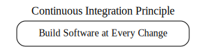

**What is a Build?**  
A build refers to the comprehensive process of creating a functional version of software. It involves compiling the code, running automated tests, integrating various components, and ensuring the software operates as a unified system. This process verifies that changes made by developers, database administrators, or configuration teams integrate seamlessly and maintain software reliability.

---

### Developer

Before changes are committed to the version control repository, a developer performs all assigned modifications and runs a private build. This ensures changes integrate correctly with those from the rest of the team. A private build runs locally and verifies that the system compiles, passes tests, and integrates successfully. Once verified, changes are committed to the repository for subsequent steps in the Continuous Integration process.

---

### Running a Private Build Using Build Tools

To automate private builds, tools like **Webpack**, **CMake**, and **Maven** can be used to compile code, run tests, and package software. Below are examples of build scripts for different tools.

#### Example 1: Webpack Build Script

```bash
# Running a Webpack build
npx webpack --config webpack.config.js
```

**Webpack configuration example (`webpack.config.js`) using ECMAScript Modules:**

```javascript
// Webpack configuration with ES Modules
import path from 'path';

export default {
    entry: './src/index.js',
    output: {
        filename: 'bundle.js',
        path: path.resolve('./dist'),
    },
    module: {
        rules: [
            {
                test: /\.js$/,
                exclude: /node_modules/,
                use: {
                    loader: 'babel-loader',
                },
            },
        ],
    },
    mode: 'production',
};
```

---

#### Example 2: CMake Build Script

```bash
# Running a CMake build
mkdir build && cd build
cmake ..
make
```

**Example `CMakeLists.txt`:**

```cmake
cmake_minimum_required(VERSION 3.0)
project(MyProject)
add_executable(MyApp main.cpp)
```

---

#### Example 3: Maven Build Script

```bash
# Running a Maven build
mvn clean install
```

**Example Maven `pom.xml`:**

```xml
<project xmlns="http://maven.apache.org/POM/4.0.0" xmlns:xsi="http://www.w3.org/2001/XMLSchema-instance"
    xsi:schemaLocation="http://maven.apache.org/POM/4.0.0 http://maven.apache.org/xsd/maven-4.0.0.xsd">
    <modelVersion>4.0.0</modelVersion>
    <groupId>com.example</groupId>
    <artifactId>my-app</artifactId>
    <version>1.0-SNAPSHOT</version>
    <build>
        <plugins>
            <plugin>
                <groupId>org.apache.maven.plugins</groupId>
                <artifactId>maven-compiler-plugin</artifactId>
                <version>3.8.1</version>
                <configuration>
                    <source>1.8</source>
                    <target>1.8</target>
                </configuration>
            </plugin>
        </plugins>
    </build>
</project>
```

---

### Committing Changes to a Repository

Once the private build passes, changes are committed to the version control repository. This step ensures that other team members can integrate these updates into their workflows. For example, in Git:

```bash
git add .
git commit -m "Added CRUD capabilities to DAO"
git push origin main
```

---

### Benefits of Private Builds

Running automated private builds helps identify and resolve issues early. Teams can ensure:

- Components integrate correctly.
- Code adheres to standards.
- Tests cover sufficient functionality.
- The application meets performance requirements.

Continuous builds provide rapid feedback and prevent defects from accumulating over time, supporting the overall health of the development lifecycle.

---

### CI Server

A Continuous Integration (CI) server automates the process of building, testing, and integrating code whenever changes are committed to a version control repository. The CI server regularly checks the repository for updates and executes predefined tasks to validate the new code. 

Using a CI server like **Jenkins** provides several benefits:
- **Automation**: Reduces the need for manual scripts by automatically running builds and tests.
- **Convenience**: Offers a web-based dashboard for monitoring builds, viewing logs, and analyzing test results.
- **Customization**: Allows you to schedule builds, define triggers for code changes, and integrate plugins to extend functionality.

#### Example CI Workflow with Git and Jenkins
1. **Code Commit**: Developers push changes to the Git repository (e.g., GitHub, GitLab, Bitbucket).
2. **Polling or Webhook**: Jenkins is configured to either poll the repository at regular intervals or listen for webhooks triggered by Git.
3. **Build Execution**: Upon detecting changes, Jenkins runs the build pipeline, which may include compiling code, running tests, and packaging the application.
4. **Feedback**: Jenkins generates a detailed report on the build status, including logs, test results, and deployment information, viewable in its dashboard.

---

### Configuring Jenkins for a Git Repository
Below is an example of configuring Jenkins to work with a Git repository and execute a basic build pipeline:

#### Jenkins Pipeline Configuration
```groovy
pipeline {
    agent any
    stages {
        stage('Clone Repository') {
            steps {
                // Clone the Git repository
                git branch: 'main', url: 'https://github.com/example/repo.git'
            }
        }
        stage('Build') {
            steps {
                // Run the build script (e.g., using Maven)
                sh 'mvn clean install'
            }
        }
        stage('Test') {
            steps {
                // Execute tests
                sh 'mvn test'
            }
        }
        stage('Package') {
            steps {
                // Package the application
                sh 'mvn package'
            }
        }
    }
    post {
        always {
            // Publish results
            archiveArtifacts artifacts: '**/target/*.jar', fingerprint: true
        }
        success {
            echo 'Build succeeded!'
        }
        failure {
            echo 'Build failed!'
        }
    }
}
```

---

### Benefits of Using Jenkins
- **Extensibility**: Jenkins supports hundreds of plugins to integrate with tools like Docker, Kubernetes, and Slack for notifications.
- **Scalability**: Jenkins can distribute builds across multiple nodes for large projects.
- **Ease of Use**: The user-friendly dashboard provides an overview of pipeline status, logs, and historical data.

---

### Jenkins Web Dashboard
Jenkins comes with a graphical web interface where developers can:
- View the latest build status (e.g., success, failure, in-progress).
- Access detailed logs to troubleshoot issues.
- Monitor build trends and test coverage using integrated reports.

By leveraging Git and Jenkins, your CI pipeline can ensure rapid feedback, maintain code quality, and streamline the development lifecycle.

---

### Build Script

A build script is a set of instructions used to automate the process of compiling, testing, inspecting, and deploying software. It ensures that builds are consistent and repeatable, forming a critical part of any Continuous Integration (CI) pipeline. While tools like **Ant**, **Maven**, **CMake**, and **Webpack** automate the build process, they work in conjunction with CI servers (e.g., Jenkins) to provide hands-off builds.

For CI purposes, the same build process should be executable outside of an Integrated Development Environment (IDE) to ensure consistency. A build script performs a sequence of tasks such as:
1. Cleaning the build environment.
2. Downloading dependencies or updating source code from the repository.
3. Compiling the code.
4. Running tests.
5. Packaging and deploying the software.


---

#### Example 1: Maven Build Script
```xml
<project xmlns="http://maven.apache.org/POM/4.0.0" xmlns:xsi="http://www.w3.org/2001/XMLSchema-instance"
    xsi:schemaLocation="http://maven.apache.org/POM/4.0.0 http://maven.apache.org/xsd/maven-4.0.0.xsd">
    <modelVersion>4.0.0</modelVersion>
    <groupId>com.example</groupId>
    <artifactId>my-app</artifactId>
    <version>1.0-SNAPSHOT</version>
    <build>
        <plugins>
            <plugin>
                <groupId>org.apache.maven.plugins</groupId>
                <artifactId>maven-compiler-plugin</artifactId>
                <version>3.8.1</version>
                <configuration>
                    <source>1.8</source>
                    <target>1.8</target>
                </configuration>
            </plugin>
        </plugins>
    </build>
</project>
```

---

#### Example 2: CMake Build Script
```cmake
cmake_minimum_required(VERSION 3.0)
project(MyProject)

# Set the source files
set(SOURCE_FILES main.cpp)

# Create an executable
add_executable(MyApp ${SOURCE_FILES})

# Add tests
enable_testing()
add_test(NAME MyTest COMMAND MyApp)
```

---

#### Example 3: Webpack Build Script
```javascript
import path from 'path';

export default {
    entry: './src/index.js',
    output: {
        filename: 'bundle.js',
        path: path.resolve('./dist'),
    },
    module: {
        rules: [
            {
                test: /\.js$/,
                exclude: /node_modules/,
                use: {
                    loader: 'babel-loader',
                },
            },
        ],
    },
    mode: 'production',
};
```

---

### Benefits of Using Build Scripts in CI
- **Consistency**: Automates repetitive tasks, reducing the risk of human error.
- **Reproducibility**: Ensures builds can be reproduced in any environment.
- **Scalability**: Integrates with CI tools like Jenkins to streamline the development lifecycle.


---

### Feedback Mechanism

One of the key purposes of a Continuous Integration (CI) pipeline is to provide immediate feedback to developers regarding the status of the latest build. A feedback mechanism ensures that issues are detected early and can be addressed promptly, improving the overall quality of the software. 

In CI pipelines managed by **Jenkins**, feedback is typically delivered through:
1. **Email Notifications**: Jenkins can be configured to send detailed reports to team members about build results.
2. **Dashboard Alerts**: The Jenkins web interface provides a real-time view of build statuses, including logs and test results.
3. **Other Notification Systems**: Jenkins can integrate with messaging platforms like Slack or SMS to send notifications.

By providing rapid feedback, CI pipelines help developers quickly resolve issues such as failed tests, code conflicts, or deployment errors.

---

### Configuring Email Notifications in Jenkins

Below is an example of configuring Jenkins to send email notifications upon build completion using the **Email Extension Plugin**.

#### Jenkins Email Notification Configuration

1. **Install the Email Extension Plugin**:
   - Navigate to `Manage Jenkins` > `Manage Plugins`.
   - Install the "Email Extension Plugin."

2. **Configure Jenkins Email Settings**:
   - Go to `Manage Jenkins` > `Configure System`.
   - Under "Extended Email Notification," set the SMTP server details:
     - SMTP Server: `smtp.example.com`
     - Default user email suffix: `@example.com`
     - Sender email address: `jenkins@example.com`

3. **Pipeline Script for Email Notifications**:
   The following script sends an email notification for both successful and failed builds:

```groovy
pipeline {
    agent any
    stages {
        stage('Build') {
            steps {
                // Simulate build process
                echo 'Building...'
            }
        }
    }
    post {
        success {
            emailext(
                subject: 'Build Success: ${JOB_NAME} #${BUILD_NUMBER}',
                body: 'The build was successful.\n\nCheck details at: ${BUILD_URL}',
                recipientProviders: [[$class: 'DevelopersRecipientProvider']]
            )
        }
        failure {
            emailext(
                subject: 'Build Failed: ${JOB_NAME} #${BUILD_NUMBER}',
                body: 'The build failed.\n\nCheck details at: ${BUILD_URL}',
                recipientProviders: [[$class: 'DevelopersRecipientProvider']]
            )
        }
    }
}
```

---

### Explanation of the Feedback Mechanism

- **Immediate Feedback**: Developers are informed of the build status as soon as possible, reducing the time needed to address issues.
- **Detailed Reports**: Email notifications include links to build logs, test results, and artifact details.
- **Custom Notifications**: Jenkins allows customization of the notification content and recipient lists, ensuring relevant information reaches the appropriate team members.

---

### Benefits of Feedback Mechanisms
1. **Rapid Issue Resolution**: Early detection and resolution of problems improve development efficiency.
2. **Enhanced Collaboration**: Team members stay informed about build and deployment statuses, fostering better communication.
3. **Improved Quality**: Timely feedback reduces the risk of regressions and helps maintain code standards.

By integrating Jenkins email notifications with your CI pipeline, you can ensure that developers receive actionable feedback, maintaining the health and reliability of your software development process.

--- 

### Integration Build Machine

An **integration build machine** is a dedicated system responsible for integrating software changes from multiple developers. Its primary role is to host the CI server, execute build scripts, run automated tests, and deploy code. By isolating the integration process on a separate machine, it ensures consistency, reproducibility, and reliability across different environments.

In a Continuous Integration (CI) setup:
1. **Hosting the CI Server**: Tools like **Jenkins** orchestrate CI workflows.
2. **Polling the Version Control Repository**: The integration build machine listens for changes in repositories (e.g., GitHub, GitLab).
3. **Executing Builds**: It compiles code, runs tests, and generates artifacts for deployment.
4. **Deploying Applications**: Automates deployments to a variety of targets, including web servers, microcontrollers, and embedded systems.

---

### Examples of Integration Build Machine Workflows

#### Example 1: General CI Workflow with Java and maven
This example uses Jenkins to build a Java project with Maven and deploy it to a production environment.

**Jenkins Pipeline**:
```groovy
pipeline {
    agent any
    stages {
        stage('Checkout Code') {
            steps {
                git branch: 'main', url: 'https://github.com/example/repo.git'
            }
        }
        stage('Build') {
            steps {
                sh 'mvn clean install'
            }
        }
        stage('Test') {
            steps {
                sh 'mvn test'
            }
        }
        stage('Package') {
            steps {
                sh 'mvn package'
            }
        }
    }
    post {
        success {
            echo 'Java project built and packaged successfully.'
        }
        failure {
            echo 'Build or tests failed!'
        }
    }
}
```

---

#### Example 2: Webpack Build for a React TypeScript Application

This workflow builds a React TypeScript application using Webpack and deploys the built files to a web server.

**Jenkins Pipeline**:
```groovy
pipeline {
    agent any
    stages {
        stage('Install Dependencies') {
            steps {
                sh 'npm install'
            }
        }
        stage('Build Application') {
            steps {
                sh 'npx webpack --config webpack.config.js'
            }
        }
        stage('Test') {
            steps {
                sh 'npm run test'
            }
        }
        stage('Deploy') {
            steps {
                sh 'scp -r dist/ user@web-server:/var/www/html/'
            }
        }
    }
    post {
        success {
            echo 'React TypeScript application deployed successfully.'
        }
        failure {
            echo 'Build or deployment failed!'
        }
    }
}
```

**Webpack Configuration** (`webpack.config.js`):
```javascript
import path from 'path';

export default {
    entry: './src/index.tsx',
    output: {
        filename: 'bundle.js',
        path: path.resolve('./dist'),
    },
    module: {
        rules: [
            {
                test: /\.tsx?$/,
                use: 'ts-loader',
                exclude: /node_modules/,
            },
        ],
    },
    resolve: {
        extensions: ['.tsx', '.ts', '.js'],
    },
    mode: 'production',
};
```

---

#### Example 3: C and CMake Application for Arduino

This example compiles and deploys code to an **Arduino Uno** microcontroller.

**CMake Configuration** (`CMakeLists.txt`):
```cmake
cmake_minimum_required(VERSION 3.0)
project(ArduinoProject)

# Specify the microcontroller
set(MCU atmega328p)
set(F_CPU 16000000UL)

# Set AVR compiler paths
set(CMAKE_C_COMPILER avr-gcc)
set(CMAKE_CXX_COMPILER avr-g++)

# Add source files
set(SOURCE_FILES main.c)

# Generate hex file
add_executable(ArduinoProject.elf ${SOURCE_FILES})
add_custom_target(
    ArduinoProject.hex ALL
    DEPENDS ArduinoProject.elf
    COMMAND avr-objcopy -O ihex -R .eeprom ArduinoProject.elf ArduinoProject.hex
)
```

**Jenkins Pipeline**:
```groovy
pipeline {
    agent any
    stages {
        stage('Compile') {
            steps {
                sh 'cmake . && make'
            }
        }
        stage('Deploy to Arduino') {
            steps {
                sh 'avrdude -v -patmega328p -carduino -P/dev/ttyUSB0 -b115200 -D -Uflash:w:ArduinoProject.hex:i'
            }
        }
    }
    post {
        success {
            echo 'Code successfully deployed to Arduino.'
        }
        failure {
            echo 'Compilation or deployment failed.'
        }
    }
}
```

---

#### Example 4: Deployment to a Raspberry Pi

This example builds a Python application and deploys it to a **Raspberry Pi**.

**Jenkins Pipeline**:
```groovy
pipeline {
    agent any
    stages {
        stage('Package Application') {
            steps {
                sh 'zip -r app.zip src/ requirements.txt'
            }
        }
        stage('Deploy to Raspberry Pi') {
            steps {
                sh 'scp app.zip pi@raspberrypi:/home/pi/app.zip'
                sh 'ssh pi@raspberrypi "unzip -o /home/pi/app.zip -d /home/pi/app && pip install -r /home/pi/app/requirements.txt"'
            }
        }
    }
    post {
        success {
            echo 'Python application successfully deployed to Raspberry Pi.'
        }
        failure {
            echo 'Deployment to Raspberry Pi failed!'
        }
    }
}
```

---

### Benefits of an Integration Build Machine

1. **Versatility**: Handles diverse projects, from web apps to embedded systems.
2. **Reproducibility**: Ensures consistent builds across different environments.
3. **Deployment Automation**: Reduces human error by automating deployments to targets like web servers, microcontrollers, and Raspberry Pi devices.

By incorporating these workflows, the integration build machine becomes a critical component in streamlining development and deployment processes.

---

### Features of Continuous Integration (CI)

A **Continuous Integration (CI)** system is built upon a few fundamental components that enable automated and repeatable processes for building, testing, and deploying software. At its core, four essential features are required for a functioning CI system:

1. **Connection to a Version Control Repository**:
   - A CI system needs access to a version control repository (e.g., Git) to fetch the latest code changes. This ensures that every build is based on the most up-to-date source code.
   - **Example**: Using GitHub or GitLab as the repository and Jenkins as the CI server to poll for changes.

2. **A Build Script**:
   - A script or set of scripts is required to compile code, run tests, and package the software. This build process ensures that the application is consistent across different environments.
   - **Example**: A Webpack build script for a React TypeScript application or a CMake build script for compiling and packaging a C program for deployment to an Arduino.

3. **A Feedback Mechanism**:
   - CI systems provide feedback on the status of the build, typically through email notifications, dashboards, or instant messaging platforms like Slack.
   - **Example**: Jenkins sending email notifications or Slack messages with build results and logs.

4. **A Process for Integrating Source Code Changes**:
   - Changes in the repository are automatically built, tested, and integrated into the mainline to ensure that they do not break the existing codebase.
   - **Example**: Jenkins polling a Git repository every 5 minutes and running an automated pipeline when changes are detected.

---

### The Importance of These Components

This "bare-bones" setup is the foundation of any effective CI system. It ensures that every code change triggers an automated process that builds, tests, and validates the changes. As a result, teams can identify and address issues early in the development lifecycle, reducing risks and improving collaboration.

---

### Enhancements to CI Systems

Once the basic components are in place, additional features can be added to extend the capabilities of the CI system:
- **Automated Testing**: Includes unit tests, integration tests, and end-to-end tests to ensure the quality of the codebase.
- **Continuous Deployment (CD)**: Automates the deployment of successfully built and tested applications to staging or production environments.
- **Static Code Analysis**: Tools like SonarQube or ESLint can be integrated to ensure the code adheres to established coding standards.
- **Database Integration**: Continuous database updates and migrations to ensure compatibility with new changes.
- **Containerization**: Using Docker to package and deploy applications in consistent environments.

---

### Real-World Example CI Workflow

Here’s an example CI pipeline built with Jenkins that incorporates these features:

**Jenkins Pipeline**:
```groovy
pipeline {
    agent any
    stages {
        stage('Checkout Code') {
            steps {
                git branch: 'main', url: 'https://github.com/example/repo.git'
            }
        }
        stage('Build') {
            steps {
                sh 'npx webpack --config webpack.config.js'
            }
        }
        stage('Test') {
            steps {
                sh 'npm run test'
            }
        }
        stage('Static Analysis') {
            steps {
                sh 'npx eslint src/'
            }
        }
        stage('Package') {
            steps {
                sh 'docker build -t example-app:${BUILD_NUMBER} .'
            }
        }
        stage('Deploy') {
            steps {
                sh 'scp docker-image.tar user@server:/path/to/deploy'
            }
        }
    }
    post {
        success {
            emailext(
                subject: 'Build Successful: ${JOB_NAME} #${BUILD_NUMBER}',
                body: 'The build completed successfully.\n\nDetails: ${BUILD_URL}',
                recipientProviders: [[$class: 'DevelopersRecipientProvider']]
            )
        }
        failure {
            emailext(
                subject: 'Build Failed: ${JOB_NAME} #${BUILD_NUMBER}',
                body: 'The build failed.\n\nDetails: ${BUILD_URL}',
                recipientProviders: [[$class: 'DevelopersRecipientProvider']]
            )
        }
    }
}
```

---

### Benefits of a Well-Configured CI System

1. **Reduced Risks**: Frequent integration reduces the risk of large-scale issues.
2. **Improved Collaboration**: Feedback mechanisms ensure that all developers are aware of the system's state.
3. **Faster Development Cycles**: Automation minimizes manual tasks, enabling faster iterations.
4. **Increased Confidence**: Automated testing ensures that code changes are less likely to introduce bugs or regressions.

By incorporating these features, teams can build robust CI systems that enable seamless software development and deployment.

---


### Source Code Compilation

**Continuous source code compilation** is one of the foundational features of a Continuous Integration (CI) system. It involves translating human-readable source code into executable code, ensuring that the application can run successfully without errors. This process has become almost synonymous with CI, as it is the first line of defense in identifying and resolving issues in the codebase.

- **Dynamic Languages**: While traditional compilation is essential for statically-typed languages like C, C++, or Java, dynamic languages (e.g., Python, PHP, Ruby) also benefit from compilation-like processes, such as syntax validation and linting.
  
#### Key Steps in Source Code Compilation
1. **Source Code Validation**: Ensures the code adheres to syntax rules and coding standards.
2. **Dependency Management**: Resolves external dependencies to ensure that all required libraries or modules are available.
3. **Compilation to Executables or Bytecode**: Converts source code into machine code (e.g., `.exe`, `.elf`) or bytecode (e.g., `.class` for Java).
4. **Error Reporting**: Provides immediate feedback on issues like missing files, syntax errors, or missing dependencies.

---

### The Integrate Button

The **Integrate button** is a metaphorical representation of a fully automated integration build process. By automating all aspects of the build, test, and deployment pipeline, developers can ensure that software works as intended with minimal manual intervention.

#### Processes Triggered by the Integrate Button:
1. **Compile Source Code**: Converts the source code into executables or interpretable scripts.
2. **Run Tests**: Executes unit tests, integration tests, and regression tests to validate functionality.
3. **Run Inspections**: Performs static code analysis and linting to check for code quality and adherence to standards.
4. **Integrate Database**: Updates or migrates databases to match the latest application changes.
5. **Deploy Software**: Packages the application for deployment to staging or production environments.

#### Key Benefits of the Integrate Button:
- **Improved Software Quality**: Early detection of issues reduces risks and improves overall quality.
- **Time Savings**: Automation minimizes the need for manual intervention, allowing developers to focus on new features.
- **Feedback**: Provides rapid feedback on build and deployment status to all team members.

---

### Practical Examples

#### Example 1: Compiling C Code for Microcontrollers (e.g., Arduino)
- **Tools**: `gcc`, `avr-gcc` for Arduino microcontrollers.
- **Pipeline Step**: 
    ```bash
    avr-gcc -mmcu=atmega328p -DF_CPU=16000000UL -o main.elf main.c
    avr-objcopy -O ihex -R .eeprom main.elf main.hex
    ```
- **Integration**: The compiled `.hex` file is flashed to the Arduino board using `avrdude`.

#### Example 2: Compilation in Web Development (React TypeScript)
- **Tools**: Webpack, Babel, TypeScript.
- **Pipeline Step**: 
    ```bash
    npx webpack --config webpack.config.js
    ```
- **Output**: A production-ready JavaScript bundle (`bundle.js`) for deployment to a web server.

#### Example 3: Integrating Database Changes
- **Tools**: Liquibase, Flyway.
- **Pipeline Step**:
    ```bash
    liquibase update
    ```
- **Output**: Schema updates and migrations applied to the database.

---

### Feedback Loop

Every action triggered by the integrate button feeds into the **feedback mechanism**, ensuring developers are promptly informed about:
- **Build Failures**: Errors during compilation or packaging.
- **Test Failures**: Issues uncovered by unit, integration, or regression tests.
- **Deployment Issues**: Failures in deploying to production or staging environments.

---

### **Integrating Database Changes**

Managing database schema changes is a critical part of Continuous Integration and Deployment workflows. Tools like **Liquibase** and **Flyway** enable teams to automate and standardize schema changes across environments, ensuring consistency and reliability.

Both **Liquibase** and **Flyway** integrate seamlessly with cloud database solutions, including **AWS** offerings such as **Amazon RDS**, **Amazon Aurora**, and more. These tools support modern cloud-native architectures, making them ideal for managing relational database schema changes in dynamic and scalable environments.

---

### **Integration with AWS Cloud Solutions**

AWS provides a robust ecosystem of database services:
- **Amazon RDS** (Relational Database Service): Fully managed relational databases for MySQL, PostgreSQL, Oracle, SQL Server, and MariaDB.
- **Amazon Aurora**: High-performance MySQL-compatible and PostgreSQL-compatible relational databases.
- **Amazon DynamoDB**: Fully managed NoSQL database for highly scalable workloads.
- **Amazon Redshift**: A fully managed data warehouse for analytics.

While **Liquibase** and **Flyway** are optimized for relational databases like RDS and Aurora, they are less applicable for NoSQL solutions such as DynamoDB.

---

### **Liquibase Integration in AWS**

#### Supported AWS Databases:
- **Amazon RDS** (MySQL, PostgreSQL, Oracle, SQL Server, MariaDB).
- **Amazon Aurora** (MySQL-compatible and PostgreSQL-compatible).

#### Integration Workflow:
1. **Configure Database Connection**:
   Connect to AWS-hosted databases using JDBC. Example for RDS PostgreSQL:
   ```bash
   liquibase --url=jdbc:postgresql://rds-endpoint.amazonaws.com:5432/yourdb \
             --username=yourusername \
             --password=yourpassword \
             update
   ```

2. **Apply Changes**:
   Use Liquibase commands (`update`, `rollback`, etc.) to manage schema changes directly.

3. **CI/CD Integration**:
   Automate Liquibase tasks in **AWS CodePipeline** or **AWS CodeBuild** by adding Liquibase commands to build scripts.

4. **Running in AWS Lambda**:
   Liquibase can run within AWS Lambda functions to execute schema changes in serverless environments.

5. **S3 Integration**:
   Store your Liquibase `changelog` files in an **S3 bucket** for centralized and secure access.

#### Example Liquibase `changelog.xml`:
```xml
<databaseChangeLog
    xmlns="http://www.liquibase.org/xml/ns/dbchangelog"
    xmlns:xsi="http://www.w3.org/2001/XMLSchema-instance"
    xsi:schemaLocation="http://www.liquibase.org/xml/ns/dbchangelog
    http://www.liquibase.org/xml/ns/dbchangelog/dbchangelog-3.8.xsd">

    <changeSet id="1" author="developer">
        <createTable tableName="users">
            <column name="id" type="int" autoIncrement="true" primaryKey="true" />
            <column name="name" type="varchar(255)" />
            <column name="email" type="varchar(255)" unique="true" />
        </createTable>
    </changeSet>
</databaseChangeLog>
```

---

### **Flyway Integration in AWS**

#### Supported AWS Databases:
- **Amazon RDS** (MySQL, PostgreSQL, Oracle, SQL Server, MariaDB).
- **Amazon Aurora** (MySQL-compatible and PostgreSQL-compatible).

#### Integration Workflow:
1. **Configure Database Connection**:
   Flyway requires a configuration file (`flyway.conf`) or CLI arguments to connect to databases. Example for RDS PostgreSQL:
   ```properties
   flyway.url=jdbc:postgresql://rds-endpoint.amazonaws.com:5432/yourdb
   flyway.user=yourusername
   flyway.password=yourpassword
   ```

2. **Run Migrations**:
   Flyway automates migrations using SQL scripts in a specific directory.
   ```bash
   flyway migrate
   ```

3. **Cloud-Native Support**:
   Flyway can run in **AWS ECS**, **AWS Fargate**, or **AWS Lambda** for flexible deployment models.

4. **Integrate with CI/CD**:
   Include Flyway in AWS **CodePipeline** or **CodeBuild** to execute migrations during deployment.

#### Example SQL Migration Script (`V1__create_users.sql`):
```sql
CREATE TABLE users (
    id SERIAL PRIMARY KEY,
    name VARCHAR(255),
    email VARCHAR(255) UNIQUE
);
```

---

### **AWS-Specific Enhancements**

1. **IAM Authentication**:
   Use **IAM Database Authentication** to connect securely to Amazon RDS or Aurora without hardcoding credentials.

2. **Secrets Management**:
   Leverage **AWS Secrets Manager** to store and retrieve database credentials securely.

3. **Monitoring**:
   Monitor database migrations and runtime performance using **Amazon CloudWatch**.

4. **Containerized Deployments**:
   Package Liquibase or Flyway into a Docker container and deploy it using **Amazon ECS** or **AWS Fargate**.

5. **S3 for Centralized Storage**:
   Store Flyway migration files or Liquibase `changelog` files in **S3** for centralized and versioned access.

---

### **Example Use Case: Flyway with AWS Aurora**

1. Create SQL migration scripts in the `sql` directory:
   ```sql
   -- V1__create_users.sql
   CREATE TABLE users (
       id SERIAL PRIMARY KEY,
       name VARCHAR(255),
       email VARCHAR(255) UNIQUE
   );
   ```

2. Configure Flyway:
   ```properties
   flyway.url=jdbc:postgresql://aurora-endpoint.amazonaws.com:5432/mydatabase
   flyway.user=admin
   flyway.password=securepassword
   ```

3. Automate Migration in AWS CodeBuild:
   ```bash
   flyway migrate
   ```

4. Store Migration Files in S3:
   - Save SQL files in an **S3 bucket**.
   - Use an AWS Lambda function to fetch and execute migrations.

---


### **Testing in Continuous Integration (CI)**

Automated testing is integral to CI, ensuring that every code change is validated. Testing frameworks like **JUnit** for Java, **Jest** for JavaScript, and **CTest** for C/C++ applications can be integrated with build tools such as **Webpack**, **Maven**, and **CMake**.

---

### **Unit Testing with Webpack**

Webpack supports JavaScript testing using tools like **Jest**. Below is an example for a React TypeScript application:


---

### **Unit Testing with Webpack and Jest for Modules**

Webpack supports testing for JavaScript and TypeScript projects using **Jest**, and here’s how to configure it with modern **ECMAScript modules**.

#### Example Webpack Configuration (ES Modules):
```javascript
// webpack.config.js
import path from 'path';
import { fileURLToPath } from 'url';

const __dirname = path.dirname(fileURLToPath(import.meta.url));

export default {
    entry: './src/index.js',
    output: {
        filename: 'bundle.js',
        path: path.resolve(__dirname, 'dist'),
    },
    resolve: {
        extensions: ['.js', '.jsx', '.ts', '.tsx'],
    },
    module: {
        rules: [
            {
                test: /\.tsx?$/,
                exclude: /node_modules/,
                use: 'babel-loader',
            },
        ],
    },
    mode: 'production',
};
```

Here, we’ve used **ECMAScript modules** with the Webpack configuration. To enable this, ensure the `type` in your `package.json` is set to `module`:
```json
{
  "type": "module",
  "scripts": {
    "build": "webpack"
  }
}
```

#### Example Jest Configuration:
```javascript
// jest.config.js
export default {
    preset: 'ts-jest',
    testEnvironment: 'jsdom',
    testMatch: ['**/__tests__/**/*.test.ts?(x)'],
    moduleFileExtensions: ['js', 'jsx', 'ts', 'tsx'],
};
```

#### Example Test File:
```typescript
// __tests__/sum.test.ts
import { sum } from '../src/utils.js';

test('adds 1 + 2 to equal 3', () => {
    expect(sum(1, 2)).toBe(3);
});
```

#### Example Module to Test:
```javascript
// src/utils.js
export function sum(a, b) {
    return a + b;
}
```

#### Command to Run Tests:
```bash
npx jest
```

#### Build and Test Flow:
1. Build the application:
   ```bash
   npm run build
   ```
2. Run tests:
   ```bash
   npm test
   ```

Integrate this setup into your CI/CD pipeline by including the `build` and `test` commands sequentially.

---

### **CI Integration with Webpack**
In Jenkins, GitHub Actions, or GitLab CI/CD, add the following pipeline steps:
1. Build the project:
   ```bash
   npm run build
   ```
2. Run Jest tests:
   ```bash
   npx jest
   ```

---

### **Unit Testing with Maven**

Maven provides seamless integration with **JUnit** for Java applications.

#### Example Maven POM Configuration:
```xml
<project xmlns="http://maven.apache.org/POM/4.0.0"
         xmlns:xsi="http://www.w3.org/2001/XMLSchema-instance"
         xsi:schemaLocation="http://maven.apache.org/POM/4.0.0 http://maven.apache.org/xsd/maven-4.0.0.xsd">
    <modelVersion>4.0.0</modelVersion>
    <groupId>com.example</groupId>
    <artifactId>ci-testing</artifactId>
    <version>1.0</version>
    <dependencies>
        <dependency>
            <groupId>org.junit.jupiter</groupId>
            <artifactId>junit-jupiter</artifactId>
            <version>5.9.2</version>
            <scope>test</scope>
        </dependency>
    </dependencies>
    <build>
        <plugins>
            <plugin>
                <groupId>org.apache.maven.plugins</groupId>
                <artifactId>maven-surefire-plugin</artifactId>
                <version>3.0.0</version>
            </plugin>
        </plugins>
    </build>
</project>
```

#### Command to Run Tests:
```bash
mvn test
```

The **Surefire plugin** executes JUnit tests and generates reports, which can be archived in CI pipelines like Jenkins.

---

### **Unit Testing with CMake**

CMake integrates with **CTest** to manage testing workflows for C/C++ projects. Below is an example for a project targeting a microcontroller (e.g., Arduino) or Raspberry Pi.

#### Example CMake Configuration:
```cmake
cmake_minimum_required(VERSION 3.15)
project(CITest)

enable_testing()

add_executable(my_test main.cpp)
target_link_libraries(my_test PRIVATE gtest gtest_main)

add_test(NAME MyTest COMMAND my_test)
```

#### Example Test File (GoogleTest):
```cpp
#include <gtest/gtest.h>

TEST(SampleTest, Addition) {
    EXPECT_EQ(2 + 2, 4);
}
```

#### Commands to Run:
1. Build:
   ```bash
   mkdir build && cd build
   cmake ..
   make
   ```
2. Run Tests:
   ```bash
   ctest
   ```

#### Deployment to Microcontrollers:
For Arduino or Raspberry Pi:
1. **Arduino**:
   - Use **PlatformIO** to manage and execute tests on embedded devices.
   - Example PlatformIO configuration:
     ```ini
     [env:uno]
     platform = atmelavr
     board = uno
     framework = arduino
     ```
2. **Raspberry Pi**:
   - Use **scp** or Docker to deploy compiled binaries to the device.

---

### **Summary**

| Build Tool | Language         | Testing Framework | Command         |
|------------|------------------|-------------------|-----------------|
| Webpack    | JavaScript/TypeScript | Jest              | `npx jest`      |
| Maven      | Java             | JUnit             | `mvn test`      |
| CMake      | C/C++            | CTest (GoogleTest)| `ctest`         |

---

### **CI Integration**

1. **Webpack**:
   - Add `npx jest` as a step in your CI pipeline after building the project.
2. **Maven**:
   - Include `mvn test` in your pipeline for Java applications.
3. **CMake**:
   - Run `ctest` as a step in CI workflows, especially for embedded or system-level applications.

---

### **Automated Inspections in CI**

Automated code inspections enforce coding standards and ensure code quality by analyzing the codebase. Tools like **ESLint** for JavaScript/TypeScript, **SpotBugs** for Java, and **Cppcheck** for C/C++ can be integrated with build tools like **Webpack**, **Maven**, and **CMake**.

---

### **Automated Inspection with Webpack and ESLint**

#### Example Webpack Configuration for ESLint:
```javascript
// webpack.config.js
const path = require('path');

module.exports = {
    entry: './src/index.ts',
    output: {
        filename: 'bundle.js',
        path: path.resolve(__dirname, 'dist'),
    },
    module: {
        rules: [
            {
                test: /\.ts$/,
                exclude: /node_modules/,
                use: [
                    {
                        loader: 'ts-loader',
                    },
                    {
                        loader: 'eslint-loader',
                        options: {
                            emitWarning: true,
                        },
                    },
                ],
            },
        ],
    },
    resolve: {
        extensions: ['.ts', '.js'],
    },
    mode: 'development',
};
```

#### Example ESLint Configuration:
```javascript
// .eslintrc.js
module.exports = {
    parser: '@typescript-eslint/parser',
    extends: ['eslint:recommended', 'plugin:@typescript-eslint/recommended'],
    rules: {
        'no-console': 'warn',
    },
};
```

#### Command to Run Linting:
```bash
npx webpack
```

Integrate this into CI pipelines by ensuring that the Webpack build step also runs linting via ESLint.

---

### **Automated Inspection with Maven and SpotBugs**

#### Example Maven POM Configuration for SpotBugs:
```xml
<project xmlns="http://maven.apache.org/POM/4.0.0"
         xmlns:xsi="http://www.w3.org/2001/XMLSchema-instance"
         xsi:schemaLocation="http://maven.apache.org/POM/4.0.0 http://maven.apache.org/xsd/maven-4.0.0.xsd">
    <modelVersion>4.0.0</modelVersion>
    <groupId>com.example</groupId>
    <artifactId>ci-inspections</artifactId>
    <version>1.0</version>
    <build>
        <plugins>
            <plugin>
                <groupId>com.github.spotbugs</groupId>
                <artifactId>spotbugs-maven-plugin</artifactId>
                <version>4.7.3.0</version>
                <executions>
                    <execution>
                        <goals>
                            <goal>check</goal>
                        </goals>
                    </execution>
                </executions>
            </plugin>
        </plugins>
    </build>
</project>
```

#### Command to Run Inspections:
```bash
mvn spotbugs:check
```

The SpotBugs plugin analyzes the code for potential bugs and outputs a report.

---

### **Automated Inspection with CMake and Cppcheck**

#### Example CMake Configuration for Cppcheck:
```cmake
cmake_minimum_required(VERSION 3.15)
project(CodeInspection)

find_program(CPPCHECK cppcheck)

if (CPPCHECK)
    set(CPPCHECK_COMMAND
        ${CPPCHECK} --enable=all --suppress=missingIncludeSystem
        ${CMAKE_SOURCE_DIR})
    add_custom_target(run-cppcheck
        COMMAND ${CPPCHECK_COMMAND}
        COMMENT "Running Cppcheck for static analysis"
    )
endif()
```

#### Command to Run Inspections:
1. Configure the project:
   ```bash
   mkdir build && cd build
   cmake ..
   ```
2. Run the Cppcheck target:
   ```bash
   make run-cppcheck
   ```

Cppcheck performs static analysis and outputs any code quality issues.

---

### **Summary of Tools and Commands**

| Build Tool | Language         | Inspection Tool  | Command               |
|------------|------------------|------------------|-----------------------|
| Webpack    | JavaScript/TypeScript | ESLint          | `npx webpack`         |
| Maven      | Java             | SpotBugs         | `mvn spotbugs:check`  |
| CMake      | C/C++            | Cppcheck         | `make run-cppcheck`   |

---

### **CI Integration**

1. **Webpack**:
   - Include the Webpack linting step in CI pipelines to ensure ESLint rules are followed.
2. **Maven**:
   - Use the `spotbugs:check` goal as part of your CI build step.
3. **CMake**:
   - Add the `run-cppcheck` custom target to your CI workflow to ensure static analysis is performed for C/C++ projects.

---

### **Deployment in Continuous Integration (CI)**

Deployment in a CI pipeline ensures that artifacts generated from the build and testing stages are moved to appropriate environments for further testing or production. Below are examples for deploying applications built with **CMake**, **Webpack**, and **Maven**.

---

### **1. Deployment with CMake**

For C/C++ applications targeting embedded systems or containerized environments:

#### **Embedded Deployment (Arduino or Raspberry Pi)**

1. **Build**: Cross-compile the application for the target environment using **PlatformIO** for Arduino or **CMake** for Raspberry Pi.
2. **Deploy**: Use **scp** for Raspberry Pi or **PlatformIO upload** for Arduino.

#### Example CMake Deployment for Raspberry Pi:
```cmake
cmake_minimum_required(VERSION 3.15)
project(EmbeddedDeployment)

# Build executable
add_executable(my_app main.cpp)

# Target deployment
install(TARGETS my_app DESTINATION /home/pi/my_app)
```

#### Deployment Commands:
```bash
# Build and deploy
mkdir build && cd build
cmake ..
make
scp my_app pi@raspberrypi.local:/home/pi/
ssh pi@raspberrypi.local './my_app'
```

#### **Containerized Deployment with Docker and Kubernetes**:
```Dockerfile
# Dockerfile for C++ Application
FROM ubuntu:20.04
COPY build/my_app /usr/local/bin/my_app
CMD ["my_app"]
```

- Use Kubernetes and **Argo CD** for orchestrating deployments to clusters:
   ```bash
   kubectl apply -f deployment.yaml
   ```

---

### **2. Deployment with Webpack**

For JavaScript/TypeScript applications:

#### **Docker Deployment for Frontend**:
1. Build the application:
   ```bash
   npx webpack --config webpack.config.js
   ```

2. Use Docker to containerize the application:
   ```Dockerfile
   # Dockerfile for Webpack Application
   FROM nginx:alpine
   COPY dist /usr/share/nginx/html
   EXPOSE 80
   CMD ["nginx", "-g", "daemon off;"]
   ```

3. Push to a container registry like **Nexus**:
   ```bash
   docker build -t nexus.example.com/my-frontend:1.0 .
   docker push nexus.example.com/my-frontend:1.0
   ```

4. Deploy to Kubernetes:
   ```yaml
   # Kubernetes deployment.yaml
   apiVersion: apps/v1
   kind: Deployment
   metadata:
     name: my-frontend
   spec:
     replicas: 2
     selector:
       matchLabels:
         app: my-frontend
     template:
       metadata:
         labels:
           app: my-frontend
       spec:
         containers:
         - name: my-frontend
           image: nexus.example.com/my-frontend:1.0
           ports:
           - containerPort: 80
   ```

   Deploy with:
   ```bash
   kubectl apply -f deployment.yaml
   ```

---

### **3. Deployment with Maven**

For Java applications, integrate with **Jenkins**, **Docker**, and **Kubernetes**.

#### **Build and Deploy with Maven**:
1. Build with Maven:
   ```bash
   mvn clean package
   ```

2. Create a Docker image:
   ```Dockerfile
   # Dockerfile for Maven Application
   FROM openjdk:11-jdk-slim
   COPY target/my-app-1.0.jar /app.jar
   CMD ["java", "-jar", "/app.jar"]
   ```

3. Push the image to **Nexus**:
   ```bash
   docker build -t nexus.example.com/my-app:1.0 .
   docker push nexus.example.com/my-app:1.0
   ```

4. Deploy to Kubernetes with **Argo CD**:
   - Create a Kubernetes manifest:
     ```yaml
     apiVersion: apps/v1
     kind: Deployment
     metadata:
       name: my-app
     spec:
       replicas: 3
       selector:
         matchLabels:
           app: my-app
       template:
         metadata:
           labels:
             app: my-app
         spec:
           containers:
           - name: my-app
             image: nexus.example.com/my-app:1.0
             ports:
             - containerPort: 8080
     ```
   - Deploy with Argo CD:
     ```bash
     argocd app create my-app --repo https://github.com/my-org/my-repo \
         --path k8s/my-app --dest-server https://kubernetes.default.svc \
         --dest-namespace default
     ```

---

### **Tool Summary**

| Build Tool | Deployment Toolchain                           | Example Technologies                    |
|------------|-----------------------------------------------|-----------------------------------------|
| CMake      | PlatformIO, scp, Docker, Kubernetes (Argo CD) | Raspberry Pi, Arduino                   |
| Webpack    | Docker, Nexus, Kubernetes (Argo CD)           | Frontend applications                   |
| Maven      | Jenkins, Docker, Nexus, Kubernetes (Argo CD)  | Backend Java applications               |

---
### **Documentation and Feedback in CI**

Documentation and feedback are essential components of a robust CI/CD system. By automating documentation generation and providing timely feedback, developers can maintain code quality and accelerate development cycles. Below are examples of integrating documentation and feedback workflows using **CMake**, **Webpack**, and **Maven**, along with open-source tools for near-real-time documentation.

---

### **1. CMake: C++ Applications**

#### **Documentation with Doxygen**
- Doxygen is an open-source tool for generating documentation from C++ codebases.

#### Example CMake Integration with Doxygen:
```cmake
# CMakeLists.txt
find_package(Doxygen REQUIRED)

set(DOXYGEN_GENERATE_HTML YES)
set(DOXYGEN_GENERATE_LATEX NO)

doxygen_add_docs(
    generate-docs
    ${CMAKE_SOURCE_DIR}
)
```

#### Command to Generate Documentation:
```bash
cmake --build . --target generate-docs
```

#### Feedback Tools:
- **Cppcheck**: Provides static analysis for C++ code.
- **CDash**: Integrates with CTest to visualize test results and feedback.

---

### **2. Webpack: JavaScript/TypeScript Applications**

#### **Documentation with TypeDoc**
- TypeDoc is an open-source tool for generating documentation from TypeScript codebases.

#### Example TypeDoc Integration:
1. Install TypeDoc:
   ```bash
   npm install typedoc --save-dev
   ```

2. Configure TypeDoc:
   ```json
   {
     "entryPoints": ["src/index.ts"],
     "out": "docs"
   }
   ```

3. Add to Webpack's `package.json`:
   ```json
   "scripts": {
     "generate-docs": "typedoc"
   }
   ```

#### Command to Generate Documentation:
```bash
npm run generate-docs
```

#### Feedback Tools:
- **ESLint**: For static analysis and feedback on code quality.
- **SonarQube**: Provides code quality and feedback dashboards.

---

### **3. Maven: Java Applications**

#### **Documentation with Javadoc**
- Javadoc is a built-in tool for generating API documentation from Java code.

#### Example Maven POM Configuration:
```xml
<build>
    <plugins>
        <plugin>
            <groupId>org.apache.maven.plugins</groupId>
            <artifactId>maven-javadoc-plugin</artifactId>
            <version>3.4.1</version>
            <executions>
                <execution>
                    <phase>package</phase>
                    <goals>
                        <goal>javadoc</goal>
                    </goals>
                </execution>
            </executions>
        </plugin>
    </plugins>
</build>
```

#### Command to Generate Documentation:
```bash
mvn javadoc:javadoc
```

#### Feedback Tools:
- **Checkstyle**: Ensures adherence to coding standards.
- **SonarQube**: For continuous code quality analysis.

---

### **Open-Source Tools for Near-Real-Time Documentation**

| Tool       | Use Case                       | Features                                                                 |
|------------|--------------------------------|-------------------------------------------------------------------------|
| **Doxygen** | C++ Documentation             | Generates HTML and LaTeX documentation from annotated source code.      |
| **TypeDoc** | TypeScript Documentation      | Converts TypeScript code comments into HTML documentation.              |
| **Javadoc** | Java API Documentation        | Built-in Java tool for API-level documentation.                         |
| **MkDocs**  | General Documentation         | Python-based static site generator for project documentation.           |
| **Sphinx**  | Python Documentation          | Static documentation generator with support for Markdown and reStructuredText. |
| **Read the Docs** | Hosted Documentation    | Integrates with repositories to host and update project documentation.  |

---

### **Feedback Summary**

Timely feedback can be provided by integrating CI tools like **SonarQube**, **CDash**, and **Jenkins**, which generate real-time reports on code quality, build status, and test results. By automating both feedback and documentation, teams can achieve better collaboration and faster development cycles.
